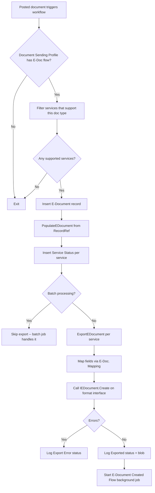
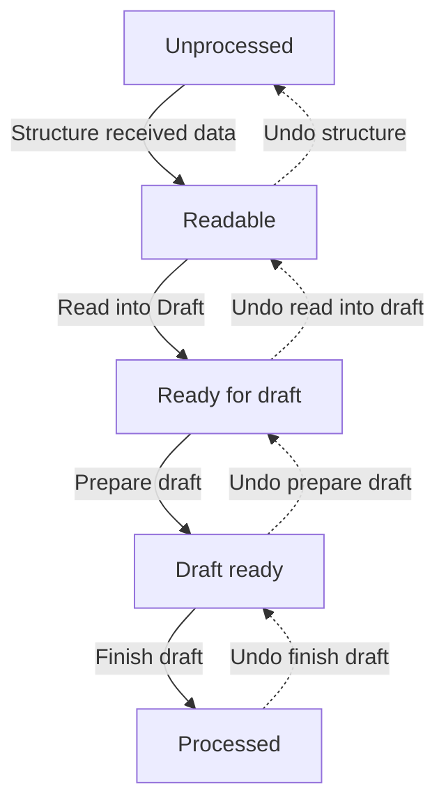
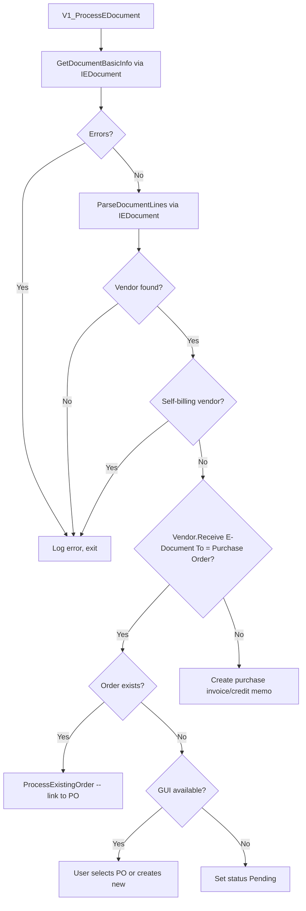

# Processing business logic

## Export pipeline

The export path runs synchronously during posting unless batch processing is enabled. `EDocExport.CreateEDocument` is the public entry point called from workflow subscribers.

The `CheckEDocument` path runs during release/pre-posting validation. It calls `IEDocument.Check` on the format interface -- this lets format implementations validate required fields before the document actually posts.

## Import pipeline -- V2

The V2 pipeline is a state machine. `EDocImport.GetEDocumentToDesiredStatus` computes the steps needed to reach a target status from the current status, undoing steps if the target is earlier than current (for reprocessing).

Each step is executed inside `Codeunit.Run` with a commit barrier, so failures are caught and logged as `Imported Document Processing Error` without corrupting the transaction.

## Import pipeline -- V1

V1 is the legacy monolithic path. It processes everything in `V1_ProcessImportedDocument`: get basic info, parse document lines, resolve vendor, then branch on vendor settings.

V1 documents only respond to the "Finish draft" step in the V2 state machine -- all other steps are no-ops.

## Status management

`EDocumentProcessing.ModifyEDocumentStatus` aggregates per-service statuses into a single E-Document status using short-circuit logic: the first error found sets the document to Error and returns. Otherwise, any in-progress service means the document is in-progress. Only if all services are done does it become Processed.

The `Import Processing Status` is a separate dimension tracked on `E-Document Service Status` and only applies to incoming documents. It represents position in the V2 pipeline and is independent of the overall service status.
