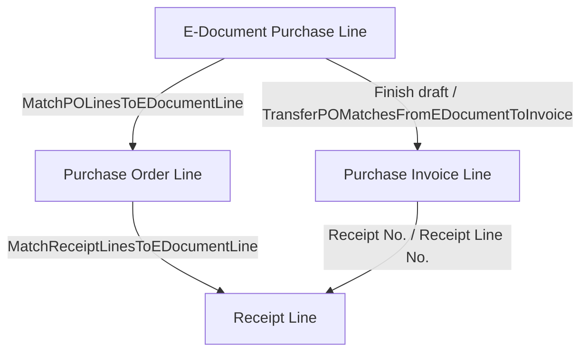
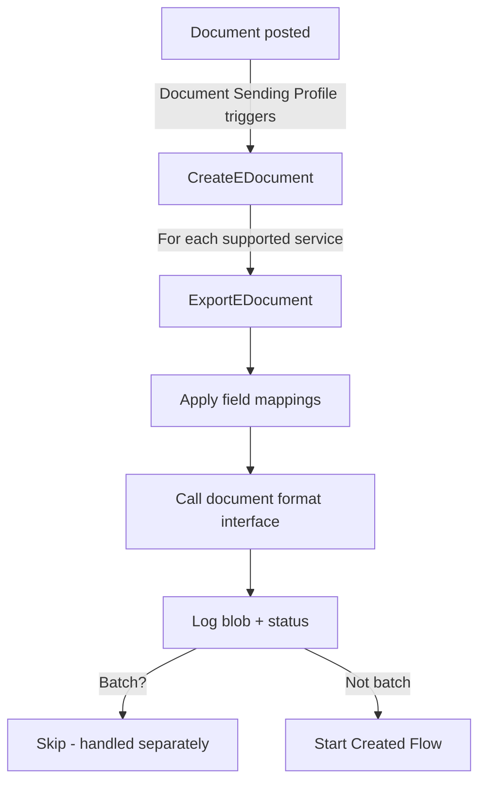

# Processing business logic

## Import V2 state machine

The import pipeline in `ImportEDocumentProcess.Codeunit.al` progresses an E-Document through five states. Each transition executes exactly one step, and every step supports an undo operation that reverts to the previous state.

**Structure received data** takes the unstructured blob (PDF, XML, JSON) stored in `E-Doc. Data Storage` and converts it to structured data. The step first resolves which `IStructureReceivedEDocument` implementation to use -- if the E-Document has none set, it falls back to the file format's `PreferredStructureDataImplementation()`. For PDFs this typically routes to the ADI (Azure Document Intelligence) handler; for XML it returns an "Already Structured" marker. The original unstructured blob is saved as an attachment, and the structured output is stored in a new data storage entry. The `IStructuredDataType` returned by the converter also specifies which `IStructuredFormatReader` to use in the next step.

**Read into Draft** invokes the `IStructuredFormatReader` to parse the structured data and populate the draft purchase tables (`E-Document Purchase Header` and `E-Document Purchase Line`). The PEPPOL handler parses XML; the ADI handler parses the ADI JSON schema; the MLLM handler processes LLM-structured JSON. The reader returns an enum indicating which `IProcessStructuredData` implementation should run next.

**Prepare draft** resolves external data into BC entities. `PreparePurchaseEDocDraft.Codeunit.al` orchestrates this: it finds the vendor via `IVendorProvider`, looks up a matching purchase order via `IPurchaseOrderProvider`, applies historical header mappings, then iterates each line to resolve UoM via `IUnitOfMeasureProvider` and account/item via `IPurchaseLineProvider`. After deterministic matching, AI matching runs (see below). If the vendor cannot be resolved, the draft proceeds anyway -- the user assigns it manually in the draft page.

**Finish draft** calls `IEDocumentFinishDraft.ApplyDraftToBC()`, which creates the actual BC purchase document (invoice or credit memo) and sets the `Document Record ID` on the E-Document. For PO-matched lines, receipt matches are transferred to the invoice. Undo deletes the created document via `RevertDraftActions`.

### V1 compatibility

If the service's import process version is "Version 1.0", the state machine is bypassed entirely. Only the "Finish draft" step is recognized, and it delegates to `EDocImport.V1_ProcessEDocument` which uses the old monolithic import path.

## Draft processing -- vendor, item, and additional field resolution

Vendor resolution follows a strict fallback chain in `EDocProviders.GetVendor`:

1. GLN / VAT ID lookup via `E-Document Import Helper`
2. Service Participant table -- first filtered to the specific service, then without service filter
3. Name + address fuzzy match

If no vendor is found, a warning is logged but processing continues. The user sees the unresolved draft and can assign the vendor manually.

Line resolution in `EDocProviders.GetPurchaseLine` tries:

1. Item Reference lookup (vendor-specific, filtered by product code, UoM, and date range -- tries exact UoM, then blank UoM, then any)
2. Text-to-Account Mapping (matches description against vendor-specific mappings)

Lines that are not resolved by either mechanism are left for AI matching or manual assignment.

Header-level historical matching (`EDocPurchaseHistMapping`) checks whether a similar invoice from the same vendor was previously processed and applies any header-level overrides (like default dimension codes) from that history.

## PO matching

PO matching links incoming invoice lines to existing purchase order lines. The matching state is tracked in the `E-Doc. Purchase Line PO Match` table using SystemId references to purchase lines, e-document purchase lines, and receipt lines.

The flow works as follows:

1. Available PO lines are loaded by filtering on the same vendor (pay-to) and optionally filtered to the order number specified in the e-document header. If the order number filter yields no results, it falls back to all orders for that vendor.
2. The user (or automated process) selects PO lines to match. Validation ensures the PO line belongs to the same vendor, is not already matched to another e-document line, and all matched lines share the same type, number, and UoM.
3. Optionally, receipt lines are matched. `SuggestReceiptsForMatchedOrderLines` auto-matches the first receipt line that covers the full invoice quantity.
4. Warnings are computed comparing invoice quantity (I) against remaining-to-invoice (R = Ordered - Previously Invoiced) and invoiceable quantity (J = Received - Previously Invoiced). The warnings are: I > J (not yet received), I > R (exceeds remaining), and I = R but I < J (over-receipt).
5. At finish-draft time, `TransferPOMatchesFromEDocumentToInvoice` copies the matched receipt references onto the created purchase invoice lines.

PO matching behavior is configurable per vendor via `E-Doc. PO Matching Setup`. The receipt configuration controls whether receipt is required before matching ("Always ask", "Always receive at posting", "Never receive at posting") and can be overridden per vendor.

## AI/Copilot matching

AI matching runs during the "Prepare draft" step, after all deterministic matching has been applied. It uses the `E-Doc. AI Tool Processor` codeunit, which wraps Azure OpenAI with function-calling. Each AI tool implements both `AOAI Function` (the tool definition and execute handler) and `IEDocAISystem` (system prompt, tool list, feature name).

The three tools run sequentially and subtractively -- each only sees lines that previous steps could not resolve:

**1. Historical matching** (`EDocHistoricalMatching.Codeunit.al`, function name: `match_lines_historical`) loads up to 5000 posted purchase invoice lines from the last year (scoped to the same vendor in the control group, all vendors in experiment variants). It collects potential matches by product code (exact), description (exact), and similar descriptions (fuzzy). These candidates are sent as JSON alongside the unmatched e-document lines. The LLM selects the best match per line and returns the purchase type, item number, deferral code, dimension codes, and a reasoning string. Confidence scoring accounts for same-vendor vs cross-vendor matches (20% penalty for different vendors).

**2. GL account matching** (`EDocGLAccountMatching.Codeunit.al`, function name: `match_gl_account`) sends all direct-posting GL accounts (with their full category hierarchy) alongside the still-unmatched lines. The LLM assigns a GL account to each line with a reasoning explanation and candidate count (used for confidence scoring -- single candidate = Medium, multiple = Low).

**3. Deferral matching** (`EDocDeferralMatching.Codeunit.al`, function name: `match_lines_deferral`) sends all deferral templates alongside lines that have an account but no deferral code. The LLM assigns deferral templates where appropriate.

All three tools use GPT-4.1 (latest) at temperature 0 with a 125K input token limit and 32K output token limit. System prompts are loaded from embedded resource files and optionally augmented with security prompts from Azure Key Vault. Results are validated (TryFunction pattern) before being applied, and every match is logged via the Activity Log and telemetry systems.

## Export pipeline

Export starts in `EDocExport.CreateEDocument`, triggered by the Document Sending Profile workflow:

`CreateEDocument` populates the E-Document record from the source document header using RecordRef field access -- it handles Sales, Purchase, Service, Finance Charge, Reminder, Shipment, and Transfer document types. For each service in the workflow, it checks `IExportEligibilityEvaluator.ShouldExport()` and `IsDocumentTypeSupported()` before proceeding.

`ExportEDocument` applies the E-Doc. Mapping rules (which perform field-level transformations on the source header and lines), then delegates to `EDocumentCreate.SetSource` which invokes the document format interface to produce the output blob. The blob is logged, and the service status is set to Exported or Export Error.

Batch export follows the same pattern but collects all documents first, applies mappings, then calls `CreateEDocumentBatch` to produce a single blob for all documents.
