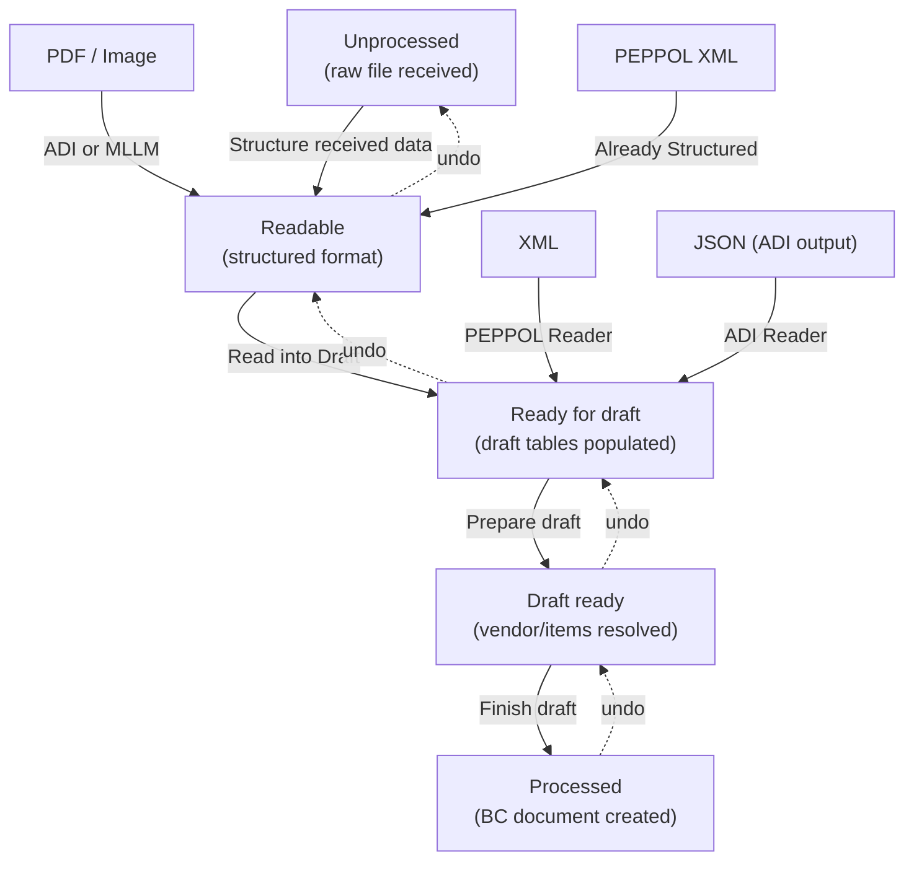

# Processing business logic

## Export flow

Export is initiated when a BC document is posted and the Document Sending Profile
routes it to the E-Document framework. `EDocumentSubscribers.Codeunit.al` subscribes
to posting events (`OnAfterPostSalesDoc`, `OnAfterPostPurchaseDoc`,
`OnAfterPostServiceDoc`, etc.) and calls `EDocExport.CreateEDocument`.

The export sequence in `EDocExport.Codeunit.al`:

1. Resolve the Document Sending Profile for the customer/vendor, then look up the
   workflow to find which E-Document Services apply.
2. Filter services to those supporting the document type, using
   `IExportEligibilityEvaluator` for per-document opt-out.
3. Create the `E-Document` record (Direction = Outgoing, Status = In Progress).
4. Populate header fields from the source document using RecordRef field reads.
5. For each applicable service, map fields via `E-Doc. Mapping` records (the mapping
   supports both import and export directions), then call the format interface's
   `Create` procedure to produce the output blob.
6. Log the result and update the service status to Exported or Export Error.

**Batch mode**: When `"Use Batch Processing"` is set on the service, `ExportEDocument`
is skipped during the initial loop. Instead, `ExportEDocumentBatch` accumulates all
mapped headers and lines into a single call to `CreateEDocumentBatch`, which invokes
the format interface once for the entire batch.

A deliberate design choice: the export uses RecordRef throughout rather than typed
records. This lets the same codeunit handle Sales, Purchase, Service, Finance Charge,
Reminder, and Transfer Shipment documents without separate code paths.

## V2 import pipeline

The V2 import is a four-stage state machine defined in
`ImportEDocumentProcess.Codeunit.al`. Each stage transitions the e-document to a new
processing status, and each can be individually run or undone.

**Stage 1 -- Structure received data** (Unprocessed -> Readable): The
`IStructureReceivedEDocument` interface converts raw input (PDF, image, XML) into a
structured format. For PEPPOL XML, the implementation is "Already Structured" -- it
just passes through. For PDFs and images, Azure Document Intelligence (ADI) or a
multimodal LLM (MLLM) extracts the data. The structured result specifies which
`IStructuredFormatReader` should handle the next stage.

**Stage 2 -- Read into Draft** (Readable -> Ready for draft): The
`IStructuredFormatReader` interface parses the structured data and populates the
`E-Document Purchase Header` and `E-Document Purchase Line` staging tables. At this
point the draft contains only external data (vendor name, product codes, amounts) --
no BC entity resolution has happened.

**Stage 3 -- Prepare draft** (Ready for draft -> Draft ready): The
`IProcessStructuredData` / `IPrepareDraft` interface resolves external data to BC
entities. This is where `IVendorProvider` matches vendor names/VAT IDs to Vendor
records, `IItemProvider` and `IPurchaseLineProvider` resolve product codes to Items or
G/L Accounts, and `IPurchaseLineAccountProvider` handles GL account mapping. AI
matching tools (historical matching, similar description matching) run here when
enabled. The user can review and correct the draft on the Purchase Draft page.

**Stage 4 -- Finish draft** (Draft ready -> Processed): The `IEDocumentFinishDraft`
interface creates the actual BC purchase document. For purchase invoices, this is
handled by `EDocCreatePurchaseInvoice.Codeunit.al` in the FinishDraft/ subfolder.
Attachments are moved from the E-Document to the created purchase document. The draft
tables and record links are cleaned up.

The pipeline supports bidirectional navigation: `EDocImport.GetEDocumentToDesiredStatus`
can undo steps to return to an earlier state, then re-run forward. This is how the
"re-process" action on the draft page works.

## V1 vs V2 difference

V1 (the original import path in `EDocImport.Codeunit.al`) does everything in a single
pass: `GetBasicInfo` extracts header-level data, `GetCompleteInfo` parses lines into
temporary Purchase Header/Line RecordRefs, then the codeunit immediately creates the
BC purchase document or journal line. There is no staging area, no draft review, no
undo capability.

V2 decouples these concerns into four explicit stages with persistent draft tables.
The V1 path is preserved for backward compatibility -- when
`GetImportProcessVersion()` returns "Version 1.0", the `ImportEDocumentProcess`
codeunit short-circuits to the old `V1_ProcessEDocument` call, but only on the
"Finish draft" step.

## Purchase document creation

`EDocumentCreatePurchDoc.Codeunit.al` handles V1 purchase document creation. It
receives temporary RecordRefs for header and lines and creates real Purchase Header /
Purchase Line records using field-by-field validation through RecordRef.

The document type is determined by the vendor configuration:

- If `Vendor."Receive E-Document To"` is set to Purchase Order and the incoming
  document is not a credit memo, the framework tries to match an existing PO. If a PO
  with matching `"Order No."` exists, lines are imported and the PO is linked via
  `"E-Document Link"`. If no PO is found, the user can select one or a new PO is
  created.
- Otherwise, a Purchase Invoice or Purchase Credit Memo is created based on the
  document type from the incoming data.

The codeunit fires integration events at key points (`OnBeforeProcessHeaderFieldsAssignment`,
`OnBeforeProcessLineFieldsValidation`, etc.) so extensions can inject additional field
handling.

## Journal line creation

`EDocumentCreateJnlLine.Codeunit.al` provides an alternative import path that creates
a General Journal Line instead of a purchase document. This is configured per service
via `"Create Journal Lines"`. The codeunit reads the journal template and batch from
the service configuration, creates the journal line with amounts from the e-document,
and optionally applies text-to-account mapping for automatic G/L account assignment.

## Attachment processing

`EDocAttachmentProcessor.Codeunit.al` handles PDF attachments that are embedded in
structured e-documents (common in PEPPOL XML, where the original PDF invoice is
base64-encoded inside the XML). The `Insert` procedure stores the attachment as a
Document Attachment linked to the E-Document. During the Finish draft step,
`MoveAttachmentsAndDelete` transfers attachments to the final purchase document and
cleans up the E-Document copies.

## AI matching tools

The AI/ subfolder contains `EDocAIToolProcessor.Codeunit.al` with buffer tables
`EDocHistoricalMatchBuffer` and `EDocLineMatchBuffer`. These support Copilot-powered
matching during the Prepare draft step:

- **Historical matching**: Looks up `E-Doc. Purchase Line History` for previously
  confirmed mappings from the same vendor with similar product codes or descriptions.
- **GL account suggestion**: Uses AI to suggest appropriate G/L accounts when no item
  match is found.
- **Similar description matching**: Finds items with similar descriptions using AI
  text comparison.

The AI system integration point is defined by the `IEDocAISystem` interface in the
Interfaces/ subfolder.
