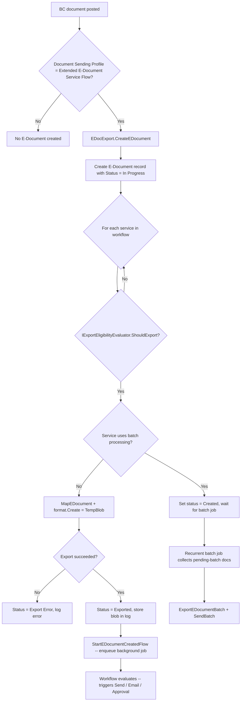

# Business logic

## Overview

Processing owns two major flows: outbound export (posting a BC document into an E-Document and handing it to the Integration layer) and inbound order matching (reconciling imported e-document lines against purchase order lines). The export flow is event-driven and largely automatic; order matching is interactive with optional AI assistance. Error handling throughout uses the `Commit(); if not Codeunit.Run()` pattern -- every interface call is isolated so a failure logs an error without rolling back the surrounding transaction.

## Export flow

The outbound pipeline starts when a BC document is posted and ends when the E-Document is queued for sending.

Key decision points in the flow:

- **Document Sending Profile.** The subscriber checks whether the customer/vendor has a profile with `"Electronic Document" = "Extended E-Document Service Flow"` and a valid, enabled workflow. If not, no E-Document is created.

- **Export eligibility.** Each service in the workflow is checked individually via `IExportEligibilityEvaluator.ShouldExport()`. The default implementation allows all documents, but extensions can filter by document type, amount, customer attributes, or any other criteria. The service's `"E-Doc. Service Supported Type"` table is also checked before the evaluator runs.

- **Batch vs. immediate.** If the service has `"Use Batch Processing"` enabled, the document gets status `Created` and is not exported inline. A recurrent job queue entry (`"E-Doc. Recurrent Batch Send"`) picks up all pending-batch documents at the configured interval, groups them by document type, exports them as a single batch blob, and sends the batch.

- **Field mapping.** Before calling the format interface's `Create()`, the framework applies field-level mappings defined in `"E-Doc. Mapping"`. Source document headers and lines are copied to temporary records with mapped field values, and a mapping log is written. This happens for both individual and batch export.

- **Error isolation.** `EDocumentCreate.Codeunit.al` is a runner codeunit invoked with `Codeunit.Run()`. If the format interface throws, `GetLastErrorText()` is captured and logged against the E-Document without aborting the caller.

## Order matching (two separate systems)

There are two distinct order matching systems in the codebase. They serve different purposes and use different data models. Do not confuse them.

### V2 import pipeline PO matching (automatic, during Prepare Draft)

This is the **newer** system, part of the V2.0 import pipeline in `Import/Purchase/PurchaseOrderMatching/`. It runs automatically during the "Prepare draft" stage when an incoming e-document references a purchase order number.

The flow:
1. During Prepare Draft, `PreparePurchaseEDocDraft` calls `IPurchaseOrderProvider.GetPurchaseOrder()` to look up a PO by order number from the e-document header.
2. If found, `EDocPOMatching.MatchPOLinesToEDocumentLine()` matches e-document purchase lines to PO lines.
3. After matching, `CalculatePOMatchWarnings()` generates warnings for over-receipt, under-receipt, quantity mismatches, etc.
4. During Finish Draft, `SuggestReceiptsForMatchedOrderLines()` proposes receipt lines, and `TransferPOMatchesFromEDocumentToInvoice()` writes matches to the created purchase invoice.

**Key data:** Matches are stored in `"E-Doc. Purchase Line PO Match"` (table 6114) -- a junction table linking e-document lines to PO lines and receipt lines via SystemIds. Warnings go in `"E-Doc. PO Match Warning"` (table 6115). Receipt behavior is configurable per vendor in `"E-Doc. PO Matching Setup"` (Always Ask / Always Receive / Never Receive).

**Main codeunit:** `EDocPOMatching.Codeunit.al` (codeunit 6196) in `Import/Purchase/PurchaseOrderMatching/`.

**Extensibility:** Override `IPurchaseOrderProvider.GetPurchaseOrder()` to customize how POs are looked up (e.g., match by vendor + date range instead of order number).

### V1 interactive order matching (user-driven, post-import)

This is the **older** system in `OrderMatching/`. It applies after the import pipeline has linked an E-Document to a purchase order (status `"Order Linked"`). The goal is to interactively reconcile imported e-document lines with PO lines so that `"Qty. to Invoice"` is set correctly before posting.

**Automatic matching** (`EDocLineMatching.MatchAutomatically`) filters PO lines to those with the same unit of measure, direct unit cost, and line discount as the imported line, then applies three matching strategies in order:

1. **Item Reference lookup** -- if the PO line is type Item, check whether an Item Reference exists for the vendor + imported line number.
2. **Text-to-Account Mapping** -- if the PO line is type G/L Account, check for a mapping from the imported line's number to the PO line's G/L account for this vendor.
3. **String nearness** -- if neither reference matches, compare descriptions with `CalculateStringNearness()`. A score above 80% counts as a match.

Each successful match creates an `"E-Doc. Order Match"` record linking the e-document line to the PO line with a precise quantity. The `"Matched Quantity"` on the imported line and `"Qty. to Invoice"` on the PO line are updated accordingly.

**Manual matching** lets users select one or more imported lines and one or more PO lines on the `"E-Doc. Order Line Matching"` page. The framework validates that all selected lines share the same unit cost, discount, and UOM before creating the match.

**Learn matching rule.** When a match is accepted with the "Learn" flag, the framework creates an Item Reference (for items) or a Text-to-Account Mapping (for G/L accounts) so future automatic matching will recognize the same pattern.

**Apply to purchase order.** `ApplyToPurchaseOrder()` validates that all imported lines are fully matched, then writes the matched unit costs and discounts to the actual PO lines and links the purchase header to the E-Document via `"E-Document Link"`.

### Common gotcha: which matching system applies?

If you are working on the V2.0 import pipeline (Prepare Draft / Finish Draft stages, `"E-Doc. Purchase Line PO Match"` table), you are in the **new** system. If you are working with `"E-Doc. Order Match"` records or the `"E-Doc. Order Line Matching"` page, you are in the **old** system. The two do not share data models, codeunits, or flow paths. Code changes to one should not be applied to the other without understanding which pipeline the document is going through.

## Copilot PO matching

When automatic matching (V1 interactive system) leaves unmatched lines, users can invoke Copilot from the matching page. `EDocPOCopilotMatching.MatchWithCopilot()` builds a prompt containing imported line and PO line descriptions, sends it to Azure OpenAI (GPT-4.1 via the `"E-Document Matching Assistance"` Copilot capability), and interprets the response through function-calling tools.

The Copilot result is **grounded** before being shown: the framework verifies that proposed matches respect the cost difference threshold configured in `"Purchases & Payables Setup"."E-Document Matching Difference"`. Proposals that exceed the threshold are discarded. Accepted proposals are surfaced on a proposal page where the user reviews and confirms.

## AI tools for import processing

`EDocAIToolProcessor` is a reusable Copilot orchestrator used during import processing (not order matching). It configures Azure OpenAI with a system prompt, registers tools from `IEDocAISystem` implementations, and executes function calls from the model's response. The `Tools/` subfolder provides four tools:

- **Historical matching** -- suggests line mappings based on previously accepted matches for the same vendor.
- **G/L account matching** -- proposes G/L accounts based on description similarity to the chart of accounts.
- **Deferral matching** -- suggests deferral codes for lines that appear to represent recurring charges.
- **Similar descriptions** -- finds items or G/L accounts with descriptions similar to the imported line text.

Each tool implements the `IEDocAISystem` interface and registers via the `OnAfterRegister*` event pattern. The `EDocAIToolProcessor.Process()` method handles token counting (125k input limit), API error handling, and function call dispatch.
