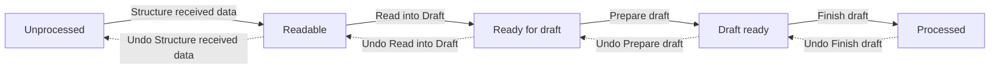
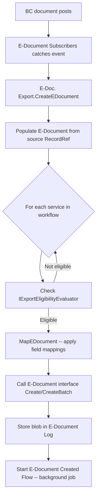

# Processing business logic

## Import pipeline state machine

The V2 import pipeline is defined by two enums: `Import E-Doc. Proc. Status` (the 5 states) and `Import E-Document Steps` (the 4 transitions between them). The step runner is `Import E-Document Process` (codeunit 6104).

The caller (`E-Doc. Import.GetEDocumentToDesiredStatus`) tells the pipeline "get this E-Document to status X." The pipeline computes the delta between the current status and the target:

- If the target is behind the current status, it walks backward, calling undo for each step that was previously completed.
- If the target is ahead, it walks forward, calling each step.

Each step is wrapped in `Codeunit.Run` so that runtime errors are caught. On failure, the error is logged to the error message framework, the service status becomes `Imported Document Processing Error`, and the pipeline stops. Because each step commits before running, rollback granularity is per-step, not per-pipeline.

**Structure received data.** Converts the raw blob (PDF, image, XML) into structured data. The E-Document stores both an "Unstructured Data Entry No." (the original blob) and a "Structured Data Entry No." (the converted output). If the blob is already structured (e.g., PEPPOL XML), this is a no-op -- it copies the unstructured entry to the structured entry. Otherwise, `IStructureReceivedEDocument` dispatches to the configured handler. The MLLM handler sends the blob to Azure OpenAI multimodal, while ADI sends it to Azure Document Intelligence. When conversion happens, the original blob is saved as an attachment on the E-Document. The handler returns an `IStructuredDataType` that specifies both the output file format and the implementation to use for the next step (Read into Draft).

**Read into Draft.** Takes the structured data and populates the E-Document Purchase Header and Purchase Lines with extracted values. `IStructuredFormatReader` dispatches to the implementation -- the built-in PEPPOL handler (`E-Document PEPPOL Handler`, codeunit 6173) parses UBL XML via XPath, extracting vendor info, line items, amounts, and dates into `E-Document Purchase Header` and `E-Document Purchase Line` records. The handler returns an `E-Doc. Process Draft` enum that determines which `IProcessStructuredData` implementation the next step uses.

**Prepare draft.** Resolves external identifiers to BC records. The default implementation (`Prepare Purchase E-Doc. Draft`, codeunit 6125) runs the following resolution cascade:

1. **Vendor resolution** via `IVendorProvider` -- tries VAT ID + GLN first, then Service Participant external ID, then name + address fuzzy match. Falls back to `E-Doc. Vendor Assign. History` for previously seen vendor identifiers.
2. **Purchase order lookup** via `IPurchaseOrderProvider` -- matches the external purchase order number to an existing BC PO.
3. **Per-line resolution** via `IUnitOfMeasureProvider` (code, international standard code, description) and `IPurchaseLineProvider` (item reference by vendor + product code, then text-to-account mapping by description).
4. **AI matching cascade** -- runs three codeunits sequentially on lines where `[BC] Purchase Type No.` is still empty: historical matching, G/L account matching, deferral matching.

**Finish draft.** Dispatched via `IEDocumentFinishDraft` based on the E-Document's Document Type. For purchase invoices, this creates the actual BC Purchase Header and Purchase Lines from the draft, linking them through `E-Doc. Record Link`. Sets `Document Record ID` on the E-Document to point to the new purchase document.

**Undo semantics.** Each step has an explicit undo path in `UndoProcessingStep`:
- Undo Finish draft calls `RevertDraftActions` (deletes the created purchase document) and clears `Document Record ID`.
- Undo Prepare draft deletes `E-Document Header Mapping` records and clears vendor/document type fields.
- Undo Structure received data resets `Structured Data Entry No.` to zero.
- Read into Draft has no explicit undo -- the draft records remain but are overwritten on re-run.

## Structure received data

Raw blobs arrive in various formats. The system determines how to structure them through a chain of interface dispatches.

The blob's `File Format` (stored on `E-Doc. Data Storage`) is queried for its `PreferredStructureDataImplementation`, which returns a `Structure Received E-Doc.` enum value. This is overridable -- if the E-Document already has `Structure Data Impl.` set (e.g., by the receive integration), that takes precedence.

The `IStructureReceivedEDocument` implementation does the actual conversion. It returns an `IStructuredDataType` that carries the output content, output file format, and the recommended `Read into Draft Impl.` For PEPPOL XML, the structure step is effectively "Already Structured" -- the XML passes through unchanged. For PDFs or images, the MLLM handler extracts text via multimodal LLM and returns structured XML/JSON.

When the original data is unstructured, the system saves it as an attachment (`E-Doc. Attachment Processor`) so users can view the original PDF/image alongside the structured interpretation.

## Draft preparation

Vendor resolution follows a priority waterfall (implemented in `E-Doc. Providers.GetVendor`, codeunit 6124):

1. Match `Vendor GLN` and `Vendor VAT Id` against Vendor table fields using `E-Document Import Helper.FindVendor`.
2. Match `Vendor External Id` against `Service Participant` records, first scoped to the current service, then any service.
3. Match `Vendor Company Name` + `Vendor Address` via `FindVendorByNameAndAddress`.
4. If all above fail, check `E-Doc. Vendor Assign. History` for a previously seen combination of GLN, VAT ID, company name, or address. The history lookup (`E-Doc. Purchase Hist. Mapping.FindRelatedPurchaseHeaderInHistory`) tries each field independently in priority order (GLN, then VAT, then name, then address).

Item matching (in `GetPurchaseLine`) checks:

1. **Item Reference** -- vendor-scoped reference by product code, respecting unit of measure and date validity.
2. **Text-to-Account Mapping** -- matches line description against `Text-to-Account Mapping` setup for the vendor, resolving to a G/L Account.

After deterministic matching, the AI cascade processes unmatched lines:

1. **Historical matching** (`E-Doc. Historical Matching`) loads up to 5000 posted purchase invoice lines from the last year, collects potential matches by product code, description, and similar descriptions (via `E-Doc. Similar Descriptions`), then sends the candidates to GPT-4.1 which returns function calls specifying which historical line best matches each unresolved e-document line. The matched posted invoice line's type, number, deferral code, and dimensions are applied to the draft line.
2. **G/L Account matching** (`E-Doc. GL Account Matching`) uses AI to match remaining unresolved lines to G/L accounts.
3. **Deferral matching** (`E-Doc. Deferral Matching`) uses AI to suggest deferral codes for lines that have a purchase type but no deferral.

## Purchase order matching

This is a V1-era subsystem for matching incoming invoices to existing purchase orders. It operates on `E-Doc. Imported Line` records (a simplified line representation with description, quantity, cost, and matched quantity).

The matching page (`E-Doc. Order Line Matching`) shows imported lines alongside PO lines and lets users create `E-Doc. Order Match` records. Each match specifies a quantity. An imported line is "Fully Matched" when its matched quantity equals its total quantity. The match is many-to-many: one imported line can match multiple PO lines (split shipments), and one PO line can match multiple imported lines (consolidated invoices).

**Copilot-assisted matching** (`E-Doc. PO Copilot Matching`, codeunit 6163) pre-filters PO lines by cost threshold (`Purchases & Payables Setup."E-Document Matching Difference"`) and available quantity (`Quantity Received - Quantity Invoiced - Qty. to Invoice > 0`). It sends formatted text descriptions of imported lines and candidate PO lines to GPT-4.1, which returns proposed matches via function calling. The results are "grounded" -- `GroundCopilotMatching` validates that each proposed match has real quantity available by calling `EDocLineMatching.MatchOneToOne`.

**PO line matching with receipt tracking** uses `E-Doc. Purchase Line PO Match` (table 6114) which has a three-part key: e-doc purchase line SystemId, purchase line SystemId, and receipt line SystemId. This enables tracking which specific receipt lines were invoiced, supporting partial receipt scenarios.

## Export flow

Export is triggered by posting events or manual "Send" actions. The path is:

The format interface (`E-Document` on the service) handles the actual XML/JSON generation. The export codeunit is format-agnostic -- it provides mapped RecordRefs and receives a blob back. Error counting before and after the interface call determines success.

Batch processing accumulates multiple documents' mapped RecordRefs, then calls `CreateBatch` once for the entire set. Mapping logs are tracked per-document within the batch to maintain audit traceability.

The emailing subsystem (`E-Document Emailing`) can attach the exported blob to outgoing emails when the Document Sending Profile specifies "E-Document" or "PDF & E-Document" as the email attachment type.
