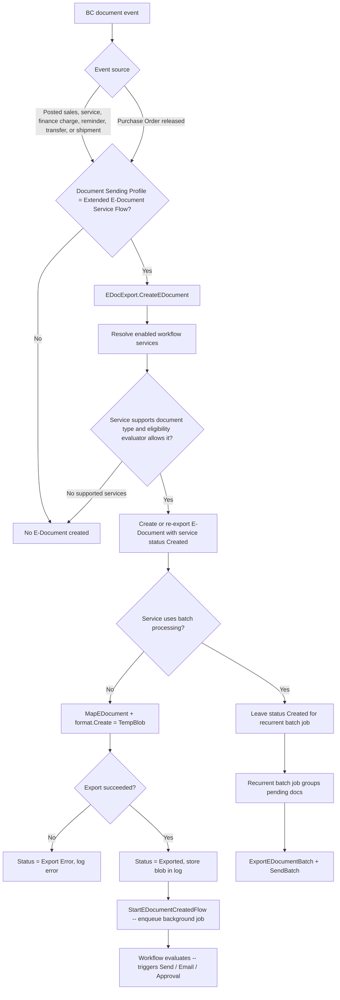
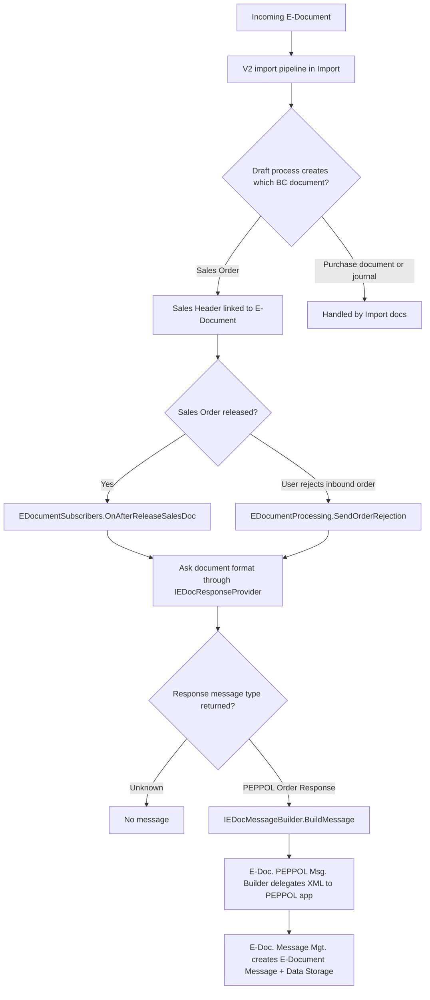

# Business logic

## Overview

*Updated: 2026-07-29 -- added purchase order export, sales order response messaging, and current error-handling boundaries.*

Processing owns the outbound export flow, the parent entry point for inbound processing, interactive V1 purchase order matching, E-Document message responses, attachment handling, and shared AI tooling. The export flow is event-driven and now covers both posted documents and released purchase orders. Inbound sales and purchase draft creation is delegated to `Import/`; this parent doc only calls out the boundaries where Processing dispatches into that pipeline or reacts after a draft creates a BC document.

Error handling throughout still uses the `Commit(); if not Codeunit.Run()` pattern -- every interface call is isolated so a failure logs an error without rolling back the surrounding transaction. Page actions that retry incoming processing now surface a message when processing leaves errors on the E-Document, and document cleanup clears linked error messages with the rest of the E-Document-owned data.

## Export flow

*Updated: 2026-07-29 -- added released purchase orders and PEPPOL purchase order export.*

The outbound pipeline starts from a document event and ends when the E-Document is queued for sending.

```mermaid
flowchart TD
    A[BC document event] --> B{Event source}
    B -- Posted sales, service, finance charge, reminder, transfer, or shipment --> C{Document Sending Profile = Extended E-Document Service Flow?}
    B -- Purchase Order released --> C
    C -- No --> Z[No E-Document created]
    C -- Yes --> D[EDocExport.CreateEDocument]
    D --> E[Resolve enabled workflow services]
    E --> F{Service supports document type and eligibility evaluator allows it?}
    F -- No supported services --> Z
    F -- Yes --> G[Create or re-export E-Document with service status Created]
    G --> H{Service uses batch processing?}
    H -- Yes --> I[Leave status Created for recurrent batch job]
    H -- No --> J[MapEDocument + format.Create = TempBlob]
    J --> K{Export succeeded?}
    K -- No --> L[Status = Export Error, log error]
    K -- Yes --> M[Status = Exported, store blob in log]
    M --> N[StartEDocumentCreatedFlow -- enqueue background job]
    N --> O[Workflow evaluates -- triggers Send / Email / Approval]
    I --> P[Recurrent batch job groups pending docs]
    P --> Q[ExportEDocumentBatch + SendBatch]
```

Key decision points in the flow:

- **Document Sending Profile.** The subscriber checks whether the customer, vendor, or location has a profile with `"Electronic Document" = "Extended E-Document Service Flow"` and a valid, enabled workflow. If not, no E-Document is created. The page action for manual creation validates this setup before it calls the subscriber path.

- **Purchase order send path.** `EDocumentSubscribers.OnAfterReleasePurchaseDoc()` handles released purchase orders, not posted purchase invoices. It resolves the vendor's electronic profile, then calls `CreateEDocumentFromPostedDocument()` with `"Purchase Order"` and `AllowReExport = true`. `EDocExport.GetLines()` reads `Purchase Line` records for the order, and `IsDocumentTypeSupported()` accepts a service that supports either Purchase Order or Purchase Invoice for this source type.

- **PEPPOL format boundary.** The core `"E-Document Format"` enum still contains `"PEPPOL BIS 3.0"` and binds it to `EDoc PEPPOL BIS 3.0`. That codeunit is a bridge: for purchase orders it calls PEPPOL app code such as `Export Purchase Order PEPPOL30`, using the PEPPOL setup's purchase format. Do not describe the Processing module as owning the PEPPOL XML builders themselves.

- **Export eligibility.** Each service in the workflow is checked individually via `IExportEligibilityEvaluator.ShouldExport()`. The default implementation allows all documents, but extensions can filter by document type, amount, customer/vendor attributes, or any other criteria. The service's `"E-Doc. Service Supported Type"` table is also checked before the evaluator runs.

- **Batch vs. immediate.** If the service has `"Use Batch Processing"` enabled, the document gets status `Created` and is not exported inline. A recurrent job queue entry (`"E-Doc. Recurrent Batch Send"`) picks up all pending-batch documents at the configured interval, groups them by document type, exports them as a single batch blob, and sends the batch.

- **Field mapping.** Before calling the format interface's `Create()`, the framework applies field-level mappings defined in `"E-Doc. Mapping"`. Source document headers and lines are copied to temporary records with mapped field values, and a mapping log is written. This happens for both individual and batch export.

- **Error isolation.** `EDocumentCreate.Codeunit.al` is a runner codeunit invoked with `Codeunit.Run()`. If the format interface throws, `GetLastErrorText()` is captured and logged against the E-Document without aborting the caller.

## E-Document message responses

*Updated: 2026-07-29 -- documented PEPPOL Order Response handling and response message storage.*

Processing stores lifecycle messages separately from the parent E-Document. The first built-in message type is `"PEPPOL Order Response"`, used when an inbound order becomes a sales order and BC needs to send an acceptance or rejection response back through the service flow.

```mermaid
flowchart TD
    A[Incoming E-Document] --> B[V2 import pipeline in Import]
    B --> C{Draft process creates which BC document?}
    C -- Sales Order --> D[Sales Header linked to E-Document]
    C -- Purchase document or journal --> X[Handled by Import docs]
    D --> E{Sales Order released?}
    E -- Yes --> F[EDocumentSubscribers.OnAfterReleaseSalesDoc]
    E -- User rejects inbound order --> G[EDocumentProcessing.SendOrderRejection]
    F --> H[Ask document format through IEDocResponseProvider]
    G --> H
    H --> I{Response message type returned?}
    I -- Unknown --> Z[No message]
    I -- PEPPOL Order Response --> J[IEDocMessageBuilder.BuildMessage]
    J --> K[E-Doc. PEPPOL Msg. Builder delegates XML to PEPPOL app]
    K --> L[E-Doc. Message Mgt. creates E-Document Message + Data Storage]
```

Key points:

- `IEDocResponseProvider` is implemented by the document format enum value, so a format can decide whether the current E-Document should emit a response message. The PEPPOL handler returns the PEPPOL Order Response message type for applicable inbound sales orders.

- `IEDocMessageBuilder` is implemented by the message type enum value. Core's PEPPOL builder reads the E-Document sales draft header and passes only primitive values to the standalone PEPPOL app's `PEPPOL Order Resp. Builder`.

- Accepted responses are created automatically after the linked sales order is released. Rejected responses are created by the E-Document page's Reject Order action through `SendOrderRejection()`.

- Messages are child records. `E-Document Message` stores message type, direction, response type, service, status, and a pointer to the XML blob in `E-Doc. Data Storage`; the messages factbox lets users download the raw XML.

## Order matching (two separate systems)

*Updated: 2026-07-29 -- narrowed this parent section to boundaries and pointed V2 details to Import docs.*

There are two distinct order matching systems in the codebase. They serve different purposes and use different data models. Do not confuse them.

### V2 import pipeline PO matching (automatic, during Prepare draft)

This is the newer system, part of the V2.0 import pipeline in `Import/Purchase/PurchaseOrderMatching/`. It runs automatically during the Prepare draft and Finish draft stages when an incoming e-document references a purchase order number.

This parent Processing doc should not duplicate the V2 matching details. See the Import docs for the stage flow, PO match tables, warnings, receipt suggestion behavior, and `IPurchaseOrderProvider` customization point. From this level, the important boundary is that `EDocImport.Codeunit.al` drives the configured import steps toward the desired processing status, while `Import/` owns the actual draft preparation and PO match data model.

### V1 interactive order matching (user-driven, post-import)

This is the older system in `OrderMatching/`. It applies after the import pipeline has linked an E-Document to a purchase order (status `"Order Linked"`). The goal is to interactively reconcile imported e-document lines with PO lines so that `"Qty. to Invoice"` is set correctly before posting.

**Automatic matching** (`EDocLineMatching.MatchAutomatically`) filters PO lines to those with the same unit of measure, direct unit cost, and line discount as the imported line, then applies three matching strategies in order:

1. **Item Reference lookup** -- if the PO line is type Item, check whether an Item Reference exists for the vendor + imported line number.
2. **Text-to-Account Mapping** -- if the PO line is type G/L Account, check for a mapping from the imported line's number to the PO line's G/L account for this vendor.
3. **String nearness** -- if neither reference matches, compare descriptions with `CalculateStringNearness()`. A score above 80% counts as a match.

Each successful match creates an `"E-Doc. Order Match"` record linking the e-document line to the PO line with a precise quantity. The `"Matched Quantity"` on the imported line and `"Qty. to Invoice"` on the PO line are updated accordingly.

**Manual matching** lets users select one or more imported lines and one or more PO lines on the `"E-Doc. Order Line Matching"` page. The framework validates that all selected lines share the same unit cost, discount, and UOM before creating the match.

**Learn matching rule.** When a match is accepted with the Learn flag, the framework creates an Item Reference for items or a Text-to-Account Mapping for G/L accounts so future automatic matching will recognize the same pattern.

**Apply to purchase order.** `ApplyToPurchaseOrder()` validates that all imported lines are fully matched, then writes the matched unit costs and discounts to the actual PO lines and links the purchase header to the E-Document via `"E-Document Link"`.

### Common gotcha: which matching system applies?

If you are working on the V2.0 import pipeline (Prepare Draft / Finish Draft stages, `"E-Doc. Purchase Line PO Match"` table), you are in the new system. If you are working with `"E-Doc. Order Match"` records or the `"E-Doc. Order Line Matching"` page, you are in the old system. The two do not share data models, codeunits, or flow paths. Code changes to one should not be applied to the other without understanding which pipeline the document is going through.

## Copilot PO matching

*Updated: 2026-07-29 -- marked the matching-page Copilot path obsolete and hidden.*

The V1 matching-page Copilot path is obsolete behind `#if not CLEAN29`. The Match with Copilot action and promoted action are hidden, and the obsolete reason points developers to import-time AI matching in `E-Doc. AI Tool Processor`. The old code still exists for compatibility until cleanup, including prompt building and grounding against purchase line cost and quantity, but it is not the place for new matching work.

## AI tools for import processing

*Updated: 2026-07-29 -- refreshed current model, capability registration, and historical matching behavior.*

`EDocAIToolProcessor` is a reusable Copilot orchestrator used during import processing. It registers the E-Document Matching Assistance capability in SaaS, checks that the capability is active, configures Azure OpenAI with the latest GPT-4.1 chat deployment, and registers tools from `IEDocAISystem` implementations. The `Tools/` subfolder provides four tools:

- **Historical matching** -- first tries direct history for the same vendor and product history; if unresolved lines remain, it builds a bounded historical candidate set and asks the model to choose matches.
- **G/L account matching** -- proposes G/L accounts using company/vendor context, posting accounts, and line descriptions.
- **Deferral matching** -- suggests deferral codes for lines that appear to represent recurring charges.
- **Similar descriptions** -- finds items or G/L accounts with descriptions similar to the imported line text.

Each tool implements the `IEDocAISystem` interface and registers via the `OnAfterRegister*` event pattern. The `EDocAIToolProcessor.Process()` method handles language-aware system prompts, token counting (125k input limit), API error handling, function call dispatch, and telemetry.

## Attachment and cleanup handling

*Updated: 2026-07-29 -- added Digital Voucher attachment context and E-Document cleanup behavior.*

Attachments created against an E-Document are stamped with `"E-Document Attachment"` and `"E-Document Entry No."` by `EDocAttachmentProcessor`. The same codeunit helps the document attachment factbox recover the E-Document record when the normal record reference is missing, which is important for Digital Voucher and factbox attachment flows. During import finalization, attachments can be moved from the E-Document to the created purchase document; during cleanup, only attachments tied to the E-Document entry are deleted.

E-Document cleanup is intentionally broad because the E-Document is the owner of processing artifacts. It clears Error Message records, logs, integration logs, service statuses, E-Document messages, mapping logs, imported lines, E-Document attachments, and V2 draft data through the configured process draft implementation. This keeps deleted or orphaned E-Documents from leaving stale processing state behind.
