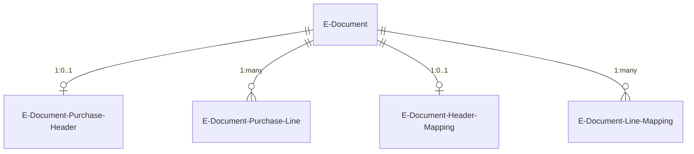
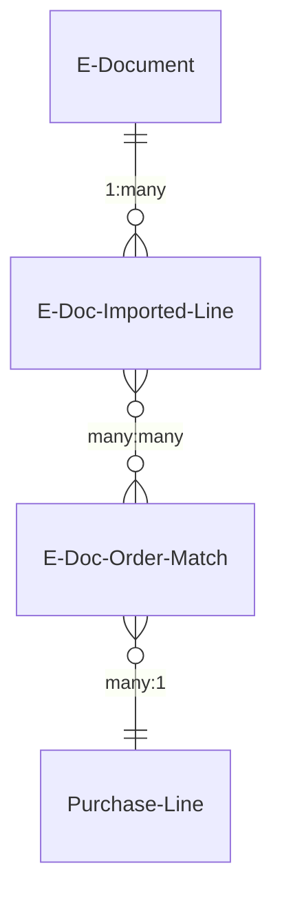
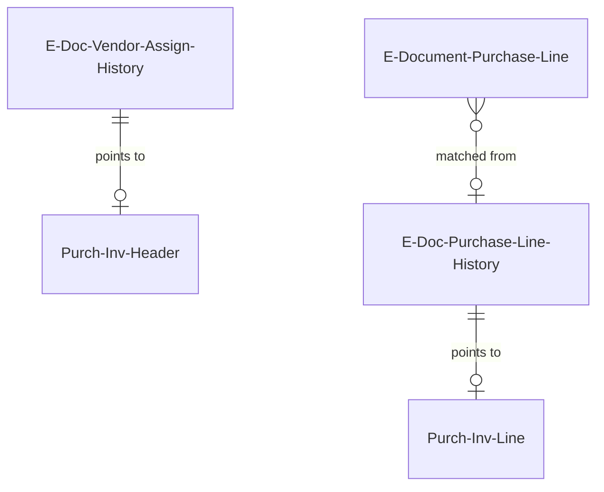
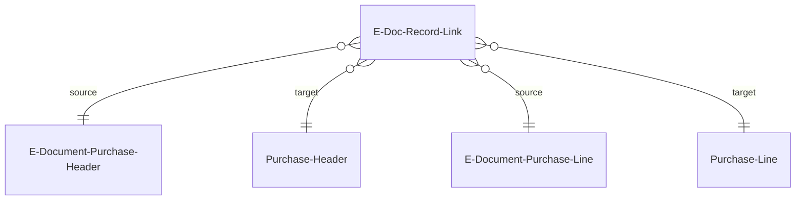

# Processing data model

## Draft tables

The draft purchase data lives in `E-Document Purchase Header` (table 6100) and `E-Document Purchase Line` (table 6101), keyed by `E-Document Entry No.` The header is 1:1 with an E-Document; lines are 1:many.

These tables use a **dual namespace** convention. Fields 2-100 store raw external data extracted from the source document -- vendor name, VAT ID, GLN, addresses, amounts, dates (on the header); product code, description, quantity, unit price, VAT rate (on lines). These fields are generally read-only and preserve the original invoice exactly as received. Fields 101-200 store BC-resolved values prefixed with `[BC]` -- vendor number, purchase line type, purchase type number, unit of measure, deferral code, dimension codes. The `[BC]` fields are what actually flow into the created purchase document.

**Why drafts exist.** The draft is the user-reviewable intermediate state between "raw data extracted from an invoice" and "real BC purchase document." The Prepare draft step populates the `[BC]` fields with best-guess resolutions. Users can review and correct these on the `E-Document Purchase Draft` page before Finish draft creates the actual purchase document. This prevents bad data from polluting the real ledger.

**Lifecycle.** Draft records are created during the Read into Draft step (populated from the structured data), enriched during Prepare draft (vendor/item resolution fills `[BC]` fields), consumed during Finish draft (the actual Purchase Header/Line are created), and cleaned up when the E-Document is deleted. If the user deletes the created purchase document, the pipeline rolls back to Draft ready state -- the draft records persist and can be re-finished.

`E-Document Header Mapping` (table 6102) and `E-Document Line Mapping` (table 6105) are secondary mapping tables that mirror the `[BC]` field structure. They store user overrides and are deleted when the Prepare draft step is undone. The line mapping table includes the same field set as the `[BC]` region of `E-Document Purchase Line` (purchase line type, purchase type no., unit of measure, deferral code, dimensions, item reference, variant code).

`E-Document Line - Field` (table in `AdditionalFields/`) stores per-line values for additional fields configured in `ED Purchase Line Field Setup`. This extends the draft line with arbitrary `Purch. Inv. Line` fields beyond the standard set, enabling localization-specific columns.

## Order matching tables

`E-Doc. Imported Line` (table 6165) is a simplified representation of incoming invoice lines, used by the V1 order matching subsystem. It stores description, quantity, matched quantity, direct unit cost, and line discount. The `Fully Matched` boolean is computed: true when `Matched Quantity = Quantity`.

`E-Doc. Order Match` (table 6164) implements the many-to-many relationship between imported lines and purchase order lines. Its compound key is (Document Order No., Document Line No., E-Document Entry No., E-Document Line No.). Each record carries a `Precise Quantity` representing how much of the imported line's quantity maps to that PO line. A SumIndexField on `Precise Quantity` keyed by (E-Document Entry No., E-Document Line No.) enables efficient totaling of matched quantities per imported line.

`E-Doc. Purchase Line PO Match` (table 6114) adds a third dimension -- receipt line tracking. Its compound key is (E-Doc. Purchase Line SystemId, Purchase Line SystemId, Receipt Line SystemId). This table is used by the V2 PO matching flow in `Import/Purchase/PurchaseOrderMatching/` and enables tracking which specific purchase receipt lines correspond to each match, supporting scenarios where a PO line has been partially received across multiple receipts.

## History tables

`E-Doc. Vendor Assign. History` (table 6108) records the external vendor identifiers (company name, address, VAT ID, GLN) from each processed e-document alongside the SystemId of the posted `Purch. Inv. Header` it became. Its secondary key is (Vendor VAT Id, Vendor GLN, Vendor Address, Vendor Company Name). When a new e-document arrives, `FindRelatedPurchaseHeaderInHistory` searches this table in priority order (GLN, then VAT ID, then company name, then address) to find a previously used vendor mapping. The `Vendor No From Purch. Header` FlowField resolves the posted header's `Buy-from Vendor No.` This table is upserted -- if all identifier fields match an existing record, only the `Purch. Inv. Header SystemId` is updated to point to the most recent posted invoice.

`E-Doc. Purchase Line History` (table 6140) records the product code and description from each draft line alongside the SystemId of the `Purch. Inv. Line` it became after posting. It has multiple secondary keys optimized for different search patterns: (Vendor No., Product Code, Description), (Product Code, Description), (Vendor No., Product Code), (Vendor No., Description). The AI historical matching codeunit loads up to 5000 of these records from the past year to find patterns. The search cascade tries product code exact match, then description exact match, then description prefix, then description contains.

History records are created by event subscribers on `Purch.-Post`. `OnAfterPurchInvLineInsert` creates line history; `OnAfterPostPurchaseDoc` creates header history. Both use `E-Doc. Record Link` to find the draft-to-purchase mapping, then delete the record links after creating history -- the links are transient, the history is permanent.

## Record linking

`E-Doc. Record Link` (table 6141) is a generic linking table that maps any source record to any target record via (Source Table No., Source SystemId) and (Target Table No., Target SystemId), scoped by `E-Document Entry No.` It has secondary keys on (Target Table No., Target SystemId) for efficient reverse lookups.

The table is used exclusively during the Finish draft to Posting window. When Finish draft creates a Purchase Header from the draft, it inserts a link from `E-Document Purchase Header` to `Purchase Header`, and from each `E-Document Purchase Line` to its corresponding `Purchase Line`. These links serve two purposes:

1. **During the user review period** -- `E-Document Purchase Line.GetLinkedPurchaseLine()` and `GetFromLinkedPurchaseLine()` use these links to navigate between draft and BC records.
2. **At posting time** -- the `Purch.-Post` event subscribers in `E-Doc. Purchase Hist. Mapping` look up these links to determine which draft lines correspond to which posted invoice lines, enabling history creation.

After posting creates the history records, all record links for the E-Document are deleted. If the purchase document is deleted before posting (user cancels), the links are cleaned up by the Undo Finish draft step.
