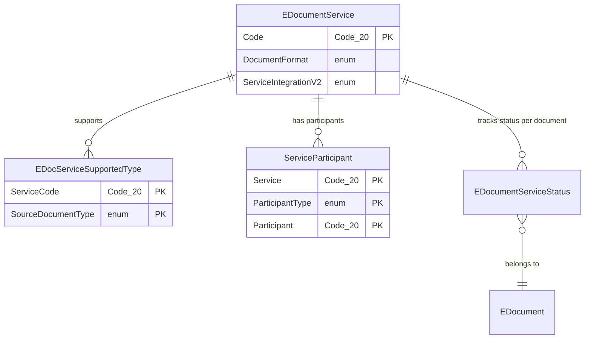
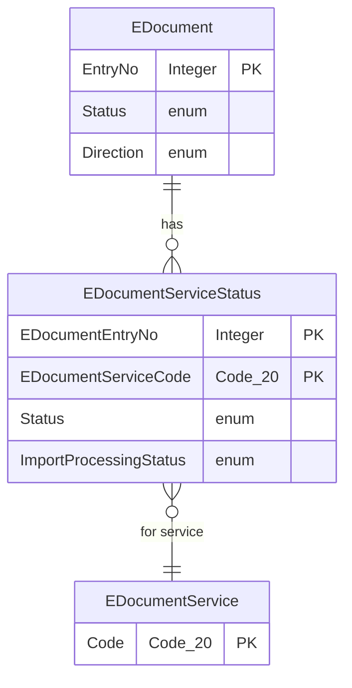

# Service data model

## Service configuration

The service table is the central configuration entity. It references two extensible enums that determine runtime behavior: the format (how to serialize/deserialize documents) and the integration (how to communicate with the external API).

`E-Doc. Service Supported Type` is a bridge table with a composite key -- one row per (service, document type) pair. It has no additional fields beyond the key.

`Service Participant` maps trading partners to their external identifiers. A customer might be `"C10000"` in BC but `"0192:987654321"` (a PEPPOL participant ID) when exchanging documents through a specific service. The `Participant Identifier` field (Text[200]) holds this external ID.

## Service status per document

Each E-Document has one status record per service that processes it. This is the junction between the document and service layers.

The `Status` field on `E-Document Service Status` uses the `E-Document Service Status` enum (the fine-grained 20+ value status). The `Status` field on `E-Document` uses the coarse three-value `E-Document Status` enum, derived pessimistically from all associated service statuses.

The `Import Processing Status` field is a V2 import pipeline addition. Its `OnValidate` trigger automatically syncs the service status: when import processing reaches "Processed", the service status is set to "Imported Document Created"; otherwise it stays at "Imported".

## Service scheduling

The service table contains two sets of scheduling fields -- one for batch sending and one for auto-importing. Both create `Job Queue Entry` records. The service stores the job queue entry GUIDs in `Batch Recurrent Job Id` and `Import Recurrent Job Id` so they can be managed (paused, removed) when configuration changes.
