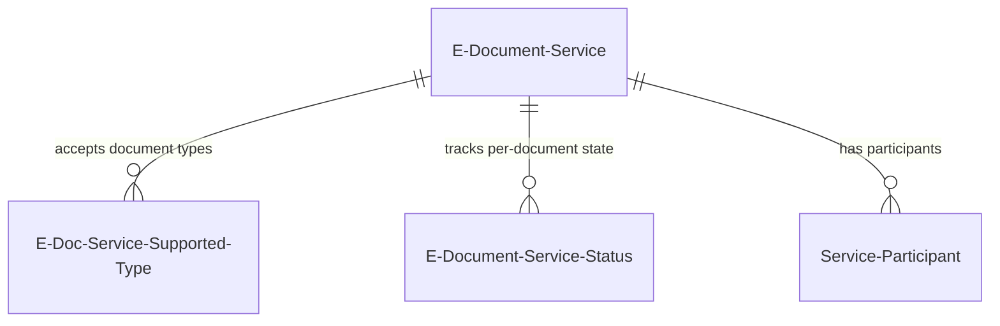
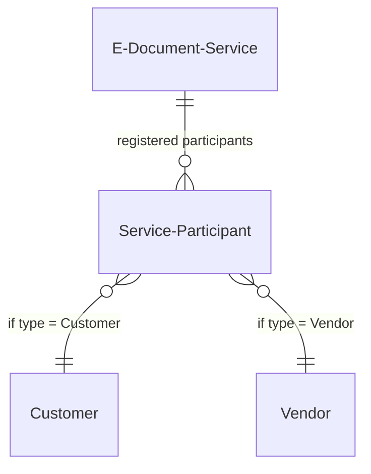

# Service data model

This describes the service configuration data model. For the full cross-module data model, see [../../docs/data-model.md](../../docs/data-model.md).

## Service configuration and type bridge

The `E-Document Service` table (6103) is the configuration hub. The `E-Doc. Service Supported Type` table (6122) creates an N:M bridge between services and the `E-Document Type` enum, with a composite primary key of `(E-Document Service Code, Source Document Type)`. This means a single service can handle Sales Invoices, Purchase Invoices, and Credit Memos, while the same document type can be handled by multiple services.

The `E-Document Service Status` table (6138, covered in the Document module) creates the link back to individual E-Documents, using `(E-Document Entry No, E-Document Service Code)` as its composite key. This is the join table that connects the Document and Service modules at runtime.

## Participant linking

The `Service Participant` table (6104) uses a three-part primary key: `(Service, Participant Type, Participant)`. The `Participant Type` field uses the `E-Document Source Type` enum (Customer or Vendor), and `Participant` is a polymorphic `Code[20]` with conditional table relations -- it points to the Customer table when the type is Customer, and to the Vendor table when the type is Vendor.

The `Participant Identifier` field (Text[200]) stores the external electronic address -- things like PEPPOL IDs or other scheme-specific identifiers. This is the value that gets embedded in the exported document to identify the recipient. The table is Public and Extensible, meaning ISVs can add fields for additional addressing schemes.

## Job queue integration

The service stores two Guid fields -- `Batch Recurrent Job Id` and `Import Recurrent Job Id` -- that reference Job Queue Entries. These are not table relations enforced at the schema level; instead, the `E-Document Background Jobs` codeunit manages their lifecycle programmatically. When `Use Batch Processing` or `Auto Import` is toggled, the OnValidate triggers call into the background jobs codeunit to create or update the corresponding job queue entry. On service deletion, both jobs are explicitly removed.

The batch and import jobs use separate scheduling configurations: batch jobs have `Batch Start Time` and `Batch Minutes between runs` (default 1440 = daily); import jobs have `Import Start Time` and `Import Minutes between runs` (also default daily). This separation means import polling and batch sending can run on completely independent schedules.

## Design decisions and gotchas

- The `Service Integration` field (v1) is being replaced by `Service Integration V2`. The old field is pending removal (CLEAN26/29 tags). During the transition, both fields may coexist, and code paths check both. The v2 field uses the `Service Integration` enum which implements `IConsentManager` for privacy consent.

- The supported type bridge table has `ReplicateData = false`, meaning it is not replicated across environments. This is intentional -- service configurations are environment-specific.

- The service carries no direct reference to E-Document records. The relationship is always mediated through `E-Document Service Status`, which is owned by the Document module. This keeps the service as a pure configuration entity.
