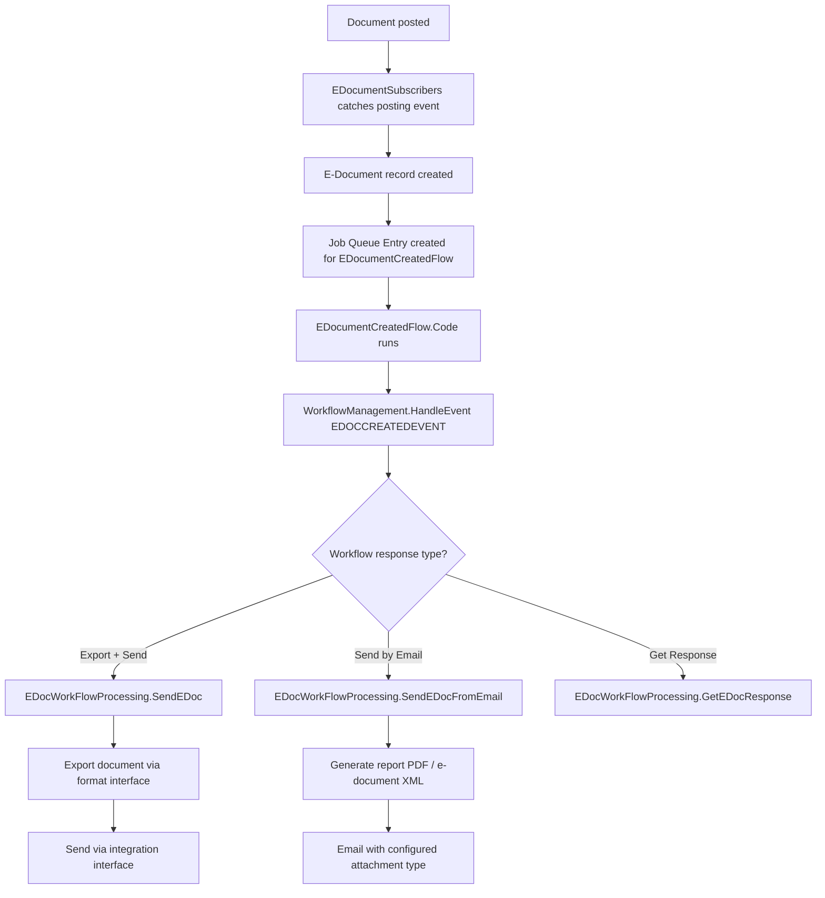

# Workflow business logic

## Outbound document flow

When a sales document is posted and has an e-document-enabled sending profile, the following sequence runs.

## Workflow step validation

Each workflow step validates its configuration before executing. `ValidateFlowStep` checks that the referenced E-Document Service exists, is properly configured, and matches the current document. For send steps, the service must have a valid integration configured. For email steps, argument validation is relaxed (the `false` parameter to `ValidateFlowStep`).

## Template structure

The single-service template creates a two-step workflow:

1. Event: E-Document Created
2. Response: Export and Send E-Document (with a service argument)

The multi-service template chains multiple send responses, each with a different service argument. Both templates insert themselves as non-templates first (to allow modification during setup), configure the steps, then flip back to template mode.
