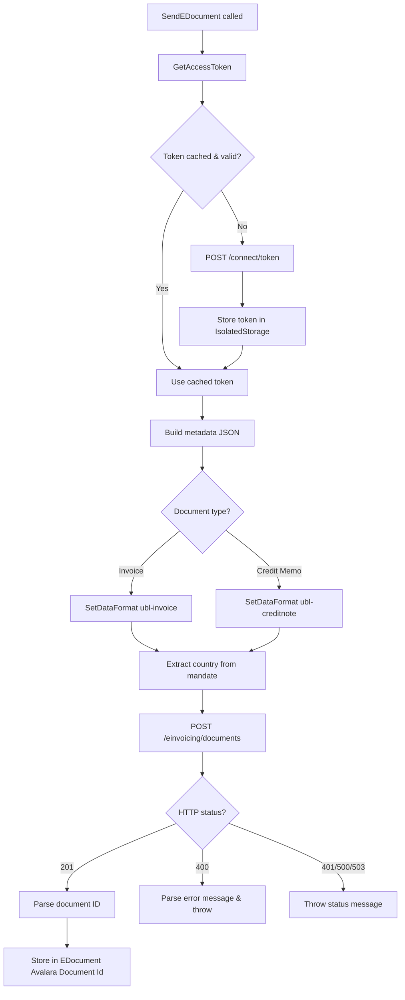

# Business logic

## Overview

The Avalara E-Document Connector enables Business Central to send outgoing invoices and credit memos to Avalara's e-invoicing platform, poll for their processing status, and receive incoming e-documents from trading partners. The connector implements three core interfaces -- IDocumentSender, IDocumentResponseHandler, and IDocumentReceiver -- which orchestrate authentication, metadata construction, HTTP communication, and response parsing.

The send flow transforms Business Central documents into UBL format, attaches metadata identifying the workflow (partner-einvoicing) and country (extracted from the mandate string), and posts them to Avalara's API. Status polling retrieves the processing state and either marks documents as complete or propagates error events. The receive flow queries Avalara for inbound documents within a date range, filters by company ID to ensure multi-tenant isolation, and downloads the UBL XML for each document that isn't already imported.

Error handling is centralized in the HTTP executor, which translates status codes into user-friendly messages. Authentication tokens are cached in isolated storage with a 60-second safety margin to avoid expiration during active requests. All flows depend on stateful connection setup that stores the API base URL, client credentials, company ID, and cached token reference.

## Send flow

The send process begins when IntegrationImpl receives a SendEDocument call through the IDocumentSender interface, which triggers Processing.SendEDocument(). The connector first authenticates by calling Authenticator.GetAccessToken(), which checks if a cached token exists and is valid for at least another 60 seconds. If the cache is stale, the authenticator posts a client_credentials grant to /connect/token and stores the new token in isolated storage, saving the storage key GUID in ConnectionSetup.

Once authenticated, MetadataBuilder constructs a JSON metadata object using its fluent API: SetWorkflowId("partner-einvoicing"), SetDataFormat() with either "ubl-invoice" or "ubl-creditnote" depending on document type, SetCountry() by parsing the mandate string (splitting on '-' and taking the first segment), and SetMandate() with the full mandate value. The builder returns the JSON string, which is attached to the multipart request alongside the UBL XML document body.

HttpExecutor posts the multipart payload to /einvoicing/documents. On success (201 Created), the response JSON contains an "id" field representing Avalara's assigned document identifier. Processing extracts this ID and writes it to the E-Document table's "Avalara Document Id" field for future reference. If the HTTP response is 400, the executor parses the error message from JSON; 401 throws "not authorized"; 500 throws "internal server error"; and 503 throws "service unavailable".



## Status polling

Processing.GetDocumentStatus() is invoked by IntegrationImpl through the IDocumentResponseHandler interface to check whether a previously sent document has completed processing. The method retrieves the Avalara Document Id from the E-Document record and issues a GET request to /einvoicing/documents/{id}/status.

The response contains a status field that drives the outcome. If the status is "Complete", the method returns true, signaling the framework to mark the document as processed. If the status is "Pending", the method returns false, leaving the document in a pending state for the next polling cycle. If the status is "Error", the connector iterates through all event messages in the response, logs each one, and throws an error to halt further processing and alert the user.

This polling-based approach means documents remain in a transitional state until Avalara's backend completes validation and submission to the tax authority or trading partner network. The frequency of polling is controlled by Business Central's job queue configuration for e-document processing.

## Receive flow

The receive process starts when IntegrationImpl calls Processing.ReceiveDocuments() through the IDocumentReceiver interface. Processing issues a GET request to /einvoicing/documents with query parameters: flow=in to request inbound documents, status=Complete to exclude drafts and errors, and a date range filter covering the last 30 days.

Avalara's API returns paginated results. If the response includes a @nextLink field, Processing recursively follows the link to retrieve all pages until no next link is present. Each document in the result set is checked against the E-Document table: if the Avalara Document Id already exists, the document is skipped to avoid duplicate imports. Documents are also filtered by ConnectionSetup.Company Id to ensure multi-tenant installations only receive documents belonging to the current company.

The method returns a list of TempBlob records, each containing the metadata JSON for a received document. The framework then calls Processing.DownloadDocument() for each TempBlob to retrieve the actual UBL XML. This two-phase approach separates discovery (listing available documents) from retrieval (downloading content), allowing the framework to apply additional filtering or user confirmation before download.

```mermaid
flowchart TD
    A[ReceiveDocuments called] --> B[GET /einvoicing/documents?flow=in&status=Complete]
    B --> C[Process result page]
    C --> D{@nextLink present?}
    D -->|Yes| E[GET next page]
    E --> C
    D -->|No| F[Filter by Company Id]
    F --> G{Document in E-Document table?}
    G -->|Yes| H[Skip duplicate]
    G -->|No| I[Add to TempBlob list]
    H --> J{More documents?}
    I --> J
    J -->|Yes| G
    J -->|No| K[Return TempBlob list]
```

## Download flow

After ReceiveDocuments returns a list of available inbound documents, the framework invokes Processing.DownloadDocument() for each one. The method extracts the Avalara Document Id from the metadata TempBlob and issues a GET request to /einvoicing/documents/{id}/$download with the Accept header set to application/vnd.oasis.ubl+xml.

The response body contains the UBL XML document, which Processing writes into ReceiveContext.TempBlob. The framework then passes this TempBlob to the configured import mapping to create the corresponding Business Central purchase invoice or other document type. HttpExecutor applies the same error handling as other flows: 200 indicates success, while 400/401/500/503 throw user-friendly error messages.

## Authentication

Authenticator.GetAccessToken() manages OAuth2 token lifecycle to minimize unnecessary authentication requests. When called, it first checks whether a token is stored in isolated storage using the GUID key saved in ConnectionSetup. If a token is found, the method compares its Token Expiry field against the current date-time plus a 60-second safety margin. If the token is still valid, it returns the cached access token immediately.

If no token is cached or the expiry has passed, the authenticator posts a client_credentials grant request to /connect/token with the client ID and secret from ConnectionSetup. The response contains an access_token and expires_in field. The expires_in value is in seconds, which the authenticator multiplies by 1000 to convert into a duration suitable for DateTime arithmetic. The token and calculated expiry are stored in isolated storage, and the storage key GUID is saved in ConnectionSetup for future lookups.

This caching strategy reduces latency and avoids hitting rate limits on the authentication endpoint. The 60-second margin ensures that tokens don't expire mid-request, even if there's a slight clock skew or processing delay between validation and usage.

## Error handling

HttpExecutor centralizes all HTTP response handling to provide consistent error messages across send, status, receive, and download operations. The executor checks the response status code and applies the following logic: 200 or 201 indicate success and allow normal processing to continue. A 400 status triggers JSON parsing of the response body to extract the error message field, which is then thrown as an error. A 401 status throws "not authorized", signaling credential or permission issues. A 500 status throws "internal server error", indicating a problem on Avalara's side. A 503 status throws "service unavailable", suggesting temporary downtime or maintenance.

This approach ensures that users see meaningful error descriptions rather than raw HTTP status codes. It also allows the connector to distinguish between client-side mistakes (400), authentication failures (401), and server-side problems (500/503), which can guide troubleshooting. All error messages are thrown as exceptions, which the E-Document framework logs and displays in the error message field of the E-Document record.

## Metadata builder

MetadataBuilder provides a fluent API for constructing the JSON metadata object required by Avalara's API. The builder exposes methods SetWorkflowId(), SetDataFormat(), SetCountry(), and SetMandate(), each of which returns the builder instance to enable chaining. The ToString() method serializes the accumulated fields into a JSON string.

The workflow ID is always set to "partner-einvoicing" to indicate that documents are being exchanged with trading partners rather than submitted directly to tax authorities. The data format is determined by the document type: invoices use "ubl-invoice", while credit memos (detected by checking if the Document Type is Sales Credit Memo or Service Credit Memo) use "ubl-creditnote". The country code is extracted from the mandate string by splitting on '-' and taking the first segment. The mandate itself is stored as-is.

This builder pattern isolates the JSON construction logic from the HTTP communication layer, making it easier to add new metadata fields or adjust formatting without modifying the send flow. It also ensures that all required fields are consistently included in every request.
