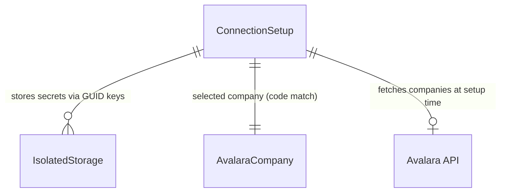
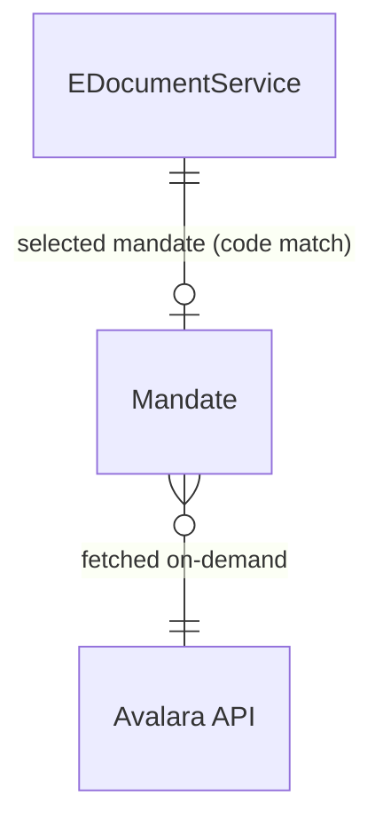
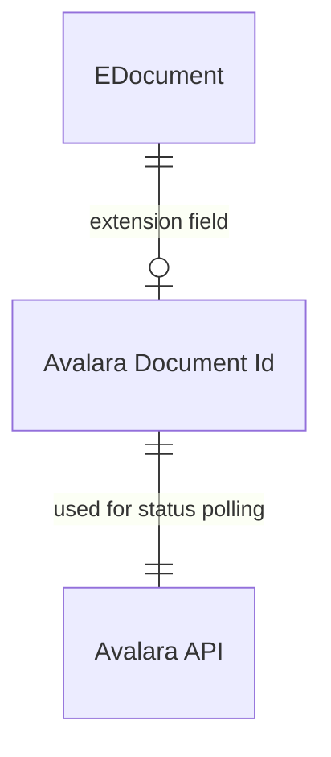

# Data model

## Overview

The Avalara connector uses a hybrid persistence model. Authentication credentials and company selection are stored in a singleton configuration table with secrets offloaded to IsolatedStorage. Runtime metadata -- country mandates and available companies -- are fetched on-demand from the Avalara API and held in temporary tables, never persisted to the database. The data model extends Business Central's core E-Document tables to track Avalara-specific identifiers (mandate codes and document IDs) without polluting the base schema.

## Authentication and configuration

The ConnectionSetup table (6372) is a singleton -- exactly one record exists globally, keyed by an empty Code[10]. It stores OAuth credentials indirectly: the table holds GUIDs (Client Id Key, Client Secret Key, Token Key) that reference encrypted values in IsolatedStorage. This keeps secrets out of the main database and SQL backups. Token Expiry tracks access token lifetime. API URL, Auth URL, and sandbox URLs are environment-specific endpoints controlled by the Avalara Send Mode enum (Production/Test/Certification).

Company Id and Company Name link to the selected Avalara company. These are populated during setup by fetching available companies from the Avalara API into the temporary Avalara Company table (6373), then copying the user's selection into ConnectionSetup. The Avalara Company table is never persisted -- it's a throw-away API response cache.

Design decision: The singleton pattern prevents multi-company Avalara configurations within a single Business Central environment. If you need different Avalara accounts per BC company, you'll need multiple BC environments or custom code.

## Mandate selection

The Mandate table (6371) is temporary. It holds country-specific document format codes (e.g. IT-FatturaPA-2.0) fetched from the Avalara API. The table is populated on-demand when the user opens mandate selection UI, then discarded.

The E-Document Service table is extended (6370) to add an "Avalara Mandate" field. This Code[50] field stores the selected mandate code and drives which Avalara endpoint receives documents. The relationship is code-based, not a formal foreign key -- if the mandate code becomes invalid (Avalara deprecates a format), there's no referential integrity to catch it.

Gotcha: Mandate codes are hyphen-delimited strings controlled by Avalara's API. If Avalara changes format naming or deprecates a mandate, existing E-Document Services will reference stale codes until manually updated.

## Document tracking

The E-Document table is extended (6372) to add an "Avalara Document Id" field (Text[50]). This field is empty until a document is successfully submitted to Avalara, at which point the API returns a document identifier. The connector stores this ID in the extension field and uses it to poll Avalara for processing status (accepted, rejected, delivery confirmation).

Design decision: The ID is stored as an extension field rather than a separate tracking table. This keeps the implementation simple but means you can't track multiple Avalara submission attempts for a single E-Document without custom code. If a document is resubmitted, the old Avalara Document Id is overwritten.

## Cross-cutting concerns

The data model relies heavily on temporary tables and external API calls. Mandate and Avalara Company tables exist only in memory during UI flows -- their schemas define the shape of API responses, not persistent entities. This reduces database clutter but means you can't query historical mandate availability or company lists.

The E-Doc. Ext. Send Mode enum (6377) and Company table (6375) were deprecated in v26 and replaced by Avalara Send Mode (6373) and Avalara Company (6373). Code references to the old artifacts should be treated as technical debt.

Secret management uses IsolatedStorage indirection. The actual OAuth credentials never appear in AL variables or database fields -- only GUID keys are visible. This protects secrets from SQL injection, database exports, and snapshot debugging, but complicates troubleshooting (you can't inspect token values without special tooling).
