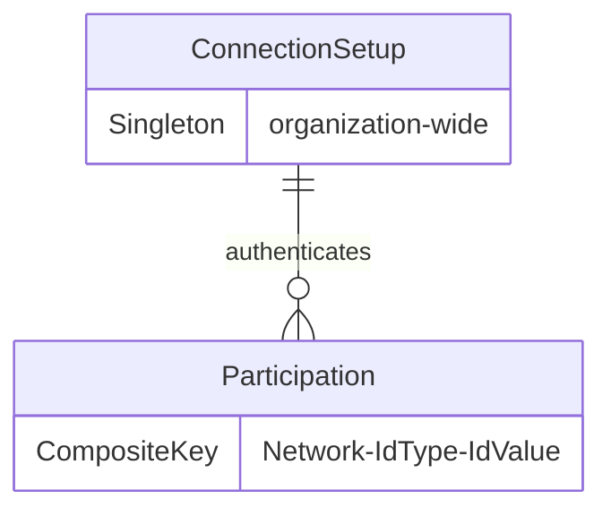
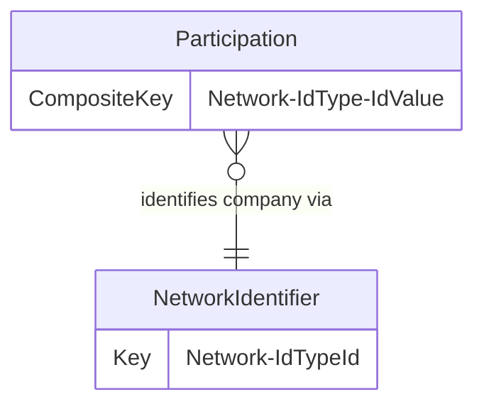
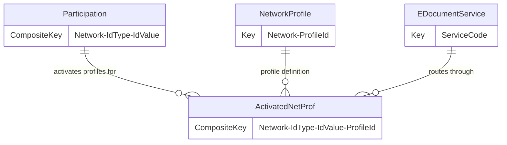

# Continia E-Document Connector Data Model

This document describes the data model for the Continia E-Document Connector, which enables Business Central to exchange electronic documents through delivery networks like Peppol and NemHandel.

## Core entities

The model consists of five main tables plus extensions to the base E-Document framework.

### Connection and authentication



**ConnectionSetup (6390)** is a singleton table with `DataPerCompany=false`, meaning one record serves the entire organization across all companies. OAuth2 credentials are stored in IsolatedStorage using SecretText fields. The table tracks token expiration using Token Timestamp and Expires In fields to enable client-side cache validation. A FlowField aggregates the number of participations across all companies.

This design choice -- organization-wide authentication with per-company participations -- allows a single OAuth2 credential to serve multiple company registrations while maintaining company isolation for operational data.

### Company registration



**Participation (6391)** represents a company's registration in a delivery network. The composite primary key (Network + Identifier Type Id + Identifier Value) enforces uniqueness -- a company can register once per identifier in each network. For example, a company with both a GLN and VAT number could have two participations in Peppol, but not two participations using the same GLN.

Each participation captures rich metadata: company details, contact information, and signatory data required by network operators. The Registration Status field drives a state machine: Draft -> InProcess -> Connected/Rejected/Disabled. Draft participations exist only in Business Central; InProcess participations have been submitted to the network operator; Connected participations are active and can exchange documents.

OnDelete behavior cascades to Activated Net. Prof. records, ensuring profile bindings are removed when a participation is deleted.

**Network Identifier (6393)** is reference data describing identifier schemes like GLN, VAT, DUNS. Each identifier type has validation rules and an Enabled flag to control which schemes are offered during onboarding.

### Profile activation



**Activated Net. Prof. (6392)** binds a participation to document exchange profiles. The composite primary key (Network + Identifier Type Id + Identifier Value + Network Profile Id) extends the participation key with the profile identifier.

Each activation links to an E-Document Service Code, which determines routing for documents matching that profile. Profile Direction (Inbound/Outbound/Both) controls which document flows are enabled. A Disabled DateTime field provides soft-delete semantics -- the record remains in the database for audit purposes, but the profile is no longer active.

**Network Profile (6394)** is reference data describing document exchange profiles. Each profile is identified by Process and Document identifiers (e.g., BIS Billing 3.0 + Invoice). Mandatory and Mandatory for Country flags indicate whether the profile is required or conditionally required based on localization.

The relationship between Activated Net. Prof. and Network Profile is filtered by Network -- profiles from one network cannot be activated for participations in another network. This constraint is enforced through table relations.

### E-Document framework integration

```mermaid
erDiagram
    EDocument {
        Extension adds ContDocId
    }
    EDocumentService {
        Extension adds NoOfProfiles
    }
    ActivatedNetProf {
        CompositeKey Network-IdType-IdValue-ProfileId
    }

    EDocument ||--o| ActivatedNetProf : "tracked by CDN via"
    EDocumentService ||--o{ ActivatedNetProf : "serves"
```

The connector extends two base E-Document tables:

**E-Document ext (6391)** adds a Continia Document Id field (GUID) to track documents in the Continia Delivery Network. This external identifier enables correlation between Business Central records and CDN transaction logs.

**E-Document Service ext (6390)** adds a FlowField counting the number of activated network profiles linked to each service. This supports validation and UI display -- services with zero profiles cannot process Continia documents.

### Onboarding UI

**Con. E-Doc. Serv. Prof. Sel. (6395)** is a temporary table used exclusively by the onboarding wizard. It presents a hierarchical tree structure with three indent levels: Network (0), Participation (1), and Profile (2). This flattened representation allows a single list page to display the network topology and profile selection state.

Records in this table exist only during the wizard session and are not persisted to the database.

## Key design decisions

**Organization-wide authentication with company-scoped participations**: This split enables centralized credential management while maintaining per-company registration data. A global administrator configures OAuth2 once; individual companies register independently.

**Composite keys encode network topology**: The hierarchical key structure (Network -> Network + IdType + IdValue -> Network + IdType + IdValue + ProfileId) makes relationships explicit and prevents cross-network contamination. Foreign key constraints enforce referential integrity without requiring separate validation code.

**Soft delete for activated profiles**: Disabling a profile sets Disabled DateTime rather than deleting the record. This preserves the activation history for audit and troubleshooting while preventing new documents from routing through the profile.

**Registration status lifecycle**: The state machine (Draft/InProcess/Connected/Rejected/Disabled) mirrors the network operator's workflow. Business Central cannot unilaterally mark a participation as Connected -- that transition requires confirmation from the CDN API.

## Enum types

- **E-Delivery Network**: Peppol, NemHandel
- **Profile Direction**: Inbound, Outbound, Both
- **Registration Status**: Draft, InProcess, Connected, Rejected, Disabled
- **Subscription Status**: Tracks CDN subscription state
- **Wizard Scenario**: Drives onboarding UI flow

These enums are extensible to support additional networks and registration workflows.
