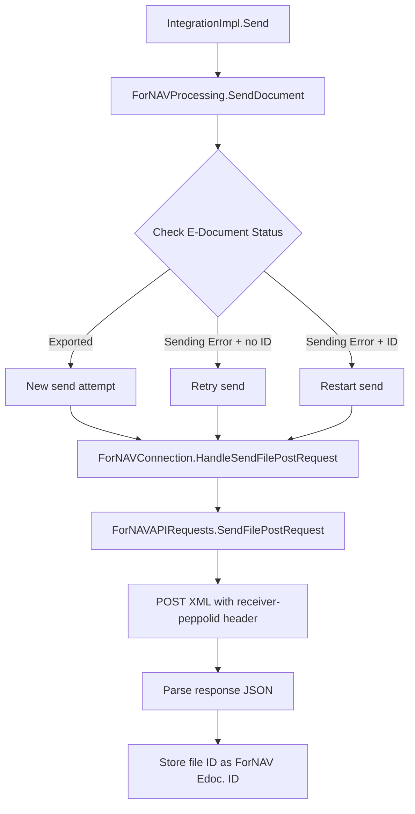
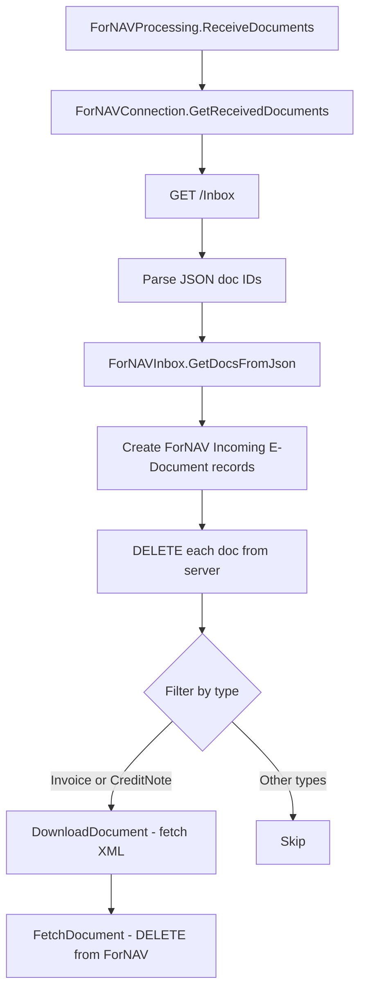
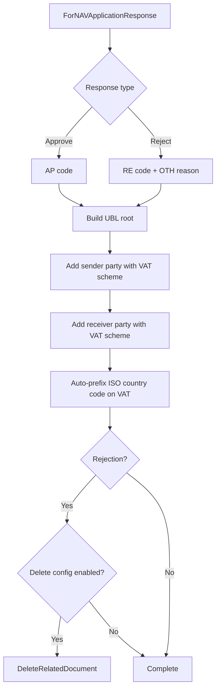
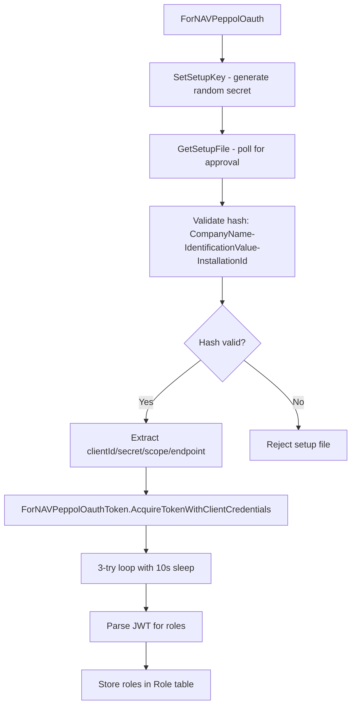

# Business logic

This document describes the core workflows and algorithms in the ForNAV PEPPOL connector.

## Document send flow

The send operation orchestrates document transmission to the ForNAV service through a multi-stage process that handles new sends, retries, and error recovery.

The entry point (`IntegrationImpl.Send()`) delegates to `ForNAVProcessing.SendDocument()`, which examines the E-Document status to determine the appropriate action. Documents in Exported status represent new transmission attempts. Documents in Sending Error status without a ForNAV ID trigger a retry of the original send. Documents in Sending Error status with an existing ForNAV ID trigger a restart operation.

All paths converge at `ForNAVConnection.HandleSendFilePostRequest()`, which calls `ForNAVAPIRequests.SendFilePostRequest()` to transmit the XML payload. The API request includes a receiver-peppolid header containing the recipient's PEPPOL identifier. The service responds with JSON containing a file ID, which is stored as the ForNAV Edoc. ID field for tracking purposes.

## Document receive flow

The receive operation implements an asynchronous polling pattern that retrieves documents from the ForNAV inbox and filters them for processing.

The job queue entry runs every 30 minutes and invokes `ForNAVProcessing.ReceiveDocuments()`. This calls `ForNAVConnection.GetReceivedDocuments()`, which performs a GET request to the /Inbox endpoint. The response contains a JSON array of document IDs.

`ForNAVInbox.GetDocsFromJson()` hydrates ForNAV Incoming E-Document records from the JSON payload. Each retrieved document is immediately deleted from the server to prevent duplicate processing. The implementation filters documents by type, processing only Invoice and CreditNote document types.

For accepted documents, `DownloadDocument()` fetches the XML content from the service. `FetchDocument()` then deletes the document from ForNAV's servers to complete the retrieval cycle. The 30-minute polling interval is configured through `ForNAVPeppolJobQueue`.

## Application response generation

The application response mechanism builds PEPPOL-compliant ApplicationResponse XML for both approval and rejection scenarios.

`ForNAVApplicationResponse` builds the XML structure according to PEPPOL BIS specifications. Approved documents receive an AP response code. Rejected documents receive an RE response code with an OTH reason code.

The implementation constructs the UBL root element and populates sender and receiver party blocks using VAT registration scheme identifiers. The system automatically prefixes VAT numbers with the ISO country code when constructing party identifiers.

For rejection scenarios, the system checks configuration settings to determine whether to invoke `DeleteRelatedDocument()` to remove the rejected document from the database.

## OAuth credential setup

The OAuth setup workflow implements a polling-based credential exchange with security validation through hash verification.

`ForNAVPeppolOauth` manages the credential provisioning flow. `SetSetupKey()` generates a random secret that serves as a shared validation token. `GetSetupFile()` polls the service for approval, validating the response hash constructed from CompanyName, IdentificationValue, and InstallationId.

Upon successful hash validation, the system extracts OAuth client credentials including clientId, secret, scope, and token endpoint from the response payload.

`ForNAVPeppolOauthToken.AcquireTokenWithClientCredentials()` implements a retry mechanism with a 3-iteration loop and 10-second sleep intervals to handle secret rotation timing. The acquired JWT token is parsed to extract role claims, which are stored in the Role table for authorization checks.

## SMP participant lookup

The SMP lookup operation queries PEPPOL registration status and returns detailed status codes that differentiate between various failure modes.

Status code semantics:

- 0: Service offline or unreachable
- 200: Participant published and ready
- 401: Unauthorized access attempt
- 402/403: License validation failure
- 404: Participant not published in SMP
- 409: Participant published in another Business Central company
- 423: Participant published by another Azure AD tenant
- 428: Registration pending approval
- 451: Participant published by another access point

`ForNAVPeppolSMP.ParticipantExists()` performs the lookup and returns the appropriate status code based on service response. These codes enable the UI to display specific error messages guiding users through resolution steps for registration conflicts and authorization issues.

## Error handling

The connector uses `EDocumentErrorHelper.LogSimpleErrorMessage()` to record HTTP errors and service failures. The E-Document Integration Log requires URL fields per schema requirements, so the implementation uses dummy URL values when logging ForNAV operations that route through internal service endpoints rather than directly addressable HTTP resources.

