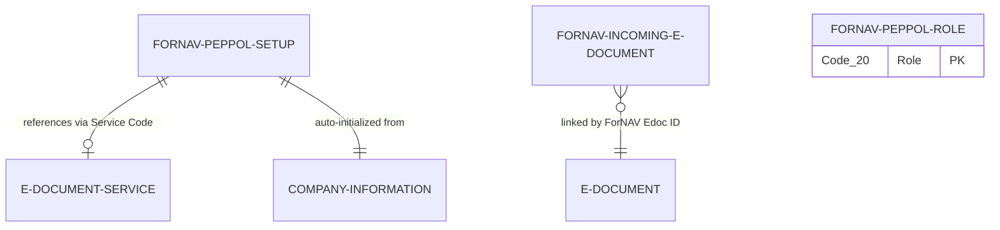

# ForNAV E-Document Connector Data Model

## Overview

The ForNAV connector uses a lightweight schema focused on PEPPOL integration. Core tables handle incoming document staging, company-level PEPPOL setup, and OAuth role caching. Extensions to base E-Document tables maintain cross-references without introducing tight coupling.

## Entity Relationship Diagram

## Tables

### ForNAV Incoming E-Document (6415)

Stores received PEPPOL documents before they are processed into Business Central sales or purchase documents. Acts as a staging area between the PEPPOL network and the E-Document framework.

**Primary key:** ID (Text[80])

**Key fields:**
- DocType: Invoice, ApplicationResponse, CreditNote, or Evidence
- Status: Progression from Unknown to Received to Approved/Rejected to Processed
- Document/Message/HTML Preview: Blob fields for raw XML, status messages, and rendered content
- EDocumentType: References the base application E-Document Type enum

**Blob accessors:** GetDoc(), GetHtml(), and GetComment() methods abstract blob field reading for integration code.

### ForNAV Peppol Setup (6414)

Singleton configuration table with one record per company. Manages PEPPOL endpoint registration, OAuth client credentials, and links to E-Document Service records.

**Primary key:** Guid

**Key fields:**
- Client Id: Stored in IsolatedStorage for security
- Identification Code + Identification Value: Compose the company's PEPPOL participant ID
- Status: Tracks registration state (Not Published, Published, Offline, Unlicensed, Published in another company)
- Service Code: FlowFilter linking to E-Document Service (filtered to FORNAV integration type)
- Document Sending Profile: FlowFilter for profile selection

**Initialization:** Auto-populated from Company Information when first accessed. Status changes reflect PEPPOL network registration state.

### ForNAV Peppol Role (6411)

Simple cache table storing OAuth token roles. Populated during token refresh and cleared when tokens expire or are revoked.

**Primary key:** Role (Code[20])

**Usage:** No foreign key relationships. Cleared and repopulated on each OAuth token refresh operation.

## Table Extensions

### ForNAV EDocument (6412)

Extends the base E-Document table with a single field to link published documents back to their PEPPOL transmission metadata.

**Added field:** ForNAV Edoc. ID (Text[80])

**Methods:** DocumentLog() procedure returns integration log entries using the ForNAV Edoc ID as a filter key.

### ForNAV E-Document Service (6411)

Extends E-Document Service with type guard procedures to validate service records are configured for the ForNAV integration.

**Purpose:** Provides validation helpers without adding persistent fields.

## Enums

### ForNAV Incoming E-Doc Status (6410)

State machine for incoming document processing:
- Unknown: Initial state for unclassified documents
- Received: Document successfully retrieved from PEPPOL network
- Approved: Document validated and ready for import
- Rejected: Document failed validation or was manually rejected
- Send: Outbound document transmission state
- Processed: Document successfully imported into Business Central

### ForNAV Integration (6410 EnumExt)

Registers the FORNAV integration type with the E-Document framework. Implements five interface contracts for send, receive, setup, validation, and status management.

## Relationships

**Setup to E-Document Service:** The Setup table references E-Document Service via the Service Code field, filtered to show only records with Integration set to FORNAV. This establishes the active service configuration for PEPPOL operations.

**Incoming E-Document to E-Document:** Linked by the ForNAV Edoc ID string field added via table extension. This is a logical relationship without a formal foreign key constraint, enabling lookup of base E-Document records from incoming PEPPOL documents.

**Setup to Company Information:** The Setup table is auto-initialized with PEPPOL participant ID values from Company Information fields. This is a one-time copy on first access, not a live reference.

**Role table:** Standalone cache with no foreign key relationships. Lifecycle is tied to OAuth token refresh operations rather than persistent entities.

## Design Notes

The schema avoids introducing dependencies on external PEPPOL-specific tables. All integration state lives within the ForNAV namespace, with the E-Document framework providing the public API surface. Table extensions use simple text fields rather than complex key structures to maintain flexibility as the base E-Document schema evolves.

Status enums model state machines for both incoming document processing (ForNAV Incoming E-Doc Status) and company-level PEPPOL registration (status field on Setup table). These states drive UI visibility and workflow automation without requiring workflow engine integration.

Blob storage for document content, messages, and preview HTML keeps the schema compact while supporting large payloads. Accessor methods abstract blob field access patterns from consuming code.
