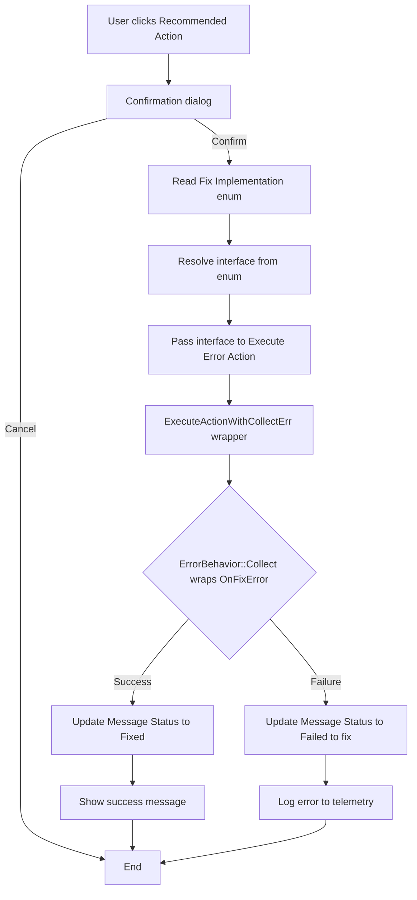

# Business logic

The Error Messages with Recommendations framework transforms logged errors into actionable items. The business logic covers four key workflows: single fix execution, bulk fix processing, error enrichment at log time, and drill-down navigation.

## Single fix execution

When a user clicks a recommended action link, the system follows this execution path:

The confirmation dialog shows the recommended action caption and the original error message, giving users context before applying the fix. The dialog text follows the pattern "Replace with correct value? Original error text here" to reinforce what will change.

After confirmation, the system reads the Error Msg. Fix Implementation enum value and resolves it to an ErrorMessageFix interface instance. The interface reference is passed to the Execute Error Action codeunit, which provides the ErrorBehavior::Collect wrapper.

ExecuteActionWithCollectErr runs in a separate codeunit with ErrorBehavior::Collect and CommitBehavior::Ignore attributes. This isolation ensures that if OnFixError throws an error, it's captured rather than propagating to the UI. The wrapper checks HasCollectedErrors and clears them if present, enabling graceful failure handling.

On success, the Message Status field updates to Fixed and OnSuccessMessage displays an acknowledgment. On failure, the status updates to Failed to fix and the error is logged to telemetry with the Fix Implementation name in custom dimensions.

The same interface instance persists across OnSetErrorMessageProps, OnFixError, and OnSuccessMessage calls. This statefulness allows implementations to cache lookups in the first method and reuse them in later methods, avoiding redundant database queries.

## Bulk fix processing

Bulk operations iterate over selected error records and apply the same execution logic used for single fixes, with additional confirmation and summary dialogs.

The system first counts how many selected errors are fixable. An error is fixable if its Message Status is not Fixed and its Error Msg. Fix Implementation is not blank. The confirmation dialog shows both counts: "Apply recommendations to X out of Y selected errors?"

If the counts match (all selected errors are fixable), the dialog simplifies to "Apply recommendations to X errors?" This distinction helps users understand when some selections won't be processed.

After confirmation, the system iterates each fixable error and calls ExecuteAction. Unlike single fix mode, bulk mode suppresses individual success messages to avoid flooding the UI. Instead, it tracks fixed and failed counts throughout the iteration.

The summary dialog displays final counts: "Recommendations applied: X, Failed to apply: Y". If all fixes succeeded, it shows a simplified message: "All selections were processed." This acknowledgment confirms completion while providing visibility into partial failures.

The bulk workflow respects previously fixed errors. If a user selects 10 errors but 3 are already Fixed, the confirmation shows 7 fixable errors and the iteration skips the 3 Fixed records. This behavior prevents redundant fix attempts and maintains accurate counts.

## Error enrichment

Error enrichment occurs when errors are logged via Error Message Management. The base app logs an error record and fires OnAddSubContextToLastErrorMessage. Fix implementations subscribe to this event and populate the extension fields.

Subscribers use tag-based routing to match their enum value. The tag parameter contains a string representation of the enum name. Each subscriber checks if the tag matches its enum value name before processing the error.

For dimension errors, the enrichment codeunit receives either a Dimension Set Entry record or a Dimension Set ID integer via the VariantRec parameter. The subscriber extracts the sub-context record ID from the variant and stores it in the error record.

After setting the sub-context fields and Error Msg. Fix Implementation enum value, the subscriber resolves the interface and calls OnSetErrorMessageProps to populate Title and Recommended Action Caption. This two-phase initialization ensures all metadata is available before the error appears in the UI.

The enrichment pattern is opt-in. Errors without subscribers appear normally in the Error Messages page, but without recommended action links. This design allows gradual adoption -- fixes can be added for high-impact errors without requiring changes to all error logging code.

## Dimension fixes

The three existing fix implementations all target dimension validation errors on journal lines and documents.

**DimensionCodeSameError** handles cases where a dimension value doesn't match the default dimension's required value. The fix reads the current dimension set from the context record, replaces the incorrect value with the correct one, and writes the updated dimension set ID back to the context record.

**DimensionCodeMustBeBlank** handles cases where a dimension value exists but shouldn't. The fix reads the dimension set, deletes the unwanted dimension entry, and updates the context record with the new dimension set ID that excludes the deleted dimension.

**DimCodeSameButMissingErr** handles cases where a required dimension is missing entirely. The fix creates a new dimension set entry with the default dimension code and value, updates the dimension set ID, and synchronizes Global Dimension 1 Code and Global Dimension 2 Code fields if the added dimension is a global dimension.

All three implementations use RecordRef and FieldRef reflection to read and modify the context record. The Data Type Management codeunit provides FindFieldByName to locate the Dimension Set ID field by name, enabling fixes to work across different table types (Gen. Journal Line, Sales Header, Purchase Line, etc.).

The dimension fixes validate preconditions before applying changes. DimensionCodeSameError checks that the default dimension's Value Posting is Same Code. DimensionCodeMustBeBlank checks for No Code. DimCodeSameButMissingErr verifies that the dimension doesn't already exist in the set. These validations prevent fixes from executing in unexpected contexts.

## Sub-context drill-down

The OnDrillDown Source event enables navigation from error records to their detail records. The page extension subscribes to this event and handles drill-down for Dimension Set Entry sub-contexts.

When a user clicks the Sub-Context Record ID field and it references a Dimension Set Entry, the system dispatches based on the context table number. For Gen. Journal Line contexts, it retrieves the journal line record and calls ShowDimensions, which opens the dimension editing page.

For other table types, it delegates to Check Dimensions codeunit's ShowContextDimensions method, which handles dimension drill-down for a wider range of document types. This fallback pattern ensures drill-down works consistently across all dimension-enabled tables.

The drill-down logic sets IsHandled to true after successfully opening the target page, preventing the base app's default drill-down behavior from executing. This override pattern is common in AL page extensions when specialized navigation logic is required.
