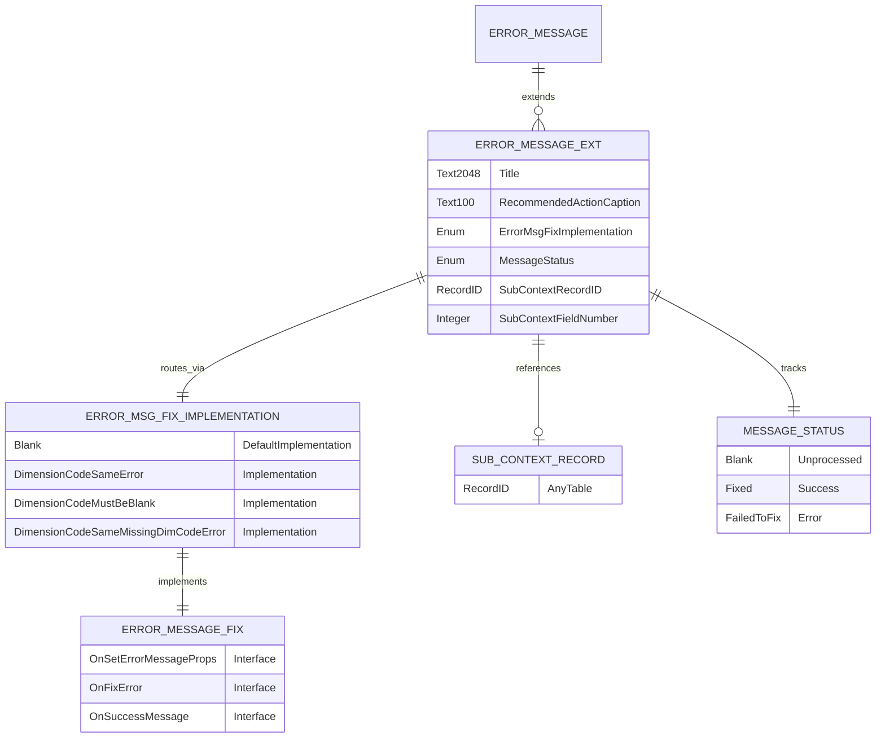

# Data model

The Error Messages with Recommendations app extends the base Error Message table without introducing new tables. The design centers on enriching error records with actionable metadata that enables automated fixes.

## Entity diagram

## Extension fields

The table extension adds six fields to Error Message:

**Title** stores a human-readable error summary. Unlike the base Message field, which contains technical error text, Title provides context-aware descriptions like "Incorrect dimension value" or "Dimension set required".

**Recommended Action Caption** holds the user-facing action text displayed as a clickable link. Examples include "Replace with correct value", "Clear the value", or "Add dimension set". This caption appears in the Error Messages page when a fix is available.

**Error Msg. Fix Implementation** is an extensible enum that routes to the correct fix codeunit. Each enum value maps to a codeunit implementing the ErrorMessageFix interface. The enum uses DefaultImplementation to provide a no-op stub for unhandled cases, ensuring the system never fails on unknown enum values.

**Message Status** tracks fix execution results. The enum supports three states: blank (unprocessed), Fixed (successful execution), and Failed to fix (execution error). The page extension uses this field to show/hide the recommended action link and display fix outcomes.

**Sub-Context Record ID** stores a RecordID pointing to the detail record that triggered the error. For dimension errors, this typically references a Dimension Set Entry record. The RecordID type enables drill-down navigation -- clicking the field opens the referenced record's page.

**Sub-Context Field Number** identifies which field on the sub-context record contains the error. For dimension fixes, this is usually the Dimension Value Code field. The field validates that it's cleared when Sub-Context Record ID is empty, maintaining referential integrity.

## Enum extensibility

Both enums are marked Extensible=true, allowing third-party extensions to add custom fix implementations. The Error Msg. Fix Implementation enum implements the ErrorMessageFix interface, creating a registry of available fixes that can be extended at runtime.

The DefaultImplementation pattern ensures backward compatibility. When an unknown enum value is encountered, the system falls back to a no-op implementation rather than throwing an error. This design allows fixes to be added incrementally without breaking existing error logs.

## Design rationale

The RecordID field type in Sub-Context enables polymorphic references to any table without foreign key constraints. This flexibility is critical for dimension fixes, which must reference Dimension Set Entry records while the context record (Gen. Journal Line, Sales Header, etc.) varies by scenario.

The interface-backed enum pattern separates fix registration from implementation. New fixes require only an enum value and a codeunit -- no changes to the orchestration logic or page extensions. This open architecture contrasts with closed frameworks like e-document connectors, where adding implementations requires modifying core objects.

The separate Title and Recommended Action Caption fields serve distinct UX purposes. Title provides diagnostic context when reviewing errors, while Recommended Action Caption describes the fix action in imperative form. This separation enables clear messaging throughout the fix workflow.
