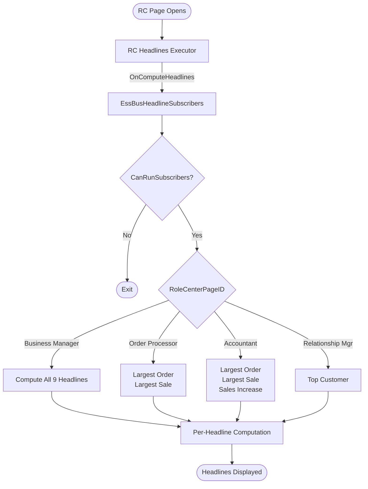
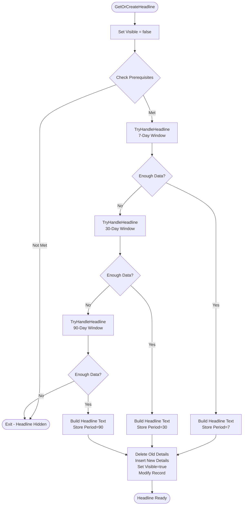

# Business Logic

This document describes the computation flow, time window strategy, and event routing for Essential Business Headlines.

## Computation Trigger

The RC Headlines Executor fires `OnComputeHeadlines` events when a role center page opens. The `EssBusHeadlineSubscribers` codeunit subscribes to this event and routes headline computation based on the `RoleCenterPageID`:

- **Business Manager** -- all 9 headline types
- **Order Processor** -- Largest Order + Largest Sale
- **Accountant** -- Largest Order + Largest Sale + Sales Increase
- **Relationship Manager** -- Top Customer

## Time Window Strategy

Most headlines use a fallback strategy to find sufficient data. The system tries progressively longer time windows until it finds enough data or exhausts all options.

**Standard window sequence:**
1. Try 7-day window (WorkDate - 7 days to WorkDate)
2. If insufficient data, try 30-day window
3. If still insufficient, try 90-day window
4. First successful window is cached (WorkDate + Period stored in headline record)

**Data thresholds:**
- **Items/Resources** -- 3 or more required
- **Orders/Invoices** -- 5 or more required

## Per-Headline Computation Flow

Each headline follows this pattern (using Most Popular Item as example):

1. **GetOrCreateHeadline()** -- Retrieve existing headline record or create new one
2. **Set visible = false** -- Assume failure until proven otherwise
3. **Check prerequisites** -- For Most Popular Item, verify item count >= 3
4. **Try time windows** -- Call `TryHandleMostPopularItem(7)`, then `TryHandleMostPopularItem(30)`, then `TryHandleMostPopularItem(90)`
5. **Execute query** -- Run `BestSoldItemHeadline` query with date filter for the current window
6. **Validate results** -- Ensure 2+ results with different quantities (proves variety)
7. **Build headline text** -- Use `Headlines` codeunit to generate display text
8. **Update details** -- Delete old `HeadlineDetails` records, insert new ones
9. **Finalize** -- Set visible = true, store period, call `Modify()`

If all time windows fail, the headline remains invisible (visible = false).

## Sales Increase Headline

The Sales Increase headline compares invoice counts between two periods:
- **Current period** -- WorkDate back N days (7, 30, or 90)
- **Same period last year** -- Same date range shifted back one year

**Display condition:** Current period invoice count > Last year invoice count

**Requirements:** Both periods must have sales data. If either period has zero invoices, the headline is not shown.

## VAT Headlines

VAT headlines use the reminder period defined in VAT Report Setup:

- **OpenVATReturn** -- VAT return is due soon (within reminder period)
- **OverdueVATReturn** -- VAT return is past due

Each VAT headline stores the `VAT Return Period` RecordId in the headline details table for drill-down navigation.

## Recently Overdue Invoices

This headline finds sales invoices that became overdue yesterday:
- **Due Date** = Yesterday (WorkDate - 1)
- **Amount <> 0** (still open, not fully paid)

## Drilldowns

Each headline has a corresponding `OnDrillDownXXX` method in `EssBusHeadlineSubscribers`. The drill-down flow:

1. Retrieve stored computation period from headline record
2. Rebuild date filter using the same period (7, 30, or 90 days)
3. Apply filter to underlying query or table
4. Open filtered list page (e.g., Item List, Sales Invoice List)

This ensures the drill-down shows exactly the data that was used to compute the headline.

## Invalidation

The `EssBusHeadlineSubscribers` codeunit subscribes to `User Settings.OnUpdateUserSettings`. When language or work date changes:

1. Call `DeleteAll` to remove all headlines for the current user
2. Force recomputation on next role center open

This prevents stale headlines from being displayed after user settings change.

## Guard Conditions

All event subscribers check `CanRunSubscribers()` before executing:
- Verify `GetExecutionContext() = Normal` (not upgrade, not install)
- Check permissions on relevant tables

If guards fail, the subscriber exits silently without computing headlines.
