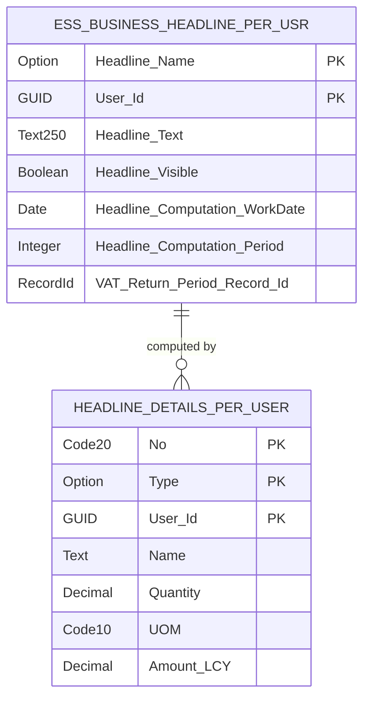
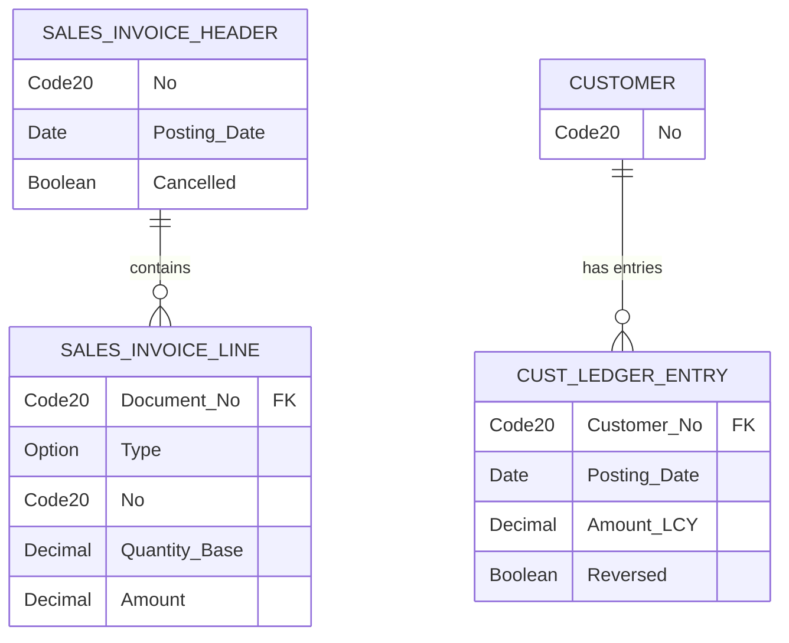

# Data Model

The Essential Business Headlines app uses a per-user caching architecture with efficient SQL aggregation queries to compute and store headline metrics.

## Core Tables

### Headline Cache

The app maintains two user-specific tables that store computed headlines and their drill-down details:

**Ess. Business Headline Per Usr (1436)** stores the computed headline text and visibility state for each user. The table uses a composite primary key of Headline Name (Option 0-8) and User Id (GUID). Each headline tracks its computation date, period (7, 30, or 90 days), and optionally links to a VAT Return Period via RecordId. The GetOrCreateHeadline() method automatically creates records on first access.

**Headline Details Per User (1437)** provides drill-down detail rows for headlines. The primary key combines No (Code[20]), Type (Option: Item/Resource/Customer), and User Id. The Type field drives which detail fields are relevant -- Quantity and UOM display for Item and Resource types, while Amount(LCY) shows for Customer type. This table is ephemeral, deleted and rebuilt during each headline computation.

## Aggregation Queries

The app uses three queries that translate to efficient SQL GROUP BY operations against transactional tables:

**Best Sold Item Headline (1440)** joins SalesInvoiceHeader to SalesInvoiceLine and computes SUM(Quantity Base) grouped by ProductNo. The query filters out cancelled invoices and zero/negative amounts. It serves double duty for both Item and Resource headlines through polymorphic filtering on ProductType.

**Top Customer Headline (1441)** joins Customer to CustLedgerEntry and computes SUM(Amount LCY) grouped by Customer. It excludes reversed entries and zero/negative amounts to ensure only real revenue appears in rankings.

**Sales Increase Headline (1442)** aggregates SalesInvoiceHeader only, computing COUNT(*) of invoices. The app invokes this query twice -- once for the current period and once for the same period last year -- to calculate year-over-year growth percentages.

## User Isolation

Both cache tables key on User Id, ensuring complete per-user isolation. No headline or detail data crosses user boundaries. Each user sees only their own computed metrics, even when multiple users compute the same headline types.

## External References

The VAT Return Period Record Id field in the headline cache provides an optional link to the base app's VAT Return Period table. This field remains nullable and unused for most headline types.
