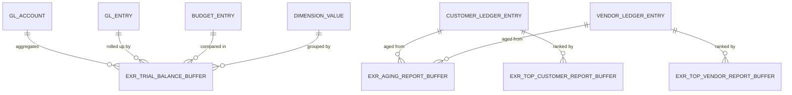

# Excel Reports Data Model

## Overview

The Excel Reports app uses temporary buffer tables exclusively. No data is persisted to the database. Reports execute queries against Business Central transaction tables, load results into memory buffers, perform calculations and aggregations in AL, then export the processed buffers to Excel workbooks with predefined layouts.

## Architecture

## Trial Balance Buffer (4402)

The trial balance buffer is the most complex structure in the app. It stores a multidimensional cube of financial data with approximately 90 fields.

The composite primary key groups data by account, two global dimensions, business unit, and period start date. This allows drill-down from high-level summaries to detailed slices without re-querying the database.

Financial amounts are tracked in parallel currency representations. Each metric (net change, starting balance, ending balance) splits positive and negative movements into separate debit and credit columns. This matches traditional accounting presentation requirements.

Budget comparison fields store both the budget figures and pre-calculated variances. Percentage comparisons are computed during load to avoid runtime formula evaluation in Excel. Prior period variance fields support year-over-year and quarter-over-quarter analysis.

The "All Zero" flag is set by the `CheckAllZero()` procedure after all calculations complete. Reports use this to suppress rows where every amount field is zero, reducing workbook size and improving readability.

Validation triggers on the Amount fields automatically populate the split debit/credit columns. This ensures consistency when buffer records are created programmatically.

Dimension captions use CaptionClass expressions to display user-configured dimension names rather than hardcoded "Dimension 1" labels.

## Aging Report Buffer (4401)

The aging buffer stores open receivables and payables bucketed by age. Each record represents a single customer or vendor ledger entry with its calculated aging period.

The "Aged By" option determines which date field drives the age calculation. Due date aging measures time until payment is contractually due. Posting date aging measures time since the transaction was recorded. Document date aging uses the invoice or bill date. The `OnOverrideAgedBy` event allows extensions to implement custom aging logic.

Period start and end dates define the bucket boundaries. Reporting date fields (month, quarter, year) enable Excel pivot table time-based grouping without date parsing formulas.

Both foreign currency and local currency amounts are preserved. Original amounts show the initial transaction value. Remaining amounts reflect partial payments and adjustments.

## Top Customer and Vendor Buffers (4405, 4404)

These buffers rank trading partners by financial metrics. The structure is intentionally minimal -- primary key, ranking criterion, and two amount fields.

The "Ranking Based On" option determines the sort criterion. For customers, ranking by sales LCY uses total invoiced amount. Ranking by balance LCY uses outstanding receivables. Vendors have equivalent purchase and payable options.

Amount field captions are dynamic. Integration events allow extensions to inject custom metrics and relabel the columns. This supports localized KPIs without modifying the base table structure.

## Query Layer

Seven queries extract data from transaction tables into the buffer structures:

- **EXR Trial Balance** (4405) aggregates GL entries by account and global dimensions
- **EXR Trial Balance BU** (4406) adds business unit grouping to the base trial balance query
- **EXR Trial Balance Budget** (4407) pulls budget entries for variance analysis
- **EXR Top Customer Balance** (4401) and **EXR Top Customer Sales** (4402) aggregate customer ledger entries by balance and invoiced amount
- **EXR Top Vendor Balance** (4403) and **EXR Top Vendor Purchase** (4404) provide equivalent vendor aggregations

Queries execute set-based operations at the SQL layer. This is substantially faster than record iteration in AL for large datasets. The query results populate the buffers, then AL code performs secondary calculations that require business logic or cross-record context.

## Design Rationale

Temporary buffers decouple report generation from operational data structures. Changes to the GL Entry or Customer Ledger Entry tables do not break report layouts. The buffer schema evolves independently based on reporting requirements.

Pre-calculation of variances, percentages, and rollups moves computational cost from Excel formula evaluation to server-side AL execution. Large workbooks with thousands of rows open instantly because cells contain values, not formulas.

The composite primary keys support efficient lookups during incremental calculations. When adding budget variances, the code can retrieve the matching actual amount record by key rather than scanning the entire buffer.

Split debit/credit columns eliminate the need for conditional formatting or formulas to distinguish positive and negative amounts. Excel templates can directly reference the appropriate column for each presentation context.

Integration events at key calculation points allow extensions and localizations to inject custom logic without modifying the base app code. This maintains upgradeability while supporting market-specific requirements.
