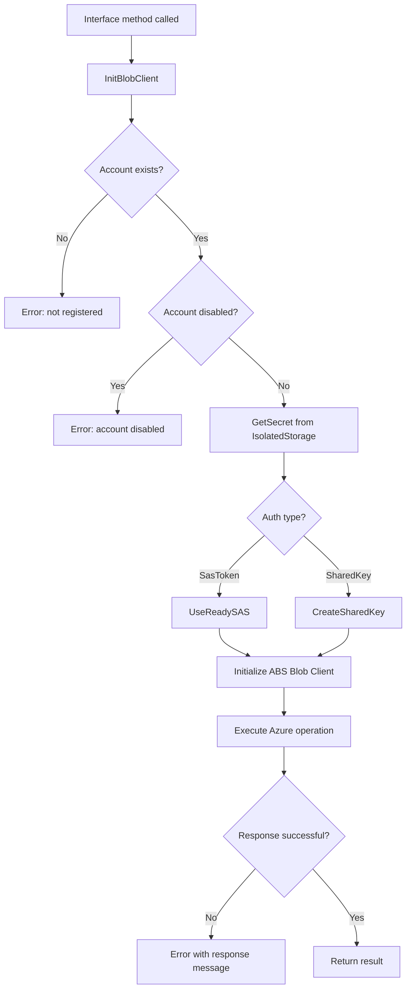
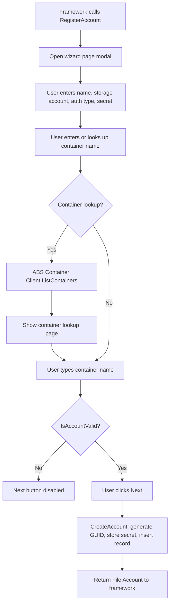
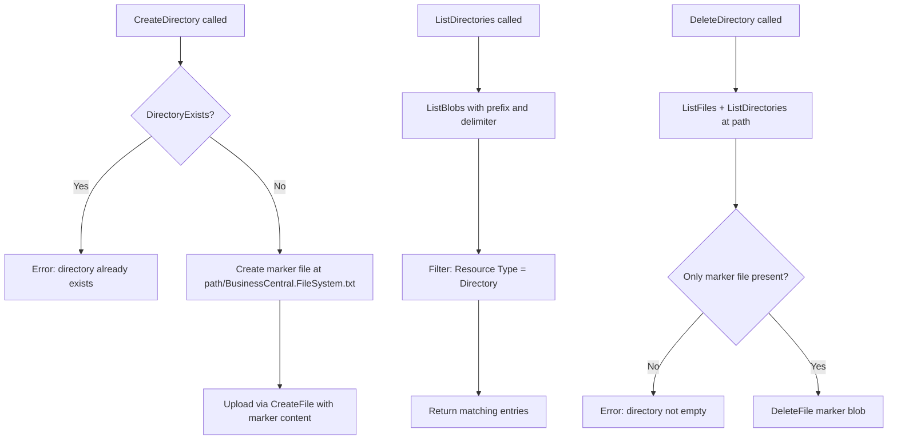

# Business logic

## Core operation pattern

Every file operation in `ExtBlobStoConnectorImpl.Codeunit.al` follows the same structure: initialize the blob client, perform the Azure operation, validate the response. The initialization is the critical gate -- it enforces account existence, disabled-state checks, and secret retrieval before any network call happens.

## Account registration

The registration flow is wizard-driven. The framework calls `RegisterAccount()`, which opens the wizard page modally. The page uses a temporary source table -- nothing is persisted until the user completes the wizard.

The `IsAccountValid()` check requires all three fields -- Name, Storage Account Name, and Container Name -- to be non-empty. The secret is validated only implicitly when the user attempts a container lookup.

## Directory simulation

Azure Blob Storage has no directory concept. The connector fakes it using a marker file named `BusinessCentral.FileSystem.txt`. This is the most surprising part of the implementation.

The marker file content is a human-readable message: "This is a directory marker file created by Business Central. It is safe to delete it." If someone deletes this marker outside of BC, the directory vanishes from BC's perspective even though files at that path still exist in blob storage.

Note that `DeleteDirectory` enforces emptiness by listing both files and subdirectories. The filter `TempFileAccountContent.SetFilter(Name, '<>%1', MarkerFileNameTok)` excludes the marker file itself from the emptiness check.

## Listing and pagination

File and directory listing operations page through results in batches of 500 (`MaxResults(500)` in `InitOptionalParameters`). The `FilePaginationData` codeunit carries the continuation token (`NextMarker`) between calls. After each batch, `ValidateListingResponse` updates the marker and sets `EndOfListing` when no more pages remain.

ListFiles uses the `/` delimiter to scope results to the current directory level and filters out entries with empty `Blob Type` (directory placeholders) and the marker file. ListDirectories omits the delimiter to get prefix-based grouping and filters for `Resource Type::Directory`.

## MoveFile

MoveFile deserves special attention because it is not atomic. The implementation calls `CopyBlob(target, source)` followed by `DeleteBlob(source)`. If the copy succeeds but the delete fails, the file ends up in both locations. The caller gets an error (from the failed delete), but the copy has already completed and will not be rolled back. There is no transaction boundary or compensation logic.
