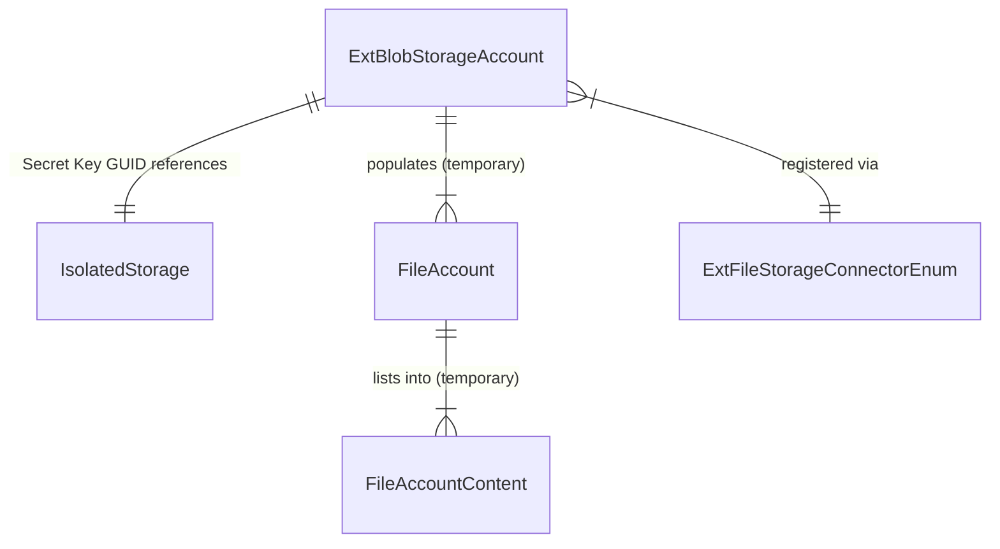

# Data model

## Overview

The connector's persistence is deliberately minimal. A single table (`Ext. Blob Storage Account`, ID 4560) stores the Azure connection configuration. Credentials never touch the database -- they live in IsolatedStorage, referenced by a GUID held in the table. At runtime, the framework passes around temporary `File Account` and `File Account Content` records that are never persisted.

## How secrets work

The `Secret Key` field is a GUID, not a credential. When an account is created, `SetSecret()` generates a new GUID, stores the actual secret text in IsolatedStorage at company scope keyed by that GUID, and saves only the GUID to the table. Every operation retrieves the secret on demand via `GetSecret()` -- the secret is never cached in memory across calls.

The OnDelete trigger cleans up: if the Secret Key GUID is not null and IsolatedStorage contains it, the entry is purged. This prevents orphaned secrets when accounts are deleted.

Company scope means the secret is isolated per-company within a tenant. If you copy a company, the IsolatedStorage entries do not come along -- the accounts will fail to authenticate until secrets are re-entered.

## The Disabled flag

The `Disabled` boolean exists specifically for the sandbox scenario. When a sandbox environment is created from production, the `EnvironmentCleanup::OnClearCompanyConfig` event fires. The connector subscribes to this and sets `Disabled = true` on every non-disabled account. `InitBlobClient()` checks this flag before every operation and errors immediately if the account is disabled. This prevents production credentials (which do survive in IsolatedStorage across environment copy) from being used in sandbox.

## Temporary records at runtime

The framework defines `File Account` and `File Account Content` as tables, but they are always used with `temporary` -- never written to the database. `GetAccounts()` iterates the real `Ext. Blob Storage Account` table and populates temporary `File Account` records. File listing operations populate temporary `File Account Content` records with name, type (file vs. directory), and parent directory. These temporaries exist only for the duration of the framework call.
