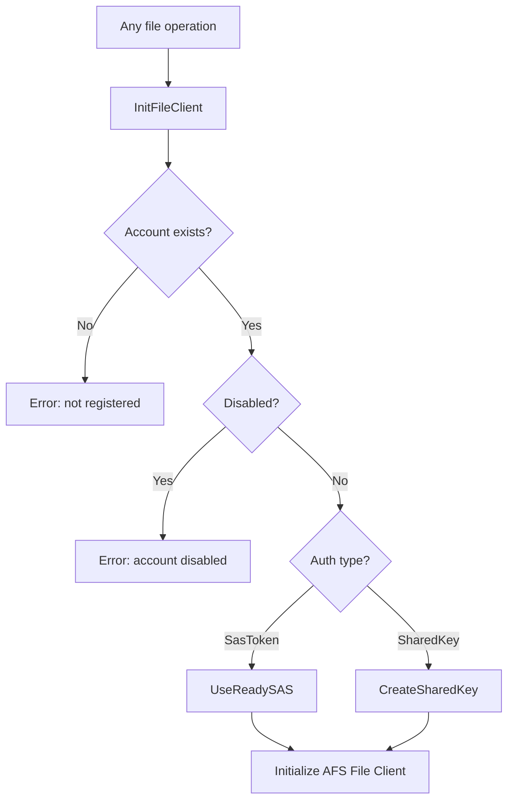
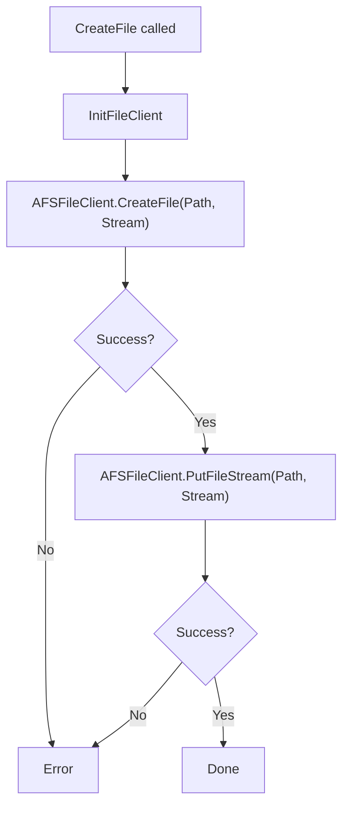

# Business logic

All business logic lives in `ExtFileShareConnectorImpl.Codeunit.al`. The
codeunit is `Access = Internal` -- only the framework and the test app
(via `internalsVisibleTo`) can call it directly.

## InitFileClient -- the gate for every operation

Every file/directory operation goes through `InitFileClient` before
touching Azure. This procedure loads the account record, checks the
`Disabled` flag, retrieves the secret from IsolatedStorage, selects the
auth strategy (SAS or SharedKey), and initializes the `AFS File Client`.
If anything fails here -- missing account, disabled flag, missing secret
-- the operation errors before making any network call.

## File creation -- the two-step protocol

This is the most important behavioral difference from the Blob connector.
Azure File Share's REST API requires you to first allocate a file resource
(with its size) and then upload the content in a separate call. The Blob
connector does both in a single `PutBlobBlockBlobStream` call.

The risk here is that if the first call succeeds but the second fails,
you are left with an allocated empty file on the share. There is no
cleanup logic.

## Move vs copy -- atomic vs constructed

MoveFile delegates to `AFSFileClient.RenameFile`, which is a native
server-side rename. This is atomic -- either the rename happens or it
does not. The Blob connector cannot do this because Azure Blob Storage
has no rename API; it must copy then delete, which can leave orphaned
copies if the delete fails.

CopyFile is more complex than you might expect. The Azure File Share copy
API requires the source to be specified as a full URI, not a relative
path. So `CopyFile` calls `CreateUri` to construct
`https://{storageAccount}.file.core.windows.net/{fileShare}/{escapedPath}`,
URL-encoding the source path with `Uri.EscapeDataString()`. The target is
just a path. This asymmetry is an Azure API requirement, not a design
choice.

## Existence checks -- two different strategies

FileExists and DirectoryExists use different approaches because the Azure
File Share API exposes different capabilities for files and directories.

`FileExists` calls `GetFileMetadata` -- a direct metadata lookup on the
file. If it succeeds, the file exists. If the error message contains
`'404'`, the file does not exist. Any other error propagates.

`DirectoryExists` cannot use a metadata call (the API does not support
directory metadata the same way). Instead it calls `ListDirectory` with
`MaxResults(1)` on the target path. A successful response means the
directory exists. A 404 means it does not. This is slightly more
expensive than a metadata call but is the only reliable option.

Both procedures use string matching on `'404'` in the error message to
distinguish "not found" from other failures. This is fragile but matches
the pattern used across all connectors in the framework.

## Directory operations -- no marker files

This is the headline simplification over the Blob connector. Azure File
Shares have real directories, so:

- `CreateDirectory` just calls `AFSFileClient.CreateDirectory(Path)`,
  with a pre-check via `DirectoryExists` to give a clean error message
  instead of a confusing Azure API error.
- `DeleteDirectory` just calls `AFSFileClient.DeleteDirectory(Path)`. No
  need to find and delete marker files.
- `ListDirectories` and `ListFiles` use the same `GetDirectoryContent`
  helper, then filter by `Resource Type` (Directory vs File).

## Listing and pagination

`GetDirectoryContent` is the shared listing engine. It initializes the
file client, enforces path constraints via `CheckPath` (trailing slash,
2048 char max), sets `MaxResults(500)` and a continuation marker, then
calls `AFSFileClient.ListDirectory`. The response is validated by
`ValidateListingResponse`, which updates the pagination marker and sets
an end-of-listing flag when the marker is empty.

This is the same marker-based pagination pattern as the Blob connector.
The page size of 500 is hardcoded.

## Account registration wizard

The wizard (`ExtFileShareAccountWizard.Page.al`) is a single-page
NavigatePage. The user fills in account name, storage account name, auth
type, secret, and file share name. There is no share lookup -- the user
must know the file share name. Clicking "Next" calls
`CreateAccount`, which generates a GUID, writes the secret to
IsolatedStorage, and inserts the record.

The "Back" button just closes the page without saving. Validation is
minimal -- `IsAccountValid` checks that three text fields are non-empty.
