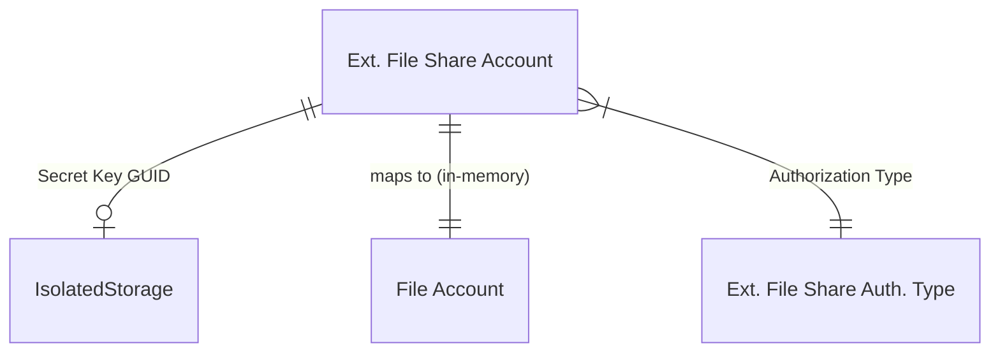

# Data model

## Overview

This connector has the simplest possible data model: one table and one
secret in IsolatedStorage. There are no table extensions, no
relationships to other tables, and no intermediate records.

## How secrets work

The table stores a GUID in the `Secret Key` field, not the actual secret.
The real credential (SAS token or shared key) lives in IsolatedStorage at
company scope, keyed by that GUID. This is the standard BC pattern for
credential storage -- the GUID is an opaque handle.

When an account is deleted, the OnDelete trigger purges the
IsolatedStorage entry. When a secret is first set (via `SetSecret`), the
procedure generates a new GUID if one does not already exist, then writes
the secret to IsolatedStorage. There is no migration path for rotating
secrets -- calling `SetSecret` again overwrites the value in place using
the same GUID.

## The "File Account" mapping

`GetAccounts` in the implementation codeunit reads every `Ext. File Share
Account` record and maps it into a temporary `File Account` record that
the framework understands. This mapping happens in memory on every call --
there is no persisted `File Account` table owned by this connector.

## Disabled flag

The `Disabled` boolean is set to true by the environment cleanup
subscriber when a sandbox is created. `InitFileClient` checks this flag
on every operation and errors if the account is disabled. The flag is
user-visible and editable on the account card page, so an admin can
manually re-enable an account in a sandbox if they provide valid
credentials.
