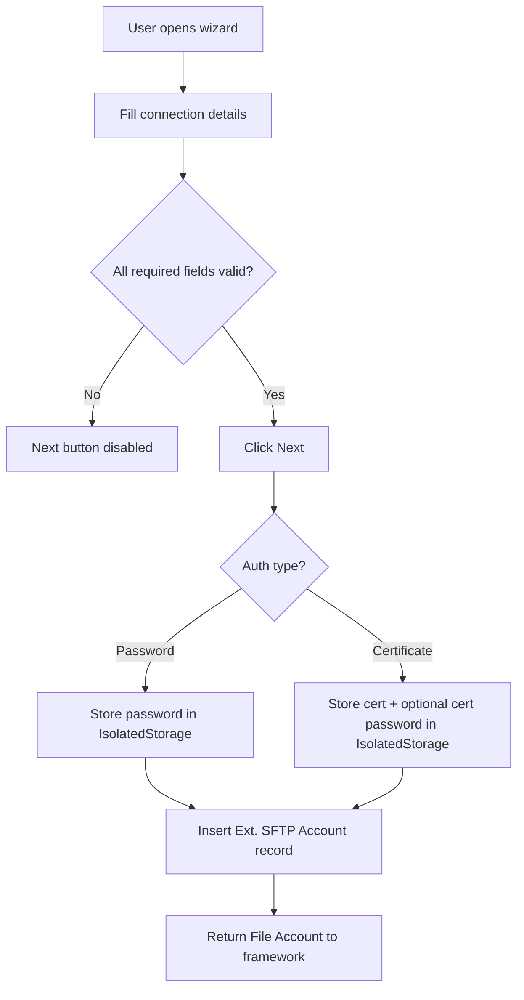

# Business logic

## Overview

The SFTP connector has two main responsibilities: managing SFTP accounts (registration, configuration, deletion) and executing file/directory operations against those accounts. All business logic lives in `ExtSFTPConnectorImpl.Codeunit.al`, which implements the `External File Storage Connector` interface. The account table (`ExtSFTPAccount.Table.al`) handles credential storage, and the wizard page (`ExtSFTPAccountWizard.Page.al`) guides account creation.

## Account registration

Account creation uses a wizard page (`Ext. SFTP Account Wizard`) that runs on a temporary record. The wizard collects all required fields -- name, hostname, port, fingerprints, auth type, username, and credentials -- and validates them via `IsAccountValid` (all required fields non-empty). The "Next" action calls `CreateAccount`, which:

1. Copies fields from the temporary record to a new `Ext. SFTP Account` record
2. Generates a new Guid as the account ID
3. Stores credentials in IsolatedStorage based on the auth type (password or certificate + optional cert password)
4. Inserts the record
5. Returns a `File Account` record with the new account's ID, name, and connector type

The wizard returns this `File Account` to the framework via `GetAccount`, which the framework uses to complete registration.

## File and directory operations

Every operation follows the same three-step pattern implemented in `Ext. SFTP Connector Impl`:

1. **InitPath** -- combines the account's `Base Relative Folder Path` with the caller's relative path using `CombinePath`. This enforces path sandboxing: all operations are scoped under the configured base directory. The combine logic trims trailing/leading slashes to avoid double separators.

2. **InitSFTPClient** -- loads the account record, checks the `Disabled` flag (errors if true), adds host fingerprints, then initializes the SFTP Client with credentials based on auth type. For password auth, it passes username + password. For certificate auth, it creates an InStream from the Base64-decoded certificate and optionally includes the certificate password.

3. **Execute + Disconnect** -- calls the appropriate SFTP Client method, then immediately disconnects. If the response indicates an error, `ShowError` raises an AL error with the SFTP server's error message.

There is no connection pooling or session reuse. Each file operation opens a new SSH connection and closes it after one operation. This is simple but means multiple sequential operations (e.g., listing then downloading) each pay the SSH handshake cost.

### Notable operation details

- **CopyFile** has no native SFTP equivalent. The connector implements it by calling `GetFile` (download to TempBlob InStream) then `CreateFile` (re-upload from that stream). This means the entire file passes through BC server memory.
- **MoveFile** uses native SFTP rename, which is efficient (no data transfer).
- **DirectoryExists** delegates to `FileExists`, and **DeleteDirectory** delegates to `DeleteFile`. SFTP treats directories as filesystem entries, so these are equivalent at the protocol level.
- **ListFiles** and **ListDirectories** both call `SFTPClient.ListFiles` and then filter by `Is Directory` (false for files, true for directories). The directory listing also excludes `.` and `..` entries. Both set `FilePaginationData.SetEndOfListing(true)` -- the connector always returns all results in one page.
- **GetFile** has a platform workaround: the InStream from `SFTPClient.GetFileAsStream` becomes invalid after crossing the interface boundary, so the content is copied through an `HttpContent` intermediary.

## Environment cleanup

The codeunit subscribes to `EnvironmentCleanup.OnClearCompanyConfig`. When a sandbox environment is created from a production environment, this subscriber sets `Disabled = true` on all active SFTP accounts. This is a safety measure -- without it, a sandbox could accidentally connect to production SFTP servers and modify files.

The subscriber is simple: it filters for `Disabled = false` and calls `ModifyAll(Disabled, true)`. There is no undo mechanism in code -- an admin must manually re-enable accounts on the sandbox if needed (with different SFTP server details).
