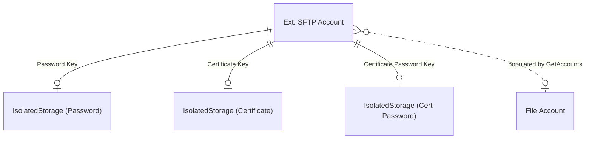

# Data model

## Overview

The SFTP connector has a single table (`Ext. SFTP Account`) that stores everything needed to connect to an SFTP server. Credentials are not stored in the table itself -- they live in BC's IsolatedStorage, referenced by Guid keys. The connector populates the framework's `File Account` table on demand (via `GetAccounts`), but there is no foreign key between them.

## Account and secrets

The `Ext. SFTP Account` table (4621) uses a Guid primary key (`Id`), not an auto-increment or code field. This Guid becomes the `Account Id` in the framework's `File Account` record.

### Secret storage pattern

Three fields -- `Password Key`, `Certificate Key`, and `Certificate Password Key` -- are Guid pointers into IsolatedStorage (Company scope). This pattern keeps credentials out of the database and out of backups. When a secret is set, a new Guid is generated (if one doesn't exist), and the value is written to IsolatedStorage under that Guid. When the account is deleted, the `OnDelete` trigger calls `TryDeleteIsolatedStorageValue` for all three keys.

Certificates (SSH private keys) are stored as Base64-encoded text. The `GetCertificate` procedure decodes the Base64 back into a binary stream via `TempBlob`. Supported key file formats are `.pk`, `.ppk`, and `.pub`.

### Authentication type

The `Ext. SFTP Auth Type` enum (4621) has two values: `Password` (0) and `Certificate` (1). This enum is `Extensible = false` -- no third-party auth methods can be added. The auth type controls which credential fields are relevant and which UI groups are visible on the account card and wizard.

Setting credentials for one auth type automatically clears the other. `SetPassword` calls `ClearCertificateAuthentication` (deletes cert + cert password from IsolatedStorage and clears the Guid keys). `SetCertificate` calls `ClearPasswordAuthentication` (deletes password from IsolatedStorage and clears the Guid key). This ensures only one set of credentials exists at any time.

### Fingerprints

The `Fingerprints` field stores comma-separated host fingerprints. Each fingerprint must be prefixed with `sha256:` or `md5:`. These are parsed by `AddFingerprints` in the implementation codeunit and passed to the SFTP Client module before connecting. An invalid prefix causes an immediate error.

### Disabled flag

The `Disabled` boolean is set automatically by the environment cleanup event subscriber when a sandbox is created from production. A disabled account cannot be used for file operations -- `InitSFTPClient` checks this flag and errors immediately if true.
