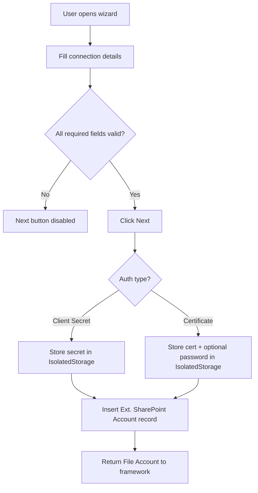

# Business logic

## Overview

The SharePoint connector has two responsibilities: managing SharePoint account configurations and executing file/directory operations against SharePoint Online. All business logic lives in `ExtSharePointConnectorImpl.Codeunit.al`, which implements the `External File Storage Connector` interface. The account table handles credential storage, and the wizard page guides initial account creation.

## Account registration

Account creation uses a wizard page (`Ext. SharePoint Account Wizard`) running on a temporary record. The wizard collects: account name, tenant ID, client ID, authentication type, credentials (client secret or certificate + optional password), SharePoint URL, and base folder path. Each field validates via `IsAccountValid` (all required fields non-empty, tenant/client IDs non-null). The "Next" action calls `CreateAccount`, which:

1. Copies fields from the temporary record to a new `Ext. SharePoint Account` record
2. Generates a new Guid as the account ID
3. Stores credentials in IsolatedStorage based on auth type
4. Inserts the record
5. Returns a `File Account` record to the framework

## SharePoint client initialization

`InitSharePointClient` is called before every file operation. It loads the account, checks the `Disabled` flag (errors if true), then dispatches based on auth type:

- **Client Secret**: calls `SharePointAuth.CreateAuthorizationCode` with the tenant ID, client ID, secret (fetched from IsolatedStorage), and the SharePoint resource scope (`00000003-0000-0ff1-ce00-000000000000/.default`).
- **Certificate**: calls `SharePointAuth.CreateClientCredentials` with the tenant ID, client ID, certificate stream (decoded from Base64 in IsolatedStorage), optional certificate password, and the same scope.

The resulting authorization object is passed to `SharePointClient.Initialize` along with the account's SharePoint URL.

## Path composition

This is the most complex part of the connector. SharePoint REST API requires server-relative URLs like `/sites/ProjectX/Shared Documents/Reports/file.pdf`. The `InitPath` procedure builds these from three inputs:

1. **SharePoint URL** (e.g., `https://contoso.sharepoint.com/sites/ProjectX`) -- `GetSitePathFromUrl` parses this via the `Uri` codeunit to extract `/sites/ProjectX`
2. **Base Relative Folder Path** (e.g., `Shared Documents`) -- configured on the account
3. **Caller's relative path** (e.g., `Reports/file.pdf`) -- passed to each file operation

These are combined with `CombinePath` (handles slash normalization), then the site path is prepended if not already present. Helper procedures `GetParentPath` and `GetFileName` split paths at the last `/` for operations like `CreateFile` (which needs the parent folder and filename separately for `SharePointClient.AddFileToFolder`).

## File and directory operations

Every operation follows the same pattern: `InitPath` to compose the server-relative URL, `InitSharePointClient` to get an authenticated client, call the appropriate `SharePointClient` method, check the boolean return value, and call `ShowError` (which reads `SharePointClient.GetDiagnostics().GetErrorMessage()`) if it failed.

### Notable operation details

- **CopyFile** downloads the source file to a TempBlob InStream via `GetFile`, then re-uploads via `CreateFile`. The entire file passes through BC server memory.
- **MoveFile** does the same as CopyFile, then deletes the source file. This is a three-step operation (download, upload, delete) -- not atomic. A failure during upload or delete leaves partial state.
- **FileExists** has no direct API equivalent. The connector calls `ListFiles` on the parent directory, then iterates results checking if `ServerRelativeUrl` matches the target path. This means checking existence requires loading the full directory listing.
- **DirectoryExists** uses `SharePointClient.FolderExistsByServerRelativeUrl` -- unlike FileExists, this has a dedicated API call.
- **ListDirectories** filters results by the `SharePoint Folder` record type (not `SharePoint File`), similar to how ListFiles filters.
- **GetFile** wraps the downloaded stream through an HttpContent intermediary due to a platform stream lifetime issue.

## Environment cleanup

The codeunit subscribes to `EnvironmentCleanup.OnClearCompanyConfig`. When a sandbox is created from production, the subscriber sets `Disabled = true` on all active SharePoint accounts. This prevents sandbox environments from accidentally modifying files on production SharePoint sites. There is no automated undo -- admins must manually re-enable accounts.
