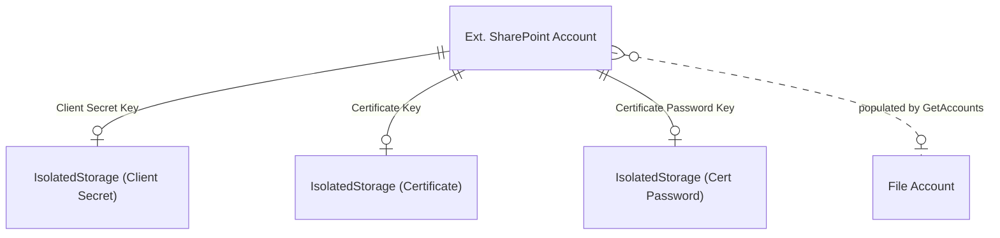

# Data model

## Overview

The SharePoint connector has a single table (`Ext. SharePoint Account`) that stores everything needed to connect to a SharePoint Online site via OAuth. Like the other file storage connectors, credentials live in IsolatedStorage rather than the table itself. The connector populates the framework's `File Account` table on demand via `GetAccounts`, but there is no foreign key between them.

## Account and secrets

The `Ext. SharePoint Account` table (4580) uses a Guid primary key (`Id`). This Guid becomes the `Account Id` in the framework's `File Account` record. The table also stores the SharePoint site URL, a base relative folder path (scoping all operations to a subdirectory), and Azure AD identifiers (Tenant Id and Client Id).

### Secret storage pattern

Three fields -- `Client Secret Key`, `Certificate Key`, and `Certificate Password Key` -- are Guid pointers into IsolatedStorage (Company scope). When a secret is set, a new Guid is generated if one doesn't exist, and the value is written to IsolatedStorage. The `OnDelete` trigger calls `TryDeleteIsolatedStorageValue` for all three keys. Certificates (.pfx/.p12) are stored as Base64-encoded SecretText.

### Authentication type

The `Ext. SharePoint Auth Type` enum (4585) has two values: `Client Secret` (0, default) and `Certificate` (1). This enum is `Extensible = false`. The auth type controls which OAuth flow is used during `InitSharePointClient`:

- **Client Secret** -- calls `SharePointAuth.CreateAuthorizationCode(TenantId, ClientId, Secret, Scopes)`
- **Certificate** -- calls `SharePointAuth.CreateClientCredentials(TenantId, ClientId, Certificate, Password, Scopes)`

Setting credentials for one auth type clears the other. `SetClientSecret` calls `ClearCertificateAuthentication`, and `SetCertificate` calls `ClearClientSecretAuthentication`. This ensures only one set of credentials exists at any time.

### Disabled flag

The `Disabled` boolean is automatically set to `true` by the environment cleanup event subscriber when a sandbox is created from production. A disabled account errors immediately in `InitSharePointClient`.
