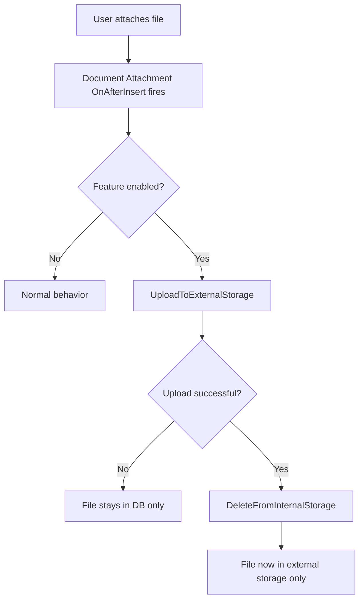

# Business logic

## Overview

The app has three layers of behavior: automatic event-driven offload (transparent to users), manual bulk operations (sync and migration reports), and File Scenario lifecycle hooks (framework integration). All file operations flow through `DAExternalStorageImpl.Codeunit.al`, which is the single point of contact with the External File Storage framework.

## Automatic offload

The core value proposition -- when enabled, document attachments are automatically moved to external storage without user intervention.

The `OnAfterInsertEvent` subscriber calls `UploadToExternalStorage`, which exports the attachment content from the Media field to a stream, generates a unique file path, and calls `ExternalFileStorage.CreateFile`. On success, it calls `DeleteFromInternalStorage`, which deletes the `Tenant Media` record and sets `Stored Internally = false`. The attachment record stays in the Document Attachment table -- only the binary content moves.

### Transparent read

When any BC code accesses attachment content, event subscribers intercept and fetch from external storage:

- **OnBeforeExportToStream** -- intercepts `ExportToStream` calls (used by downloads, previews). If the file is external-only (`Stored Internally = false`, `Stored Externally = true`, no Document Reference ID), downloads from external storage and sets `IsHandled = true`.
- **OnBeforeGetAsTempBlob** -- same pattern for code that loads attachments into memory via TempBlob.
- **OnBeforeHasContent** -- reports `true` if the file exists in external storage, even though the DB has no content.
- **OnBeforeGetContentType** -- provides MIME type based on file extension (maps common types like pdf, docx, xlsx, etc.) when the file is external-only.

This means reports, factboxes, REST APIs, and other BC code that reads Document Attachments continue to work without modification.

### Auto-delete

The `OnAfterDeleteEvent` subscriber handles cleanup when an attachment is deleted from BC:

1. Checks if the "Delete from External Storage" setting is enabled
2. Checks if the file is stored externally
3. Checks the `Skip Delete On Copy` flag -- if set (by the Document Attachment Mgmt copy handler), skips deletion and clears the flag
4. Calls `DeleteFromExternalStorage`, which has an additional safety check: if the file originated from a different environment/company (detected via Source Environment Hash), it only clears the reference without deleting the actual file

## Bulk sync

The `DA External Storage Sync` report (8752) provides bidirectional bulk synchronization:

- **To External Storage** -- finds all attachments with `Stored Externally = false`, uploads each one. In "Move" mode, also deletes the DB copy. Supports `MaxRecordsToProcess` for batching large sets.
- **To Internal Storage** -- finds all attachments with `Stored Externally = true`, downloads each one back to the DB. In "Move" mode (only processes files where `Stored Internally = false`), also deletes the external copy.

Both directions commit after each record to prevent re-processing on connection failures. A progress dialog shows status during interactive runs. Telemetry distinguishes manual (UI) from automatic (Job Queue) runs.

## Cross-environment migration

The `DA External Storage Migration` report (8753) handles files that originated in a different tenant, environment, or company:

1. Finds all externally stored attachments
2. For each, compares `Source Environment Hash` against `GetCurrentEnvironmentHash()`
3. If different: downloads from old path, generates new path under current environment hash, uploads to new location, updates the record
4. The old file is NOT deleted (can be cleaned up manually)

This is needed when data is restored from backup to a different environment or when records are moved between companies.

## File Scenario lifecycle

The codeunit implements the `File Scenario` interface with four hooks:

- **BeforeAddOrModifyFileScenarioCheck** -- when an admin assigns a storage account to the "Doc. Attach. - External Storage" scenario, this hook checks if files already exist (blocks reassignment if so) and opens the setup page for configuration.
- **GetAdditionalScenarioSetup** -- opens the `DA External Storage Setup` page in modal mode.
- **BeforeDeleteFileScenarioCheck** / **BeforeReassignFileScenarioCheck** -- prevents removing or reassigning the scenario account if uploaded files exist. This avoids orphaning files by losing the account reference.

## Path generation

`GetFilePathWithRootFolder` builds the unique file path:

1. Generates a unique filename: `{OriginalName}-{NewGuid}.{Extension}`
2. Gets the table name via `GetTableNameFolder` (with TryFunction fallback to `Table_{ID}`)
3. Gets the current environment hash
4. Gets the root folder from setup
5. Ensures all intermediate folders exist via `EnsureFolderExists` (checks `DirectoryExists`, creates if needed)
6. Combines: `RootFolder/EnvironmentHash/TableName/UniqueFileName`

The resulting path is stored in `External File Path` on the Document Attachment record and is used for all subsequent operations.
