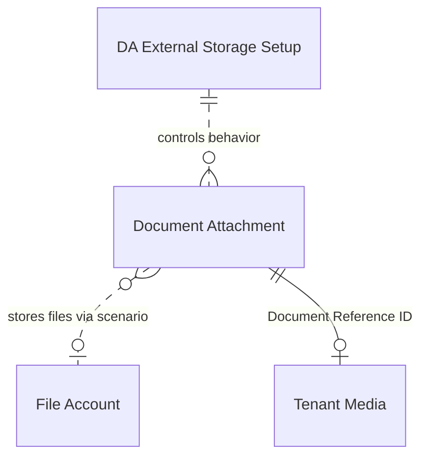

# Data model

## Overview

The app extends BC's existing Document Attachment table with external storage tracking fields and adds a singleton setup table. There are no new standalone tables -- the design integrates into the existing Document Attachment data model rather than creating a parallel one.

## Configuration and attachments

### Setup table

`DA External Storage Setup` (table 8750) is a singleton -- its primary key is a fixed `Code[10]` field, ensuring only one configuration record exists. Key fields:

- **Enabled** -- master toggle. Validation requires a disclaimer confirmation on first enable. Cannot be set to `false` if `Has Uploaded Files` (a FlowField) is `true`.
- **Delete from External Storage** -- controls whether deleting an attachment in BC also deletes the external copy. Default is `true`.
- **Root Folder** -- base path in external storage. Set via an interactive folder browser (`SelectRootFolder` calls `ExternalFileStorage.SelectAndGetFolderPath`). Changing this after files are uploaded shows a warning.
- **Has Uploaded Files** -- FlowField that checks if any Document Attachment has `Stored Externally = true`. Used as a safety gate for disabling the feature.
- **Job Queue Entry ID** -- reference to a scheduled job for automatic sync.

### Document Attachment extension

The table extension (ID 8750) adds six fields to the standard `Document Attachment` table:

- **Stored Externally** (Boolean) -- is the file in external storage? Set by `UploadToExternalStorage`, cleared by `DeleteFromExternalStorage`.
- **External Upload Date** (DateTime) -- when the upload happened. Audit trail.
- **External File Path** (Text[2048]) -- full path in external storage. Format: `RootFolder/EnvironmentHash/TableName/FileName-GUID.ext`. This is the key field -- it's what `GetFile` and `DeleteFile` use to locate the file.
- **Stored Internally** (Boolean, InitValue=true) -- is the file in the BC database (Tenant Media)? All new attachments start as `true`. Set to `false` by `DeleteFromInternalStorage` (which also clears Document Reference ID).
- **Source Environment Hash** (Text[32]) -- MD5 hash of TenantId|EnvironmentName|CompanySystemId at the time of upload. Used to detect when a file originated in a different environment/company and needs migration.
- **Skip Delete On Copy** (Boolean) -- transient flag set during attachment copy operations to prevent the `OnAfterDeleteEvent` subscriber from deleting a shared external file.

The two helper procedures `MarkAsNotUploadedToExternal` and `MarkAsDeletedInternally` encapsulate the field-clearing logic for their respective scenarios.

### File path structure

Files are stored at: `{RootFolder}/{EnvironmentHash}/{TableName}/{FileName}-{GUID}.{Extension}`

- **RootFolder** -- from setup, optional. If empty, paths start at EnvironmentHash.
- **EnvironmentHash** -- 32-character MD5 hex string. Different per tenant, environment, and company.
- **TableName** -- the name of the table the attachment belongs to (e.g., `Sales_Header`). Spaces become underscores, invalid characters are stripped. Falls back to `Table_{ID}` if the table no longer exists.
- **FileName-GUID.ext** -- original filename with a GUID appended for uniqueness.

This structure means you can browse external storage and see files organized by environment and table -- useful for troubleshooting and manual cleanup.
