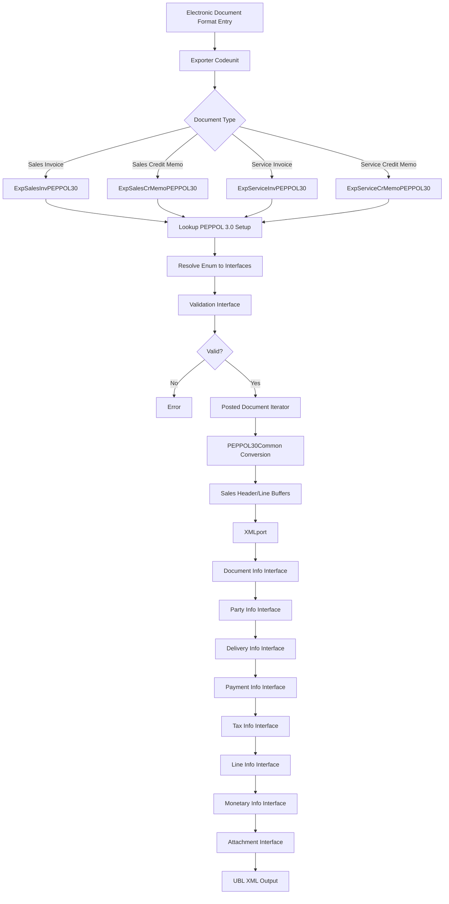

# PEPPOL 3.0 Business Logic

## Export Pipeline

The PEPPOL 3.0 export process follows a multi-stage pipeline from posted document to UBL XML file. The following flowchart illustrates the complete flow:

### Pipeline Stages

**1. Trigger:** The export process begins when the Electronic Document Format system calls an exporter codeunit based on the document type and format selected.

**2. Format Resolution:** The exporter looks up the PEPPOL 3.0 Setup table to determine which enum value to use (sales or service format). This enum value provides all 10 interface implementations.

**3. Validation:** Before any data conversion occurs, the Validation interface runs document-level checks to ensure the data meets PEPPOL requirements. If validation fails, the export terminates with an error.

**4. Document Iteration:** The Posted Document Iterator interface locates the specific posted document records to export. For sales documents, this retrieves from Sales Invoice Header/Line or Sales Cr.Memo Header/Line. For service documents, it retrieves from Service Invoice Header/Line or Service Cr.Memo Header/Line.

**5. Data Conversion:** PEPPOL30Common converts the posted document records into Sales Header and Sales Line temporary buffers using RecordRef.SetTable. This standardizes the data structure regardless of source document type.

**6. XML Generation:** The appropriate XMLport (Sales Invoice, Sales Credit Memo, Service Invoice, or Service Credit Memo) generates UBL XML by calling each interface method in sequence to populate the XML elements.

**7. Output:** The completed UBL XML document is written to a file or stream for transmission.

## Validation Logic

The validation layer ensures that documents meet PEPPOL BIS 3.0 requirements before export. Two validation codeunits implement the Validation interface:

- **PEPPOL30SalesValidation** -- For sales invoices and credit memos
- **PEPPOL30ServiceValidation** -- For service invoices and credit memos

### Validation Rules

**Currency Code:** Must be a 3-character ISO 4217 code. Empty values are rejected.

**Country/Region Code:** Must be a 2-character ISO 3166-1 alpha-2 code for all party addresses (customer, ship-to, company information). Empty values are rejected.

**Ship-To Address:** Must not be empty for sales documents. At minimum, the ship-to name or address fields must contain data.

**Unit of Measure:** All document lines with a UoM must have an International Standard Code defined in the Unit of Measure table. This ensures proper mapping to UN/ECE Recommendation 20 codes in the UBL output.

**VAT Category Consistency:** VAT categories must be consistent with VAT rates:
- Categories Z (zero-rated), E (exempt), AE (reverse charge), K (intra-community), and G (free export goods) must have a 0% VAT rate
- Category S (standard rate) must have a positive VAT rate

**Single Outside-Scope Breakdown:** Only one VAT category breakdown can be marked as outside scope (category O). Multiple outside-scope breakdowns are rejected.

**General Field Presence:** Various mandatory fields are checked for presence (customer no., posting date, document no., etc.).

If any validation fails, the exporter raises an error with a specific message indicating which rule was violated.

## Document Conversion

The PEPPOL30Common codeunit handles the conversion of posted documents to the working buffer format. This conversion is necessary because:
- Sales and service documents have different table structures
- XMLports expect a consistent data format
- Additional processing (line filtering, rounding detection) is needed

### Conversion Process

**RecordRef Transfer:** The core conversion uses `RecordRef.SetTable` to copy matching fields from the posted document headers and lines to Sales Header and Sales Line buffers. This handles all standard fields like amounts, dates, customer information, and line details.

**Line Filtering:** During line conversion, the process excludes lines with blank type. These represent text or comment lines that do not contribute to monetary totals and are handled separately in the XML generation.

**Invoice Rounding Detection:** The process identifies invoice rounding lines by checking the Type field and G/L Account number against the setup in General Ledger Setup. Rounding lines receive special handling in the monetary totals section.

**Attachment Collection:** The process gathers document attachments from the Document Attachment table and makes them available through the Attachment interface. Attachments can be embedded in the UBL XML or referenced externally.

**Extended Text Handling:** For lines with extended text enabled, the process retrieves extended text lines from the appropriate tables and includes them in the line description.

## VAT Handling

VAT processing is one of the most complex aspects of PEPPOL export because it must map Business Central's VAT posting setup to PEPPOL's standardized tax categories and exemption reasons.

### VAT Category Mapping

The PEPPOL 3.0 standard uses UN/ECE UNCL5305 tax category codes:

| PEPPOL Category | Code | BC Scenario | VAT Rate |
|-----------------|------|-------------|----------|
| Standard rate | S | Normal VAT | Positive |
| Zero rated | Z | Zero-rated goods | 0% |
| Exempt | E | Exempt supplies | 0% |
| Reverse charge | AE | Reverse charge | 0% |
| Intra-community | K | EU services | 0% |
| Free export goods | G | Export outside EU | 0% |
| Outside scope | O | Non-VAT supplies | 0% |

### Category Determination Logic

The PEPPOL30Impl codeunit implements complex logic to determine the correct category:

**1. Reverse Charge:** If the VAT posting setup has "Reverse Charge VAT" enabled, the category is AE regardless of other settings.

**2. EU Service:** If the VAT calculation type is "Reverse Charge VAT" and the service type is "EU Services", the category is K.

**3. Standard Rate:** If the VAT rate is positive (greater than 0), the category is S.

**4. Zero-Rated:** If the VAT rate is 0% and the transaction is standard domestic VAT, the category is Z.

**5. Exempt:** If the VAT rate is 0% and the transaction is marked as exempt in the posting setup, the category is E.

**6. Free Export:** If the VAT rate is 0% and the customer is outside the EU, the category is G.

**7. Outside Scope:** If the VAT rate is 0% and none of the above apply, the category is O.

### Exemption Reasons

For categories AE, E, K, and G, the PEPPOL standard requires an exemption reason code and text. The PEPPOL30Impl codeunit populates these fields based on the VAT posting setup and document context:

- **Reverse Charge (AE):** Reason code "vatex-eu-ae" with text "Reverse charge"
- **Exempt (E):** Reason code from VAT posting setup or "vatex-eu-e" with exemption text
- **Intra-community (K):** Reason code "vatex-eu-ic" with text "Intra-community supply"
- **Free Export (G):** Reason code "vatex-eu-g" with text "Export outside the EU"

The exemption text is populated from the Tax Exemption Reason field in the VAT posting setup if available, otherwise from standard PEPPOL text.

### VAT Breakdown Calculation

The Tax Info interface calculates VAT breakdown by grouping document lines by VAT category and rate:

1. **Group Lines:** Lines are grouped by VAT identifier, VAT percentage, and determined category
2. **Calculate Taxable Amount:** Sum of line amounts for each group (excluding VAT)
3. **Calculate Tax Amount:** Sum of VAT amounts for each group
4. **Determine Rate:** VAT percentage from the posting setup
5. **Add Exemption Info:** Populate reason code and text for applicable categories

The breakdown is included in the UBL XML as a TaxSubtotal element for each unique combination of category and rate.

## XML Generation

Four XMLports generate the actual UBL XML output:

- **ExpSalesInvPEPPOL30** (ID 37200) -- Sales Invoice
- **ExpSalesCrMemoPEPPOL30** (ID 37201) -- Sales Credit Memo
- **ExpServiceInvPEPPOL30** (ID 37202) -- Service Invoice
- **ExpServiceCrMemoPEPPOL30** (ID 37203) -- Service Credit Memo

### XMLport Structure

Each XMLport follows the UBL 2.1 schema structure with PEPPOL BIS 3.0 customizations. The generation process calls interface methods to populate each section:

**1. Header Elements:** Document Info interface provides invoice number, issue date, due date, document currency code, and accounting cost code.

**2. Party Information:** Party Info interface provides supplier party (company information with VAT registration, address, contact), customer party (bill-to customer with VAT registration, address, contact), and optionally tax representative party.

**3. Delivery Information:** Delivery Info interface provides actual delivery date and delivery location (ship-to address).

**4. Payment Information:** Payment Info interface provides payment means code, payment ID, payment terms, and optionally payment due date.

**5. Allowances/Charges:** Document-level discounts and charges are extracted from the invoice discount amount and any charge lines.

**6. Tax Total:** Tax Info interface provides the VAT breakdown with category, rate, taxable amount, and tax amount for each group.

**7. Legal Monetary Total:** Monetary Info interface provides line extension amount (sum of line amounts), tax exclusive amount (subtotal before VAT), tax inclusive amount (total with VAT), allowance total amount (discounts), charge total amount (additional charges), prepaid amount (payments on account), and payable amount (balance due).

**8. Invoice Lines:** Line Info interface is called iteratively for each document line to populate item description, quantity, unit code, price, line extension amount, VAT category, and item classification.

**9. Attachments:** Attachment interface provides embedded or referenced documents.

### BIS vs Standard Format

The XMLports support both PEPPOL BIS format (optimized for the PEPPOL network) and standard UBL format. The key differences:

- **BIS:** Uses simplified party identification with endpoint ID and scheme
- **Standard:** Uses full legal entity registration with company ID and scheme
- **BIS:** Includes PEPPOL-specific customization indicators
- **Standard:** Omits PEPPOL network metadata

The format selection is controlled by a parameter passed to the XMLport. The Electronic Document Format entry determines which format to use based on the selected code.

## Error Handling

Throughout the export pipeline, errors are handled with specific, actionable messages:

- **Validation errors:** Indicate which field or rule failed and what corrective action is needed
- **Missing setup errors:** Indicate which setup table or field requires configuration
- **Data conversion errors:** Indicate which posted document or line could not be processed
- **XML generation errors:** Indicate which UBL element could not be populated

All errors terminate the export process immediately to prevent incomplete or invalid XML from being generated. Users must correct the underlying data or setup issue and retry the export.
