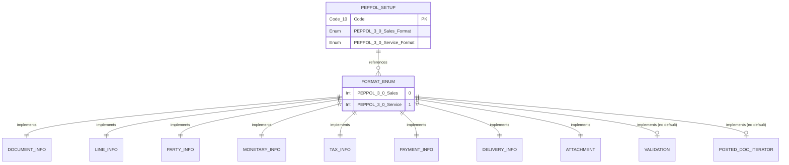

# PEPPOL 3.0 Data Model

## Overview

The PEPPOL 3.0 extension uses a minimal persistent storage model combined with an interface-based provider pipeline. Instead of maintaining custom tables for document data, it relies on the base application's posted document tables and uses Sales Header/Line as temporary working buffers during export.

## Entity Relationship Diagram

## Core Tables

### PEPPOL 3.0 Setup (Table 37202)

This is the single persistent configuration table for the extension. It is a singleton record accessed via the `GetSetup()` method, which auto-creates the record if it doesn't exist.

**Primary Key:** Code (Code[10])

**Key Fields:**
- **PEPPOL 3.0 Sales Format** -- Enum value specifying which implementation to use for sales documents
- **PEPPOL 3.0 Service Format** -- Enum value specifying which implementation to use for service documents

The `OnInsert` trigger sets default values for both format fields when the record is first created.

## Extensible Enum

### PEPPOL 3.0 Format (Enum 37200)

This extensible enum is the foundation of the provider model. It defines two standard values and implements 10 interfaces that form the document export pipeline.

**Values:**
- **PEPPOL 3.0 - Sales** (0)
- **PEPPOL 3.0 - Service** (1)

**Implemented Interfaces:**
1. **Document Info** -- Provides document-level information (ID, issue date, type code, etc.)
2. **Line Info** -- Provides line-level information (item description, quantity, price, etc.)
3. **Party Info** -- Provides party information (supplier, customer, tax representative)
4. **Monetary Info** -- Provides monetary totals (line extension, tax amount, payable amount)
5. **Tax Info** -- Provides tax breakdown by category and rate
6. **Payment Info** -- Provides payment means and terms
7. **Delivery Info** -- Provides delivery location and date
8. **Attachment** -- Provides document attachments
9. **Validation** -- Validates document data before export (no default implementation)
10. **Posted Document Iterator** -- Iterates posted documents for export (no default implementation)

**Default Implementations:** Most interfaces have default implementations that point to the PEPPOL30 facade methods. However, the Validation and Posted Document Iterator interfaces have no default implementation and must be specified per enum value. This allows different document types (sales vs. service) to have different validation rules and data access patterns.

## Data Flow Architecture

The extension does not maintain custom persistent tables for document data. Instead, it follows this pattern:

1. **Posted Documents** -- Data originates from posted sales/service invoice and credit memo tables in the base application
2. **Conversion to Buffers** -- The `PEPPOL30Common` codeunit uses `RecordRef.SetTable` to convert posted documents to `Sales Header` and `Sales Line` temporary records
3. **Interface Access** -- XMLports and exporter codeunits access the buffer data through the 10 interface methods
4. **XML Generation** -- XMLports generate UBL XML by calling the facade methods for each document section

This architecture provides several benefits:
- **Minimal Storage** -- No duplication of document data
- **Extensibility** -- New document formats can be added by implementing the same interfaces
- **Flexibility** -- Different enum values can provide different implementations for validation and data access
- **Base App Alignment** -- Uses standard Business Central buffer patterns

## Interface Pipeline

The 10 interfaces form a logical pipeline for document export. When an XMLport generates UBL XML, it calls the interface methods in sequence:

1. **Document Info** -- Header elements (invoice number, date, currency)
2. **Party Info** -- Supplier and customer details
3. **Delivery Info** -- Shipping address and date
4. **Payment Info** -- Payment terms and means
5. **Tax Info** -- VAT breakdown by category
6. **Line Info** -- Iterates document lines
7. **Monetary Info** -- Document totals and tax amounts
8. **Attachment** -- Embedded files or references
9. **Validation** -- Pre-export validation (called before XMLport runs)
10. **Posted Document Iterator** -- Locates posted documents to export

Each interface method receives the `Sales Header` and/or `Sales Line` buffer as parameters and returns the specific data needed for that section of the UBL document.
