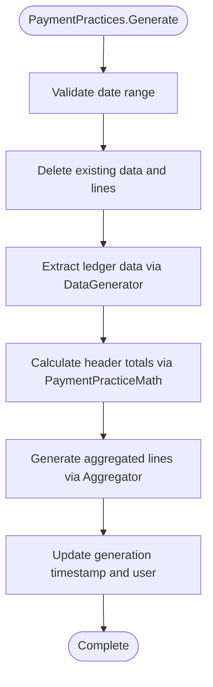

# Payment Practices Business Logic

This document describes the business logic and processing pipeline for generating payment practice reports.

## Report Generation Pipeline

The report generation process follows a multi-stage pipeline that validates configuration, extracts data, performs calculations, and produces aggregated results.

The Generate method in the PaymentPractices codeunit orchestrates the entire pipeline. It begins by validating the date range configuration on the header record. Next, it deletes any existing data and lines from previous runs to ensure a clean slate. The system then invokes the data generator interface implementation based on the header type. After data extraction completes, PaymentPracticeMath calculates summary metrics for the header. The aggregator interface implementation then produces detail lines. Finally, the system updates generation metadata including timestamp and user.

## Data Extraction

PaymentPracticeBuilders codeunit handles the extraction of raw invoice and payment data from ledger entries.

For vendor transactions, the system queries Vendor Ledger Entry records filtered to document type Invoice within the specified date range. It excludes vendors marked for exclusion in the configuration. For each qualifying invoice, it calls CopyFromInvoiceVendLedgEntry on the PaymentPracticeData table, which copies core fields and calculates both agreed payment days (based on due date) and actual payment days (based on payment posting date).

Customer transaction extraction mirrors the vendor process, querying Customer Ledger Entry records and using CopyFromInvoiceCustLedgEntry for data population.

The combined customer-vendor generator invokes both extraction processes sequentially to populate data for both transaction types.

## Payment Metrics Calculation

PaymentPracticeMath codeunit provides the core mathematical operations for payment performance metrics.

GetPercentOfOnTimePayments calculates the on-time payment rate by comparing payment posting date to due date for closed invoices. An invoice is considered on time when the payment posting date is less than or equal to the due date. Open invoices with past due dates count toward the total denominator but not the numerator, reducing the on-time percentage. The method returns both a count-based percentage and an amount-based percentage.

GetAverageActualPaymentTime computes the mean actual payment days across all closed invoices in the dataset. Open invoices are excluded from this calculation since they have no payment date.

GetAverageAgreedPaymentTime computes the mean agreed payment days across all invoices in the dataset, including both open and closed invoices. This represents the contracted or expected payment terms.

## Aggregation Strategies

The system supports two primary aggregation strategies implemented through the PaymentPracticeLinesAggregator interface.

### Period Aggregation

The period aggregator iterates through all records in the Payment Period master table ordered by Days From. For each period, it applies a filter to PaymentPracticeData where Actual Payment Days falls within the period's range defined by Days From and Days To.

For each filtered subset, it calculates the percentage of invoices paid within that period by both count and amount. When Days To equals zero, the period is treated as open-ended and includes all payments with actual days greater than or equal to Days From.

### Company Size Aggregation

The company size aggregator iterates through all records in the Company Size master table. For each size category, it applies a filter to PaymentPracticeData matching the company size code and invokes PaymentPracticeMath to calculate average agreed days, average actual days, and on-time percentage.

This aggregation strategy is only valid for header type Vendor. If invoked for Customer or Both header types, the ValidateHeader method throws an error preventing report generation.

## Validation and Error Handling

The ValidateHeader method in each aggregator implementation enforces business rules before generation begins. Period aggregation accepts all header types. Company size aggregation validates that the header type is Vendor and raises an error for other types.

Date range validation ensures the ending date is greater than or equal to the starting date. The system prevents generation when validation fails, preserving data integrity and ensuring meaningful results.

## Manual Modifications

After generation completes, users can manually modify line values. The OnModify trigger on PaymentPracticeLine sets the Modified Manually flag on the parent header, creating an audit trail that distinguishes calculated reports from adjusted reports. This flag persists through subsequent views and exports, providing transparency about data provenance.
