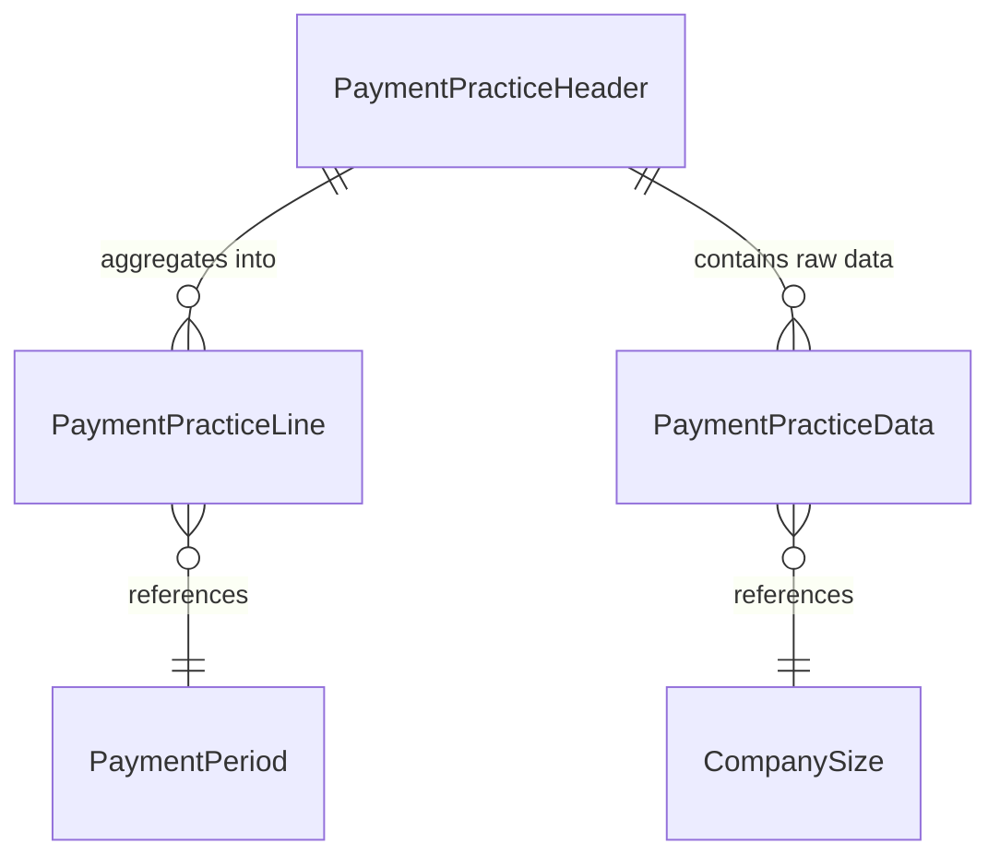

# Payment Practices Data Model

This document describes the data model for the Payment Practices feature, which tracks and reports on payment performance metrics for vendors and customers.

## Entity Relationship Overview

## Core Tables

### PaymentPeriod (Table 685)

The master configuration table defining payment period buckets for aggregation. Each period represents a range of days used to categorize payment timing.

Primary key is a Code field. Supports region-aware defaults for GB, FR, AU, and NZ markets. Open-ended periods are represented by setting Days To to zero. Includes an OnBeforeSetupDefaults integration event for customization.

### PaymentPracticeHeader (Table 687)

The main report configuration and summary table. Each header represents a single payment practice report run.

Uses an auto-increment primary key. Contains date range parameters, aggregation type selection, and header type selection. Stores calculated summary metrics including average agreed payment period, average actual payment period, and percentage paid on time. Tracks generation metadata such as timestamp and user. Includes a FlowField to indicate whether detail lines exist.

Supports cascade deletion of related lines and raw data. The Modified Manually field is set when lines are edited after generation.

### PaymentPracticeLine (Table 688)

Contains aggregated results for each segment within a report. Lines represent either payment period buckets or company size groupings depending on the aggregation type.

Composite primary key consists of header number and line number. Stores source type, company size code, and payment period code as dimension fields. Contains calculated averages and percentages specific to each segment.

Modifications to lines automatically set the Modified Manually flag on the parent header through the OnModify trigger.

### PaymentPracticeData (Table 686)

Raw extracted ledger data serving as the source for aggregation calculations. Each record represents a single invoice entry with payment information.

Composite primary key includes header number, invoice entry number, and source type. Captures invoice dates, payment dates, amounts, and calculated payment day metrics. Links to customer/vendor number and company size code for filtering.

Provides CopyFromInvoiceVendLedgEntry and CopyFromInvoiceCustLedgEntry methods for data extraction. Includes SetFilterForLine method to apply dimension filters during aggregation.

## Enums and Interfaces

### Aggregation Type Enum

Defines how payment practice lines are grouped, either by payment period or by company size. Extensible to support custom aggregation strategies. Implements the PaymentPracticeLinesAggregator interface.

### Header Type Enum

Specifies the scope of data extraction: vendor transactions, customer transactions, or both. Extensible to support additional transaction sources. Implements the PaymentPracticeDataGenerator interface.

### PaymentPracticeDataGenerator Interface

Contract for data extraction implementations. Defines the GenerateData method that populates PaymentPracticeData records from ledger entries.

### PaymentPracticeLinesAggregator Interface

Contract for aggregation implementations. Defines PrepareLayout for setup, GenerateLines for calculation, and ValidateHeader for configuration validation.

## Relationships and Constraints

The header table serves as the parent for both lines and raw data, with cascade deletion ensuring referential integrity. Lines reference the payment period master table through a code field. Raw data references the company size master table through a code field. All foreign key relationships use standard AL table relations.

The Modified Manually flag provides audit tracking when users override generated values, preserving the distinction between calculated and manually adjusted reports.
