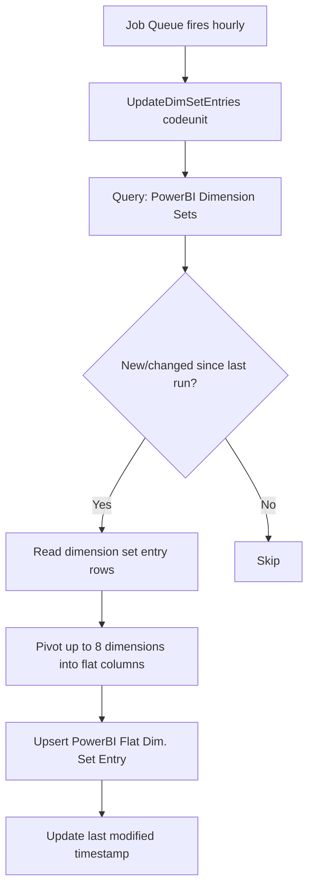
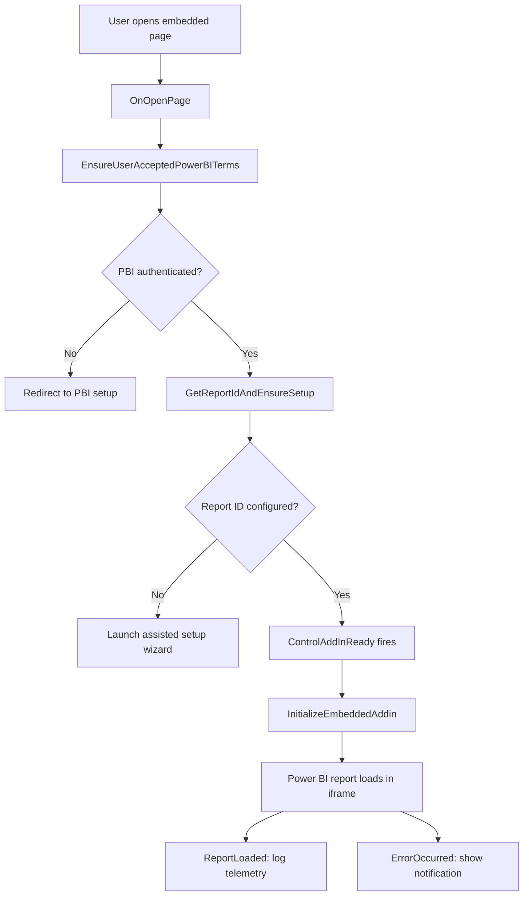

# Business logic

## Overview

The app's business logic falls into four areas: installation/initialization (setting up defaults and jobs), dimension set caching (an hourly background job), the embedded report page pattern (how reports are loaded), and date filtering (how data volume is controlled). There is no transactional business logic -- this app only reads data and manages configuration.

## Installation and initialization

The `InstallationHandler` codeunit runs on `OnInstallAppPerCompany` and calls `Initialization.SetupDefaultsForPowerBIReportsIfNotInitialized`. This procedure orchestrates all first-time setup:

1. **Guided experience** -- registers the "Connect to Power BI" assisted setup entry
2. **Setup singleton** -- creates the `PowerBI Reports Setup` record if it doesn't exist
3. **Working days** -- inserts 7 rows (Sun-Sat) with Mon-Fri marked as working
4. **Date ranges** -- pulls start/end dates from the `Accounting Period` table
5. **Dimension cache job** -- schedules the `UpdateDimSetEntries` codeunit as an hourly job queue entry
6. **Finance setup** -- calls `FinanceInstallationHandler` to populate account category mappings and close income source codes

The same initialization runs on `OnCompanyInitialize` (new company creation). The `OnClearCompanyConfig` and `OnAfterCreatedNewCompanyByCopyCompany` subscribers clear report IDs when copying companies -- you don't want a copied company pointing to the original's Power BI reports.

## Dimension set caching



The `UpdateDimSetEntries` codeunit reads dimension set entries via the `PowerBI Dimension Sets` query, which cross-joins against the 8 shortcut dimension codes from General Ledger Setup. For each dimension set, it creates or updates a single row in `PowerBI Flat Dim. Set Entry` with up to 8 dimension code/name pairs.

The codeunit tracks the last `SystemModifiedAt` value to process only delta changes. This is critical for performance -- BC environments can have millions of dimension set entries, and a full rescan would be prohibitively expensive.

## Embedded report page pattern

All 70+ embedded pages follow the same lifecycle:



Each embedded page is a `UserControlHost` hosting the `PowerBIManagement` control add-in. The page stores a `ReportPageLbl` label containing the Power BI report page section identifier. The `PowerBIReportSetup` codeunit handles the shared logic:

- **EnsureUserAcceptedPowerBITerms** -- validates the user has authenticated with Power BI service
- **GetReportIdAndEnsureSetup** -- reads the report GUID from the setup table (each domain has its own field). If empty, launches the assisted setup wizard.
- **InitializeEmbeddedAddin** -- configures the control with auth token, locale, filter context, and report URL

The pages are intentionally thin -- they contain no business logic or data manipulation. All report intelligence lives in the Power BI template app.

## Date filtering

Each domain has a filter helper codeunit (e.g., `FinanceFilterHelper`, `SalesFilterHelper`) that generates BC filter expressions for date fields. These are applied in the Query's `OnBeforeOpen` trigger:

```
Query OnBeforeOpen:
  → FilterHelper.GenerateXxxReportDateFilter()
  → Returns filter string like "2024-01-01..2024-12-31"
  → SetFilter(DateField, FilterString)
```

The Sales module supports two date modes:
- **Absolute** -- explicit start/end dates from setup
- **Relative** -- uses `DateFormula` (e.g., `-30D`) to calculate a rolling window from today

This filtering is critical for performance. Without it, Power BI would attempt to pull the entire transaction history, which can be millions of rows in a production environment.

## Assisted setup wizard

The `PowerBIAssistedSetup` page (36951) guides users through:

1. **Calendar type** -- Standard (Gregorian), Fiscal, or Weekly (445/454/544 patterns)
2. **UTC offset** -- timezone for accurate date calculations
3. **Date table range** -- auto-populated from accounting periods, determines the date dimension in Power BI
4. **Working days** -- which days of the week are business days
5. **Report mapping** -- for each domain, the user selects a Power BI workspace, then selects a report within that workspace. The report GUID is stored in the setup table.

The `PowerBISelectionLookup` page provides the workspace/report picker, using the Power BI REST API (via the base application's Power BI integration framework) to list available workspaces and reports.

## Upgrade logic

The `PowerBIUpgrade` codeunit handles version migrations using upgrade tags to prevent re-execution:

- **Dimension data transfer** -- uses `DataTransfer` (bulk copy) to migrate pre-flattened dimension entries from old table structures
- **Setup initialization** -- ensures new setup fields have proper defaults after upgrade
- **Close income source code** -- migrates finance-specific source code configuration
