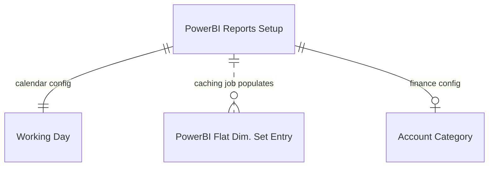
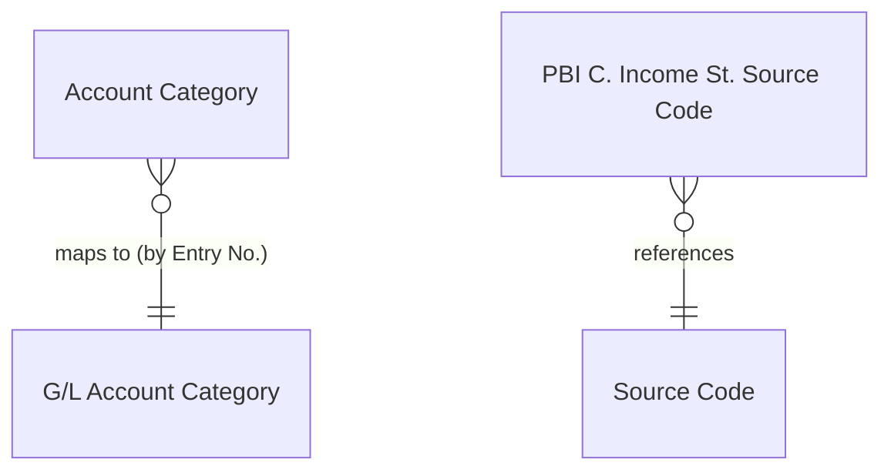

# Data model

## Overview

The app has a small number of actual tables (5) plus 7 domain-specific table extensions. The data model is focused on configuration and caching -- the actual business data comes from BC's existing tables, exposed through API queries. The key design insight is the dimension set caching table, which denormalizes BC's M:M dimension structure into a flat format optimized for Power BI.

## Setup and configuration

### PowerBI Reports Setup (36951)

Singleton configuration table (primary key is a fixed `Code[10]`). Stores three categories of settings:

- **Calendar configuration** -- fiscal year start date, first day of week, UTC offset, and date table range. These align with the Power BI semantic model's date table generation.
- **Dimension configuration** -- tracks when dimension set entries were last updated, and the date table start/end range based on accounting periods.
- **Report ID mappings** -- each domain module adds its own report ID field via table extension (Finance Report Id, Sales Report Id, etc.). These GUIDs link embed pages to specific Power BI reports.

The setup is extended by 7 table extensions (one per domain). Each extension adds domain-specific date range fields and a report ID GUID. For example, `SetupFinance.TableExt.al` adds `Finance Report Start Date`, `Finance Report End Date`, `Finance Report Id`, and `Sales Report Id`. The Sales extension adds `Item Sales Date Type` (absolute vs relative), date formulas for relative filtering, and `Sales Report Id`.

### Working Day (36952)

Simple 7-row table mapping day numbers (0=Sunday through 6=Saturday) to names and a `Working` boolean. Initialized by `InstallationHandler` with Monday-Friday as working days. Used by the Power BI semantic model to build a date table that excludes non-working days from calculations.

### PowerBI Flat Dim. Set Entry (36954)

Denormalized cache of BC's dimension set entries. Each row stores a Dimension Set ID plus up to 8 dimension code/name pairs (Dimension 1 Code, Dimension 1 Name, through Dimension 8). This flattens the M:M relationship between dimension sets and dimension values into a single wide row.

The table is populated by the `UpdateDimSetEntries` codeunit running as an hourly job queue entry. It uses `SystemModifiedAt` tracking to process only new/changed entries, avoiding full table scans. A secondary key on `SystemModifiedAt` supports this delta pattern.

This design exists because Power BI's tabular model performs much better with wide denormalized tables than with the normalized dimension set entry structure BC uses internally.

## Finance-specific tables

### Account Category (36953)

Maps Power BI's GL account hierarchy (25 values in the `Account Category Type` enum -- L1 Assets, L1 Liabilities, L2 Current Assets, L3 Inventory, etc.) to BC's `G/L Account Category` records. This enables chart-of-accounts rollup in Power BI reports that matches the BC account structure.

The `FinanceInstallationHandler` populates these mappings on install by walking the G/L Account Categories table and matching indentation levels to L1/L2/L3 hierarchy tiers.

### PBI C. Income St. Source Code (36955)

Stores source codes used in close income statement batch jobs. Used to filter out closing entries from income statement reports in Power BI (you typically don't want year-end closing entries appearing in monthly P&L views).
