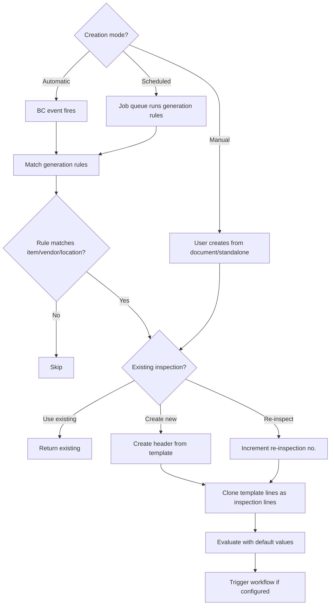

# Business logic

## Overview

The app's business logic covers four phases of the inspection lifecycle: creation (how inspections come into existence), execution (recording values and evaluating results), completion (finishing with validation), and disposition (acting on non-conforming items). The creation phase has three modes; the evaluation phase uses a condition-driven engine; dispositions generate downstream BC documents.

## Inspection creation

**Automatic creation** is triggered by event subscribers in the Integration module. Each domain (purchase, production, assembly, warehouse, transfer, sales return) has subscribers on posting codeunits that call `QltyInspectionCreate`. The generation rule's `Intent` + trigger enum determines which events fire.

**Manual creation** can be initiated from item tracking lines, document lines, or the template list page. The `QltyInspectionCreate` codeunit handles all modes.

**Scheduled creation** uses job queue entries linked to generation rules with a `Schedule Group`. The `QltyScheduleInspection` report iterates matching rules and creates inspections for applicable items.

The `Inspection Creation Option` on setup controls behavior when an inspection already exists: always create new, always re-inspect, use existing open, use any existing, or create re-inspection if finished.

## Result evaluation

The `QltyResultEvaluation` codeunit is the evaluation engine. When a test value changes on an inspection line:

1. **Parse the value** -- `QltyValueParsing` converts text input to the appropriate type (numeric, boolean, etc.)
2. **Match conditions** -- iterate `QltyIResultConditConf` records for this test/template/inspection, checking if the value satisfies each condition expression
3. **Apply evaluation sequence** -- the matching result with the lowest `Evaluation Sequence` wins
4. **Cascade to header** -- after all lines are evaluated, the header result is determined by the line with the lowest evaluation sequence among all line results

For **Text Expression** tests, `QltyExpressionMgmt` evaluates formulas that can reference other inspection line values, creating computed/derived measurements within an inspection.

Condition expressions support ranges (`10..20`), comparisons (`>=80`), lists (`RED|GREEN|BLUE`), and combinations. The `QltyBooleanParsing` codeunit handles complex boolean logic in condition strings.

## Finishing an inspection

Finishing validates several conditions:

- **Item tracking** -- if setup requires, lot/serial/package must be filled and (optionally) posted to inventory
- **Result blocking** -- results with `Finish Allowed = Do Not Allow Finish` prevent completion (e.g., INPROGRESS)
- **All lines evaluated** -- lines without a result may block depending on configuration

On finish: sets `Finished Date` and `Finished By User ID`, locks the record from further edits, triggers the `OnInspectionFinished` workflow event. Item tracking blocking rules from the result now take effect for downstream transactions.

## Re-inspection

When a re-inspection is needed, the system increments `Re-inspection No.` on a new header sharing the same `No.`. Source fields, template, and item tracking are copied from the prior inspection. Lines are re-cloned from the template with fresh default values. The `Most Recent Re-inspection` flag is set on the new header and cleared on the old one.

## Dispositions

Post-inspection actions for non-conforming items, handled by codeunits in the Dispositions module:

- **Item tracking change** (`QltyDispChangeTracking`) -- reclassify lot/serial/package numbers
- **Negative adjustment** (`QltyDispNegAdjustInv`) -- create item journal lines for scrap/waste
- **Inventory move** (`QltyDispMoveItemReclass` / `QltyDispMoveWhseReclass`) -- transfer to quarantine bin or rework location via reclassification journal
- **Purchase return** (`QltyDispPurchaseReturn`) -- create purchase return order to send back to vendor
- **Warehouse put-away** (`QltyDispWarehousePutAway`) -- direct to rework/quarantine bin
- **Transfer order** (`QltyDispCreateTransferOrder`) -- move to another location (external lab, rework center)

These can be triggered manually from the inspection card or automatically via workflow responses when an inspection finishes with a specific result.

## Integration triggers

Each BC domain has dedicated subscriber codeunits in the Integration module:

| Domain | Trigger event | Codeunit |
|--------|--------------|----------|
| Purchasing | Post purchase receipt | `QltyReceivingIntegration` |
| Production | Post output journal | `QltyManufacturIntegration` |
| Assembly | Post assembly output | `QltyAssemblyIntegration` |
| Warehouse | Register warehouse receipt | `QltyReceivingIntegration` |
| Transfer | Post transfer receipt | `QltyTransferIntegration` |
| Sales return | Post sales return receipt | `QltySalesIntegration` |
| Warehouse movement | Register movement | `QltyWarehouseIntegration` |

The Integration module also extends 27+ BC pages with inspection-related fields, actions, and factboxes -- making inspections visible wherever users work with the source documents.
