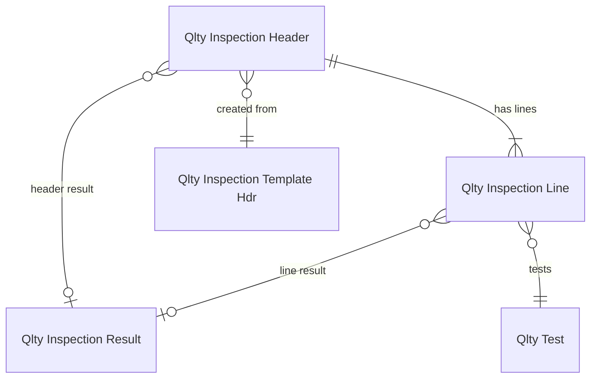
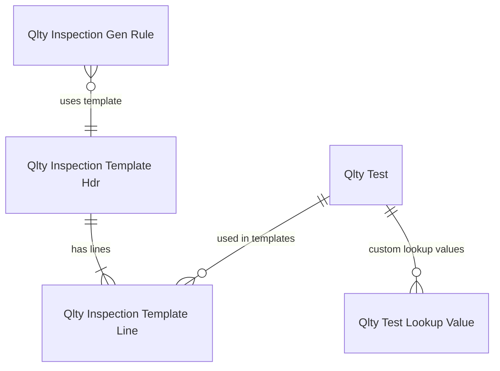
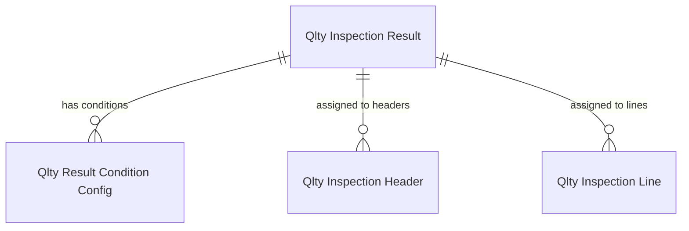

# Data model

## Overview

The data model has three conceptual layers: configuration (tests, templates, results, generation rules), documents (inspection header/line), and setup (global settings). The configuration layer defines what to inspect and how to evaluate results. The document layer captures actual inspections. The key design insight is the flexible source tracking via RecordIds -- inspections can attach to any BC table without schema changes.

## Inspection documents

The `QltyInspectionHeader` (20405) is the core document. Its primary key is `No.` + `Re-inspection No.`, which enables the re-inspection chain -- same inspection number, incrementing re-inspection counter. The header stores source tracking via `Source Table No.`, `Source Document No.`, `Source Item No.`, plus up to 5 `RecordId` fields and 10 custom text/decimal fields for flexible source linking.

The `QltyInspectionLine` (20406) stores individual test measurements. Each line has a `Test Value` (Text[250]) plus a `Test Value Blob` for large values, and a `Derived Numeric Value` for auto-calculated numeric interpretation. The `Failure State` enum tracks whether the line failed from an Acceptable Quality Level check. Lines reference their template origin via `Template Code` + `Template Line No.`.

### Quantity model

The header tracks `Source Quantity (Base)`, `Pass Quantity`, `Fail Quantity`, and `Sample Size`. Sample size is derived from the template's sampling strategy (fixed or percentage). Pass and fail quantities can be manually entered or derived from line results.

### Re-inspection

Re-inspections share the same `No.` but increment `Re-inspection No.`. The `Most Recent Re-inspection` boolean flags the latest in the chain. Only the most recent re-inspection's result applies for item tracking blocking decisions.

## Configuration hierarchy

**QltyTest** (20401) defines what to measure. Key properties: `Test Value Type` (one of 10 types including Decimal, Boolean, Text Expression, Table Lookup), `Allowable Values` (constraint expression), and for Table Lookup types: `Lookup Table No.`, `Lookup Field No.`, `Lookup Table Filter`. The Table Lookup mechanism allows tests to reference any BC table/field as a dropdown, with filter expressions.

**QltyInspectionTemplateHdr/Line** (20402/20403) groups tests with a sampling strategy. `Sample Source` is either `Fixed Quantity` or `Percent of Quantity`. Template lines can override test-level properties (description, UOM, expression formula).

**QltyInspectionGenRule** (20409) connects templates to business events. The `Intent` enum determines the domain (Purchase, Production, Transfer, etc.), and intent-specific trigger enums control when to fire (e.g., `Purchase Order Trigger: On Receipt`). Item and attribute filters narrow which items trigger the rule.

## Result evaluation

**QltyInspectionResult** (20411) defines outcomes (PASS, FAIL, INPROGRESS, custom). Each result has an `Evaluation Sequence` (priority -- lower wins), `Result Category` (Acceptable/Not acceptable/Uncategorized), and `Finish Allowed` (whether the inspection can be completed with this result).

The result also controls item tracking blocking via 9 independent fields: `Item Tracking Allow Sales`, `Allow Transfer`, `Allow Consumption`, `Allow Pick`, `Allow Put-Away`, `Allow Movement`, `Allow Output`, `Allow Assembly Consumption`, `Allow Assembly Output`. Each can be `Allowed`, `Blocked`, or `Blocked but can be overridden`. This enables granular quarantine scenarios.

**QltyIResultConditConf** (20418) maps test values to result codes. Conditions are text expressions (e.g., `>=80`, `RED|GREEN`, `true`) with a priority. They exist at three levels: test defaults, template overrides, and inspection-specific overrides.

## Setup

**QltyManagementSetup** (20400) is the global singleton. Key settings: `Inspection Creation Option` (always new, re-inspection, use existing, etc.), `Inspection Search Criteria` (how to find existing inspections), trigger defaults per domain, item tracking enforcement rules, and journal batch names for disposition operations.
