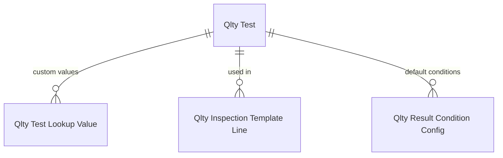
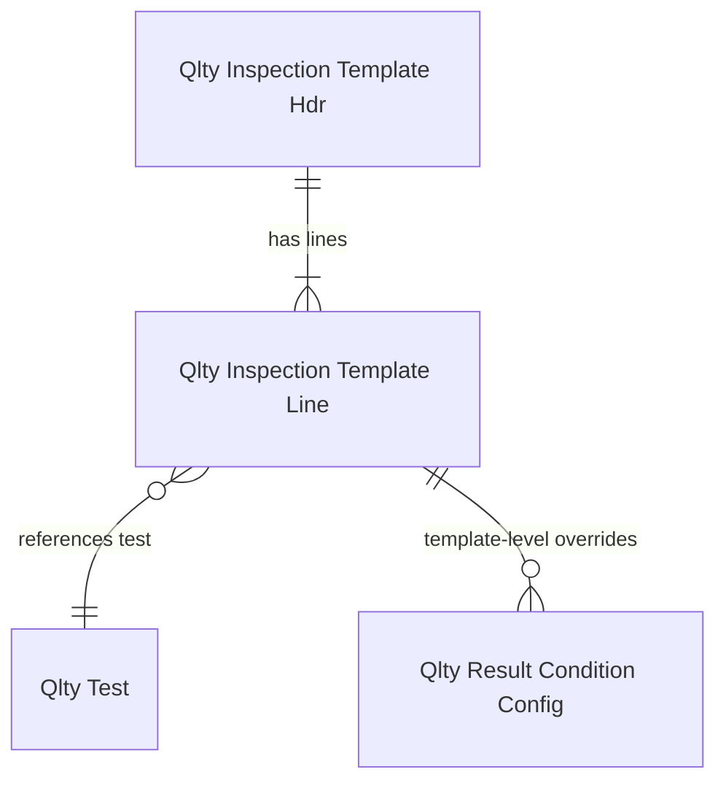
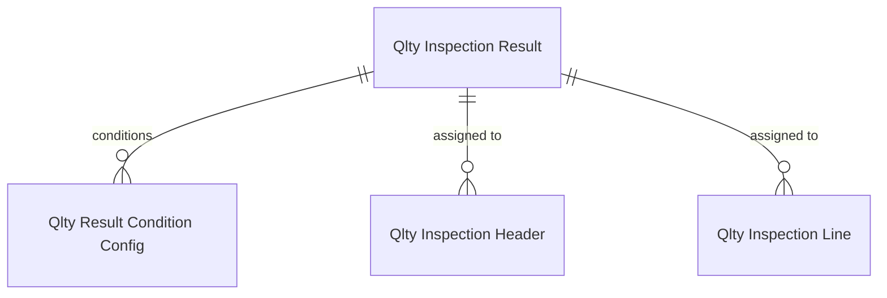

# Data model -- Configuration

## Overview

The configuration module contains 9 tables that define the inspection blueprint hierarchy. Tests define individual measurements, templates group tests with sampling, generation rules connect templates to business events, and results/conditions define pass/fail evaluation.

## Tests and lookup values

`QltyTest` (20401) is the atomic measurement definition. The `Test Value Type` enum controls the entire input/validation UX: Decimal and Integer get numeric input, Boolean gets a checkbox, Option and Table Lookup get dropdowns, Text Expression gets a formula editor. For Table Lookup types, three fields (`Lookup Table No.`, `Lookup Field No.`, `Lookup Table Filter`) configure which BC table/field to use as the dropdown source.

`QltyTestLookupValue` (20408) provides an alternative to Table Lookup -- a custom picklist with `Lookup Group Code`, `Value`, `Description`, and 4 extensible custom text fields. Useful when the desired values don't exist in any BC table.

## Templates and lines

`QltyInspectionTemplateHdr` (20402) groups tests with a sampling strategy. `Sample Source` determines whether to inspect a fixed number of units or a percentage. `Copied From Template Code` provides audit trail when templates are cloned.

`QltyInspectionTemplateLine` (20403) links tests to templates and can override test-level properties: description, UOM, expression formula. Template lines can also override result conditions -- a test might default PASS for `>=80` but a stricter template could override to `>=90`.

## Results and conditions

`QltyInspectionResult` (20411) defines outcome codes. Beyond the obvious code/description, the interesting fields are: `Evaluation Sequence` (priority -- lower wins), `Result Category` (Acceptable/Not acceptable), `Finish Allowed` (whether the inspection can complete with this result), and 9 item tracking blocking fields that control per-transaction-type access.

`QltyIResultConditConf` (20418) is the condition rules table. Each row maps a condition expression to a result code at a specific level (`Condition Type`: Test, Template, or Inspection). The condition is a text expression evaluated against the test value. Multiple conditions can exist per test -- evaluation sequence determines which wins.

## Generation rules

`QltyInspectionGenRule` (20409) connects templates to business events. `Intent` determines the domain (Purchase, Production, etc.), and intent-specific trigger enums control the activation point. `Item Filter` and `Item Attribute Filter` narrow which items trigger the rule. `Schedule Group` enables job-queue-based creation separate from event-driven triggers.
