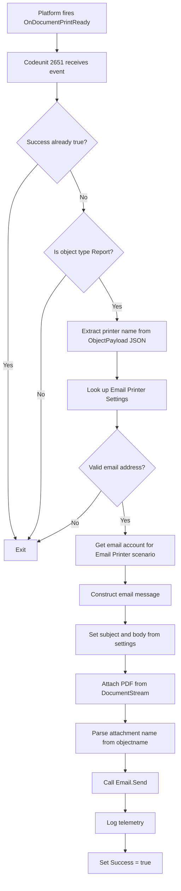

# Business logic

This document describes the core business logic of the Send To Email Printer feature.

## Print flow

The email printer handles print jobs through a platform event-driven flow:

1. **Platform trigger**: The Business Central platform fires the `OnDocumentPrintReady` event when a document is ready to print
2. **Event handler**: Codeunit 2651 "Email Printer Document Ready" subscribes to this event
3. **Early exit conditions**: The handler exits immediately if:
   - The `Success` parameter is already true (another printer handled it)
   - The payload object type is not a Report
4. **Printer identification**: Extracts the `printername` value from the `ObjectPayload` JSON
5. **Settings lookup**: Retrieves the Email Printer Settings record matching the printer name
6. **Email validation**: Validates that a valid email address is configured
7. **Account selection**: Gets the appropriate email account for the "Email Printer" scenario
8. **Email construction**: Builds the email message with:
   - Subject and body text from Email Printer Settings
   - PDF attachment from the `DocumentStream` parameter
   - Attachment filename parsed from the `objectname` field in ObjectPayload plus MIME type extension
9. **Send**: Calls `Email.Send()` to deliver the message
10. **Telemetry**: Logs telemetry data for monitoring and diagnostics

## Setup registration

The platform discovers available printers through a registration mechanism:

1. **Platform query**: The platform queries for available printers by firing the `SetupPrinters` event
2. **Registration handler**: Codeunit 2650 "Email Printer Setup" subscribes to this event
3. **Iteration**: The handler iterates through all Email Printer Settings records
4. **JSON construction**: For each printer, builds a JSON structure containing:
   - Printer version information
   - Description text
   - Array of paper trays with properties:
     - Paper source name
     - Paper kind (e.g., A4, Letter, Custom)
     - Landscape orientation flag
     - Height in hundredths of units
     - Width in hundredths of units
     - Unit type (inches or millimeters)
5. **Validation**: Skips printers with empty ID values
6. **Fallback handling**: For custom paper sizes, falls back to A4 dimensions if configured dimensions are invalid

## Configuration

Page 2650 "Email Printer Setup Card" provides the user interface for configuring email printers:

- **Progressive disclosure**: Uses a card layout that reveals configuration options as needed
- **Defaults on new record**: When creating a new printer, applies these defaults:
  - Paper size: A4
  - Orientation: Portrait
  - Email subject: "Printed Copy"
- **Email validation**: When the email address field changes:
  - Calls `MailManagement.CheckValidEmailAddress()` to validate format
  - Displays a privacy notification to inform users about data handling
- **Save validation**: When the user attempts to close the page:
  - Validates that an email address is configured
  - For custom paper sizes, validates that dimensions are greater than zero

## Deletion

The system prevents accidental deletion of email printers that are in use:

- **Usage check**: Before allowing deletion, checks if the printer appears in the Printer Selection table
- **Deletion block**: If the printer is referenced by any records, blocks the delete operation and informs the user

This protects against breaking existing printer configurations and ensures data integrity across the system.
