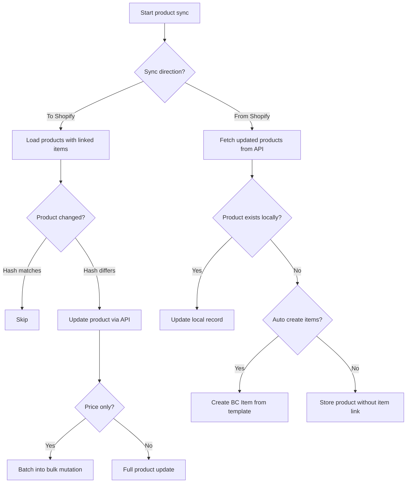
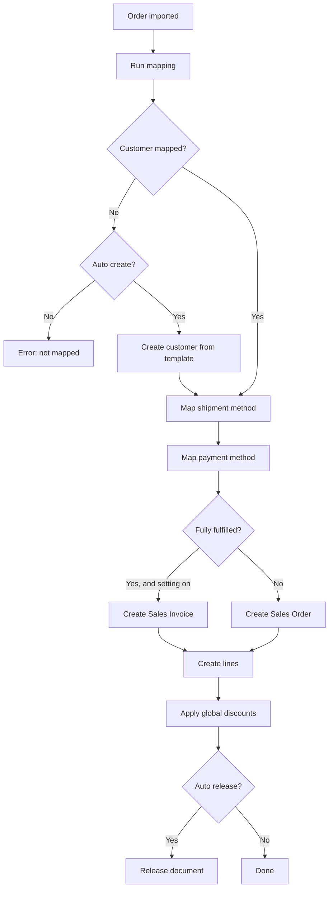

# Business logic

This document covers the major processing flows in the Shopify Connector, focusing on decision points, non-obvious behavior, and what can go wrong.

## Authentication and token lifecycle

The connector authenticates to Shopify with **expiring offline access tokens** (public apps must migrate to these by 2027-01-01). An access token lives for 1 hour; a refresh token lives for 90 days and is rotated on each refresh. Tokens are held on `Shpfy Registered Store New` (keyed by store URL) -- the access and refresh tokens as `SecretText` in IsolatedStorage, with `Token Expires At` and `Refresh Token Expires At` as fields.

`ShpfyCommunicationMgt.GetAccessToken` calls `ShpfyAuthenticationMgt.EnsureValidAccessToken` before every API request, so the following happens transparently in any session, interactive or background:

- **Fast path** -- a valid expiring token is used as-is.
- **Refresh** -- when the access token is within a 5-minute buffer of expiry, `RefreshAccessToken` exchanges the refresh token (`grant_type=refresh_token`) for a new access + refresh token. Transient failures are retried with the *same* refresh token (Shopify returns the same response for ~1 hour); a 401 or a lapsed refresh token is terminal and surfaces a "reconnect the store" error.
- **Migration** -- a legacy non-expiring token (no refresh token stored) is migrated once via token exchange. This is best-effort: if it fails the existing token is kept (it still works until the deadline); on success Shopify revokes the old token, so the exchange is irreversible per shop.

Refresh and migration are serialized with a table lock plus a double-checked re-read, because Shopify allows only one refreshable token per app and store -- this keeps concurrent sessions (or multiple BC companies sharing a shop) from thrashing the token. As a safety net, an unexpected 401 from a normal API call triggers a single forced refresh and retry.

The `Shpfy Token Refresh` job (a recurring Job Queue entry registered on install and upgrade) is the proactive backstop. It iterates enabled shops and runs a per-shop worker so one shop's failure does not abort the run, keeping access tokens and 90-day refresh tokens alive for shops that are otherwise idle. When a refresh token has fully lapsed, the Shop Card shows a reconnect notification.

*Updated: 2026-07-11 -- Expiring offline access token support (slice 637954)*

## Product synchronization

Product sync is bi-directional, controlled by the Shop's `"Sync Item"` setting (To Shopify, From Shopify, or disabled). The two directions have fundamentally different architectures.

### BC to Shopify export

The export flow is driven by `ShpfyProductExport.Codeunit.al`. It iterates all Shopify Product records that have a linked BC Item (non-empty `"Item SystemId"`) and belong to the current shop. For each product, it checks whether the Shop allows updates (`"Can Update Shopify Products"` flag), then calls `UpdateProductData()`.

The update flow relies heavily on hash-based change detection. Before making any API call, the codeunit computes the current hash of the product's tags, HTML description, and images, then compares them against the stored hashes on the Product record. Only fields that have actually changed result in API calls. This is critical because Shopify's GraphQL API has per-store rate limits, and a full product catalog update without change detection would quickly exhaust the budget.

Price sync can run independently of the full product sync via the `OnlyUpdatePrice` flag. When enabled, prices are batched into a bulk mutation (`ShpfyBulkUpdateProductPrice.Codeunit.al`) for efficiency. If the bulk operation fails, it falls back to individual variant price updates, reverting variant changes on failure. Item price sync is skipped when the item's unit of measure is invalid, preventing errors from propagating into Shopify pricing data.

*Updated: 2026-04-08 -- Price sync skipped for invalid unit of measure*

The product body HTML is assembled from BC data by `CreateProductBody()` in the export codeunit -- it concatenates extended text, marketing text, and item attributes into an HTML structure. Events fire before and after this assembly (`OnBeforeCreateProductBodyHtml`, `OnAfterCreateProductBodyHtml`), allowing extensions to customize the output.

### Shopify to BC import

The import direction is handled by `ShpfyProductImport.Codeunit.al`. It fetches products from Shopify using timestamp-based incremental sync, creates or updates local Product and Variant records, and optionally creates BC Items.

Item creation uses the template system -- the Shop's `"Item Templ. Code"` provides defaults, and the `OnAfterFindItemTemplate` event allows per-product template selection. `ShpfyCreateItem.Codeunit.al` handles the actual item creation. Variant mapping is complex because Shopify variants carry option values (size/color) that may map to BC Item Variants, and the `"UoM as Variant"` setting can make unit-of-measure values appear as variant options.

A product that is blocked or sales-blocked in BC gets its Shopify status changed according to the `"Action for Removed Products"` setting. The `IRemoveProductAction` interface drives this -- implementations include moving to Draft, Archived, or doing nothing. This also fires when a product is deleted from the local table (via the OnDelete trigger on `ShpfyProduct.Table.al`).

## Order import and processing

Order processing is the most complex flow in the connector. It spans multiple codeunits and involves several mapping steps before a BC sales document can be created.

### Discovery and staging

`ShpfyOrdersAPI.Codeunit.al` queries Shopify for orders updated since the last sync time. New orders are inserted into the Orders to Import staging table. The `"Order Created Webhooks"` setting can supplement polling -- when enabled, Shopify pushes real-time notifications that trigger immediate order import.

### Import

`ShpfyImportOrder.Codeunit.al` takes an order from the staging table and creates the full Order Header and Order Lines. It parses the GraphQL response to populate all address blocks, financial fields (in both currencies), customer IDs, discount codes, attributes, tax lines, and risk assessments. Staff member handling during order import is gated by the Shop's `"Advanced Shopify Plan"` flag (true for Plus, Plus Trial, Development, and Advanced plans). The `OnAfterImportShopifyOrderHeader` and `OnAfterCreateShopifyOrderAndLines` events fire after import.

*Updated: 2026-04-08 -- Staff member gating moved from B2B Enabled to Advanced Shopify Plan*

### Mapping

Before a sales document can be created, the order must be mapped to BC entities. `ShpfyOrderMapping.Codeunit.al` orchestrates this. The mapping proceeds in sequence: customer mapping, then shipment method, shipping agent, and payment method. Each step has Before/After events that allow extensions to override or supplement the logic.

Customer mapping is the most involved step. For B2B orders (where `"Company Id"` is set), the company mapping strategy runs instead. For D2C orders, the `ICustomerMapping` interface dispatches based on the Shop's `"Customer Mapping Type"` enum -- options include By Email/Phone, By Bill-to Info, and Default Customer. If the customer cannot be found and `"Auto Create Unknown Customers"` is enabled, a new BC customer is created from the template.

### Sales document creation

`ShpfyProcessOrder.Codeunit.al` creates the BC sales document. It first confirms mapping succeeded, then creates the Sales Header, Sales Lines, and applies global discounts.

The header creation in `CreateHeaderFromShopifyOrder()` is notably manual -- it directly assigns address fields with `CopyStr()` truncation rather than using standard BC validation, because the Shopify data may not conform to BC's address validation rules. Currency handling branches on the Shop's `"Currency Handling"` setting: either the shop's configured currency code or the order's presentment currency.

The `"Create Invoices From Orders"` setting causes fully-fulfilled orders to be created as Sales Invoices instead of Sales Orders. The `"Use Shopify Order No."` setting uses the Shopify order number (e.g., "#1001") as the BC document number, which requires the number series to have Manual Nos. enabled.

Special line types require attention: gift card purchases map to the `"Sold Gift Card Account"` G/L account, tips map to `"Tip Account"`, and shipping charges map to `"Shipping Charges Account"`. These are all configured on the Shop record.

The Shopify Order page includes contact lookup and validation, allowing users to verify and resolve customer contact information directly from the order.

*Updated: 2026-04-08 -- Contact lookup/validation added to Shopify Order page*

## Fulfillment

Fulfillment sync runs when BC sales shipments are posted. `ShpfyOrderFulfillments.Codeunit.al` creates fulfillment records in Shopify from the posted shipment data, including tracking numbers and carrier information.

The connector registers itself as a Shopify Fulfillment Service (controlled by `"Fulfillment Service Activated"` on the Shop), which causes Shopify to create Fulfillment Order Headers assigned to BC's virtual location. When a shipment posts, the connector accepts the fulfillment request and creates the actual fulfillment with `ShpfyFulfillmentOrdersAPI.Codeunit.al`.

The `"Send Shipping Confirmation"` setting controls whether Shopify sends a shipping notification email to the customer when the fulfillment is created. This is a Shop-level setting, not per-fulfillment.

## Returns and refunds

Returns and refunds are fetched from Shopify and processed according to the Shop's `"Return and Refund Process"` setting. This is one of the more nuanced flows because returns and refunds are independent in Shopify's model.

`ShpfyReturnsAPI.Codeunit.al` fetches return data and populates Return Header and Return Line records. `ShpfyRefundsAPI.Codeunit.al` does the same for refunds. Both are incremental, driven by the order's `"Updated At"` timestamp.

The processing strategy is selected by the `"Return and Refund Process"` enum on the Shop, which dispatches through the `IReturnRefundProcess` interface. Three implementations exist:

- **Import Only** (`ShpfyRetRefProcImportOnly.Codeunit.al`) -- fetches and stores the data but creates no BC documents. The user manually creates credit memos.
- **Auto Create Credit Memo** (`ShpfyRetRefProcCrMemo.Codeunit.al`) -- automatically creates BC Sales Credit Memos (or Return Orders, based on `"Process Returns As"` setting) from the refund data. This requires `"Auto Create Orders"` to be enabled.
- **Default** (`ShpfyRetRefProcDefault.Codeunit.al`) -- no-op processing.

The `IDocumentSource` interface determines which Shopify document (return or refund) provides the line data for the BC credit memo. The default implementation sources from refund lines, but this can be overridden.

Refund lines carry a `"Restock Type"` that affects inventory: Return means items go back to stock, Cancel means they were never shipped, NoRestock is purely financial. Lines with non-restock types are mapped to G/L accounts (`"Refund Acc. non-restock Items"`) instead of item lines on the credit memo.

## Inventory synchronization

Inventory sync pushes stock levels from BC to Shopify. It is always one-directional (BC to Shopify). `ShpfySyncInventory.Codeunit.al` orchestrates the flow.

For each product variant with inventory tracking enabled, the connector calculates the available stock using the `IStockCalculation` interface. The Shop Location mapping determines which BC locations contribute stock to each Shopify location, and the stock calculation strategy (configured per Shop Location via the `"Stock Calculation"` enum) determines the calculation method.

Built-in strategies include `ShpfyBalanceToday.Codeunit.al` (projected available balance) and `ShpfyFreeInventory.Codeunit.al` (current physical inventory minus reserved). The `IStockAvailable` interface controls whether a given inventory management setting allows stock tracking at all.

Stock levels are set via the `ShpfyInventoryAPI.Codeunit.al` which calls Shopify's `inventorySetQuantities` mutation. The connector uses Shopify's "available" quantity name and sets it absolutely (not as a delta).

## Customer and company synchronization

Customer sync can run in both directions, controlled by `"Shopify Can Update Customer"` and `"Can Update Shopify Customer"` flags (which are mutually exclusive -- enabling one disables the other).

Import from Shopify is handled by `ShpfyCustomerImport.Codeunit.al`. The `"Customer Import From Shopify"` setting controls when customers are imported: with order import only, or as a separate sync operation. When auto-creating BC customers, the connector uses the Customer Template system -- the `ShpfyCustomerTemplate.Table.al` allows different templates per country, falling back to the Shop's `"Customer Templ. Code"`.

Export to Shopify is handled by `ShpfyCustomerExport.Codeunit.al`. It creates or updates Shopify customers from BC customer records.

Company sync follows the same pattern but with `ShpfyCompanyImport.Codeunit.al` and `ShpfyCompanyExport.Codeunit.al`. Company mapping uses `ICompanyMapping` with strategies including By Email/Phone, By Tax ID, and Default Company. The B2B chain is: Company -> Company Location -> Customer (the location's main contact becomes the BC customer).

When a B2B order arrives, the customer resolution differs from D2C: the connector looks up the company's main contact customer ID and the company location to determine the sell-to and ship-to customer numbers. This can result in different BC customers for different company locations of the same Shopify company.

## Test infrastructure

Test mocking uses the HttpClientHandler pattern rather than `IsTestInProgress` checks. Test codeunits inject a mock HTTP handler that intercepts Shopify API calls and returns canned responses, avoiding conditional test logic scattered through production code.

*Updated: 2026-04-08 -- Test mocking migrated from IsTestInProgress to HttpClientHandler*
