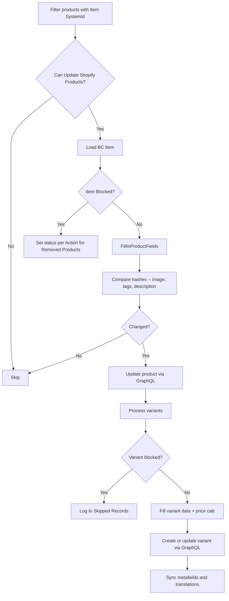
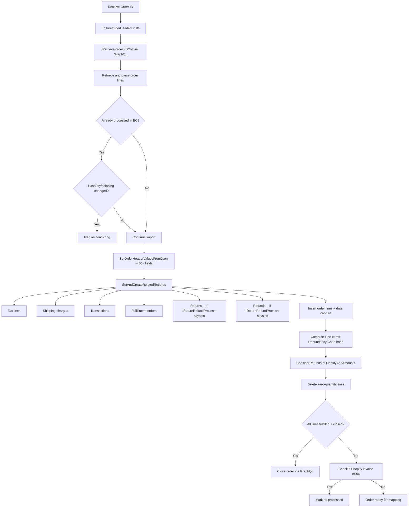

# Business logic

## Product sync

Product sync is direction-dependent, controlled by the Shop's `Sync Item` option (To Shopify / From Shopify). The `ShpfySyncProducts.Codeunit.al` entry point dispatches to either `ShpfyProductExport` or `ShpfyProductImport` based on this setting. There is also a price-only mode (`SetOnlySyncPriceOn`) that skips all non-price fields and uses bulk operations for efficiency.

### Export (BC to Shopify)

The export flow in `ShpfyProductExport.Codeunit.al` starts by filtering `Shpfy Product` records that have a non-empty `Item SystemId` and belong to the current shop. The `OnAfterProductsToSynchronizeFiltersSet` event fires here, allowing subscribers to add additional filters.

For each product, the flow calls `UpdateProductData`, which loads the linked BC Item, calls `FillInProductFields` to populate the temp product record (title from item translation or description, vendor from vendor table, product type from item category, HTML body from extended text + marketing text + attributes), then compares hashes to detect changes.

The blocked-item handling is worth noting: when an Item is blocked, the product's status is set according to the Shop's `Action for Removed Products` setting (archive or draft). The `IRemoveProductAction` interface handles the status transition, and the `ICreateProductStatusValue` interface determines the initial status when creating new products.

Variant export iterates all Item Variants plus, if `UoM as Variant` is enabled, all Item Units of Measure. Each variant gets a price calculation, SKU mapping (configurable: barcode, item no., vendor item no.), barcode lookup, and weight computation. Blocked or sales-blocked variants are skipped and logged to the Skipped Records table.

Item attributes mapped as product options occupy variant option slots. Since Shopify caps at 3 options and UoM-as-variant consumes one slot, attributes are limited to 2 (or 3 with UoM disabled). The `VerifyNoItemAttributesAsOptions` check in the Shop table enforces this constraint.

### Import (Shopify to BC)

Import in `ShpfySyncProducts.Codeunit.al` retrieves all product IDs from Shopify via `ProductApi.RetrieveShopifyProductIds`, then compares `Updated At` timestamps against local records. Products where the Shopify timestamp is newer than both `Updated At` and `Last Updated by BC` are queued into a temp table. Products already up-to-date are silently skipped.

For each changed product, `ShpfyProductImport` runs in its own commit scope. If it fails, the error is captured and the loop continues with the next product. This per-record isolation prevents one bad product from blocking the entire sync.

## Order import

Order import is the connector's most complex flow, orchestrated by `ShpfyImportOrder.Codeunit.al`. The process handles first-time import, re-import of changed orders, and conflict detection for already-processed orders.

The conflict detection in `IsImportedOrderConflictingExistingOrder` checks three conditions: (1) whether `currentSubtotalLineItemsQuantity` increased, (2) whether the line items redundancy hash changed, and (3) whether the shipping charges amount changed. Any mismatch sets `Has Order State Error` and `Has Error` on the header, blocking auto-processing until manually resolved.

The refund adjustment step (`ConsiderRefundsInQuantityAndAmounts`) is particularly important. It iterates all order lines, sums refund line quantities for each, and subtracts them directly from the order line's `Quantity`. It also adjusts the header's total amounts. This means the order lines in BC reflect net quantities after refunds, not the original Shopify quantities. Lines reduced to zero are deleted entirely.

## Order mapping and creation

After import, `ShpfyOrderMapping.Codeunit.al` maps the Shopify order to BC entities. The mapping splits based on B2B status:

- **B2C orders** use customer mapping through the `ICustomerMapping` interface, selected by the Shop's `Customer Mapping Type`. The fallback logic is notable: if both `Name` and `Name2` on the order are empty, the mapper always uses "By EMail/Phone" regardless of the configured strategy.
- **B2B orders** use company mapping through `ICompanyMapping`, routing through the Shop's company settings.

For each order line, `MapVariant` resolves the Shopify variant to a BC Item + Item Variant. Tip lines check that `Tip Account` is configured, gift card lines check `Sold Gift Card Account`.

Once mapping succeeds, `ShpfyCreateSalesDocHeader.Codeunit.al` creates the actual Sales Order (or Sales Invoice, depending on configuration). The `Auto Release Sales Orders` shop setting controls whether the document is immediately released.

## Customer sync

Customer import in `ShpfySyncCustomers.Codeunit.al` retrieves customer IDs from Shopify via GraphQL, then processes each through `ShpfyCustomerImport`. The mapping in `ShpfyCustomerMapping.Codeunit.al` uses a two-phase approach:

1. **FindMapping** checks if the Shopify customer already has a `Customer SystemId`. If the linked BC customer no longer exists, it clears the link and proceeds to step 2.
2. **DoFindMapping** searches BC customers by email (case-insensitive filter using `@` prefix) and phone number (digits-only fuzzy matching via `CreatePhoneFilter`). The phone matching extracts only digits from both the Shopify phone and BC phone fields, handling format differences like +1 (555) 123-4567 vs 5551234567.

Customer export is not automatic. The old `Export Customer To Shopify` boolean was removed in v27 (the field definition is still guarded by `#if not CLEANSCHEMA27` in the Shop table). The replacement is a manual "Add to Shopify" action on the Shopify Customers page.

## Inventory sync

Inventory sync in the Inventory folder is export-only: it calculates BC stock and pushes adjustments to Shopify. For each Shop Location, the connector applies the location's `Location Filter` to restrict which BC locations contribute to the stock calculation, then calls the configured stock calculation interface.

The stock calculation is a three-layer interface hierarchy. `Shpfy IStock Available` answers a boolean "can this type have stock?" question. `Shpfy Stock Calculation` provides the basic `GetStock(Item)` method. `Shpfy Extended Stock Calculation` extends it with `GetStock(Item, ShopLocation)` for location-aware calculations. The Shop's stock calculation enum selects the active implementation.

The connector sends stock adjustments (deltas) to Shopify via the `ModifyInventory` GraphQL mutation, not absolute values. It compares the calculated BC stock against the `Shopify Stock` field on `Shpfy Shop Inventory` to determine the delta.

## Webhooks

The connector supports webhooks for real-time order notifications, managed by `ShpfyWebhooksMgt.Codeunit.al`. When the `Order Created Webhooks` setting is enabled on the Shop, the connector registers a webhook subscription with Shopify. Incoming webhook payloads trigger `ShpfyWebhookNotification.Codeunit.al`, which queues the order for import.

Webhook subscriptions are cleaned up when the shop is disabled (the `Enabled` field's OnValidate trigger calls `WebhooksMgt.DisableBulkOperationsWebhook`).

## Return and refund processing

The `Return and Refund Process` enum on the Shop controls the behavior through the `IReturnRefundProcess` interface. The interface has three key methods:

- `IsImportNeededFor(SourceDocumentType)` -- whether to import returns/refunds at all
- `CanCreateSalesDocumentFor(SourceDocumentType, SourceDocumentId)` -- whether a credit memo can be created
- `CreateSalesDocument(SourceDocumentType, SourceDocumentId)` -- creates the actual credit memo

The "Import Only" setting imports returns and refunds for visibility but does not create credit memos. "Auto Create Credit Memo" requires `Auto Create Orders` to be enabled (enforced by validation on both fields). This two-field coupling is a common source of configuration errors.
