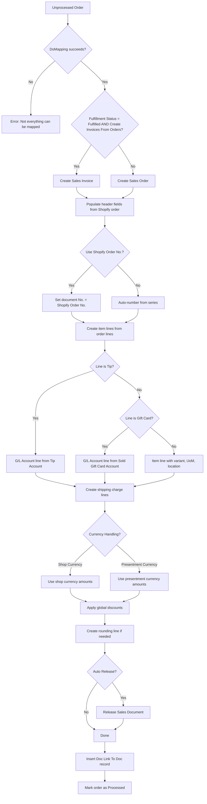

# Business logic

## Product sync

Product sync is driven by `Shpfy Sync Products` (codeunit 30185), which reads `Shop."Sync Item"` to decide direction.

**Import from Shopify** (`ImportProductsFromShopify`): The `Product API` fetches a `Dictionary of [BigInteger, DateTime]` -- product IDs and their `UpdatedAt` timestamps. For each ID, the code checks whether a local `Shpfy Product` exists. If it does, it compares `Product."Updated At" < UpdatedAt` AND `Product."Last Updated by BC" < UpdatedAt`. Only products that pass both checks are added to a temporary record set. New products (no local record) are always added. The temporary set is then processed one-at-a-time through `Shpfy Product Import`, wrapped in the standard `Commit(); ClearLastError(); if not Run()` error isolation loop.

**Export to Shopify** (`ExportItemsToShopify`): Delegates to `Shpfy Product Export`, which iterates BC Items matching the shop's filters, builds temporary Shpfy Product and Variant records from Item data, compares them against existing Shopify records using hash fields (`Description Html Hash`, `Tags Hash`, `Image Hash`), and pushes only changed data via GraphQL mutations. The export can be limited to prices only via `SetOnlyUpdatePriceOn`.

Key gotcha: product sync direction is one-way per shop configuration. There is no bidirectional merge. If `Sync Item` is "To Shopify", the import path never runs, and vice versa. Changing direction mid-stream does not reconcile differences.

## Customer sync

`Shpfy Sync Customers` (codeunit 30123) handles both directions in a single run, controlled by shop settings.

**Import**: When `Customer Import From Shopify` is `AllCustomers`, it fetches all customer IDs and imports new/changed ones (same timestamp comparison as products). When set to `WithOrderImport` and `Shopify Can Update Customer` is on, it imports only previously-known customers (skips creating new ones from the ID list). The import uses `Shpfy Customer Import` per customer, wrapped in the Commit/ClearLastError loop.

**Export**: When `Can Update Shopify Customer` is on, `Shpfy Customer Export` pushes BC customer changes to Shopify. Note: creating new customers in Shopify is done via a separate "Add Customer to Shopify" action, not the sync.

Customer mapping is pluggable via the `ICustomerMapping` interface. The `Customer Mapping Type` enum on Shop selects the strategy. The interface's `DoMapping` method receives a Shopify customer ID, a JSON object with address fields, and the shop code, and returns a BC Customer No. Strategies include mapping by email, phone, name+city combinations, or always using a default customer.

Mutual exclusion: `Shopify Can Update Customer` and `Can Update Shopify Customer` are mutually exclusive -- enabling one disables the other in field validation triggers. This prevents update loops.

## Order import and processing

Order handling is the most complex flow. It has two distinct phases: **import** (fetching from Shopify) and **processing** (creating BC documents).

### Import phase

The import phase runs via `Shpfy Sync Orders from Shopify` (report 30104), which fetches orders from Shopify, creates/updates `Shpfy Orders to Import` staging records, then creates/updates `Shpfy Order Header` and `Shpfy Order Line` records. During import, it also resolves customers, companies, shipping methods, and payment methods via mapping events.

### Processing phase

`Shpfy Process Orders` (codeunit 30167) iterates unprocessed orders and calls `Shpfy Process Order` (codeunit 30166) for each one. The processing flow:

The dual-currency branching is pervasive. In `CreateLinesFromShopifyOrder`, every monetary assignment has a `case ShopifyShop."Currency Handling"` block choosing between shop-currency and presentment-currency fields. This applies to line unit prices, discounts, shipping charges, and rounding amounts.

Error handling: `Process Orders` wraps each order in a `if not ProcessOrder.Run() then` block. On failure, it records the error message on the order header, clears the sales order/invoice number, calls `CleanUpLastCreatedDocument` to delete the partially-created sales document, and continues to the next order. On success, it marks the order as Processed and stamps `Processed Currency Handling`.

After processing orders, `Process Orders` also handles refunds. If `Return and Refund Process` is "Auto Create Credit Memo", it iterates unprocessed refund headers and calls `IReturnRefundProcess.CreateSalesDocument` for each one.

### Order mapping

Before processing, `Shpfy Order Mapping.DoMapping` runs. This resolves:

- **Customer mapping** via events (`OnBeforeMapCustomer`, `OnAfterMapCustomer`) -- if not handled by an event subscriber, uses the `ICustomerMapping` interface selected by the shop's `Customer Mapping Type`
- **Company mapping** for B2B orders via `OnBeforeMapCompany`
- **Shipment method** via `OnBeforeMapShipmentMethod` -- falls back to `Shpfy Shipment Method Mapping` table lookup
- **Payment method** via `OnBeforeMapPaymentMethod` -- falls back to `Shpfy Payment Method Mapping` table lookup

Mapping must fully succeed or the order will not process. The `MappingErr` error aborts processing for that order.

## Fulfillment sync

Fulfillment works in the opposite direction -- BC shipments push to Shopify. When a sales shipment is posted for an order that originated from Shopify (identified by `Shpfy Order No.` on the shipment header, transferred via an event subscriber on `Sales-Post`), the connector can create a fulfillment in Shopify.

The fulfillment sync reads `Shpfy Fulfillment Order Header` and `Shpfy Fulfillment Order Line` records (Shopify's fulfillment order concept), matches them against posted shipment lines, and calls the `GQL FulfillOrder` mutation with tracking numbers, URLs, and the notify-customer flag.

The `Send Shipping Confirmation` field on Shop controls whether Shopify emails the customer when a fulfillment is created.

When the shop has `Fulfillment Service Activated`, BC acts as a Shopify fulfillment service. In this mode, Shopify sends fulfillment requests to BC (via `Shpfy Fulfillment Order Header` with `Request Status`), and BC accepts/fulfills them. The `GQL AcceptFFRequest` mutation handles acceptance.

## Return and refund processing

Returns and refunds are imported as part of order sync. `Shpfy Return Header` and `Shpfy Return Line` are purely informational -- they record what the customer is returning.

`Shpfy Refund Header` represents the actual money movement. A refund may or may not be linked to a return (via `Return Id`). Processing depends on the `Return and Refund Process` shop setting:

- **Import Only**: Refunds are imported but no BC documents are created. This is the default.
- **Auto Create Credit Memo**: After order processing, unprocessed refunds are picked up by `ProcessShopifyRefunds`, which uses the `IReturnRefundProcess` interface to create sales credit memos. The interface implementation creates a credit memo header, adds lines for refunded items (or G/L lines for non-restockable items using the `Refund Acc. non-restock Items` account), and links the result via `Shpfy Doc. Link To Doc.`.

The `CheckCanCreateDocument` method on Refund Header checks the doc link table to prevent duplicate credit memos. Error tracking uses Blob fields (`Last Error Description`, `Last Error Call Stack`) for full error details.

Key constraint: `Auto Create Credit Memo` requires `Auto Create Orders` to be enabled. This is enforced in both directions -- disabling auto-create orders when refund processing is set to auto-create will raise an error, and vice versa.

## Inventory sync

`Shpfy Sync Inventory` pushes BC stock levels to Shopify. For each `Shpfy Shop Location` that has a `Stock Calculation` other than Disabled, it uses the `Shpfy Stock Calculation` interface to compute available stock. The interface has multiple implementations (projected available balance, non-negative inventory, etc.) selected by the enum on the location record.

After calculating stock, it compares against the current Shopify inventory level and uses the `GQL ModifyInventory` mutation to adjust. The `OnAfterCalculationStock` event allows extensions to adjust the computed stock value before it is sent.

## Company sync (B2B)

`Shpfy Sync Companies` follows the same pattern as customer sync -- fetch IDs with timestamps, filter by `Updated At`/`Last Updated by BC`, import changed records in a Commit/ClearLastError loop. Company mapping uses the `ICompanyMapping` interface, selected by `Company Mapping Type` on Shop. The `Auto Create Catalog` flag triggers automatic catalog creation for new companies.

B2B orders carry `Company Id`, `Company Location Id`, and `Company Main Contact` fields on the order header. The `B2B` boolean flag distinguishes B2B from DTC orders.
