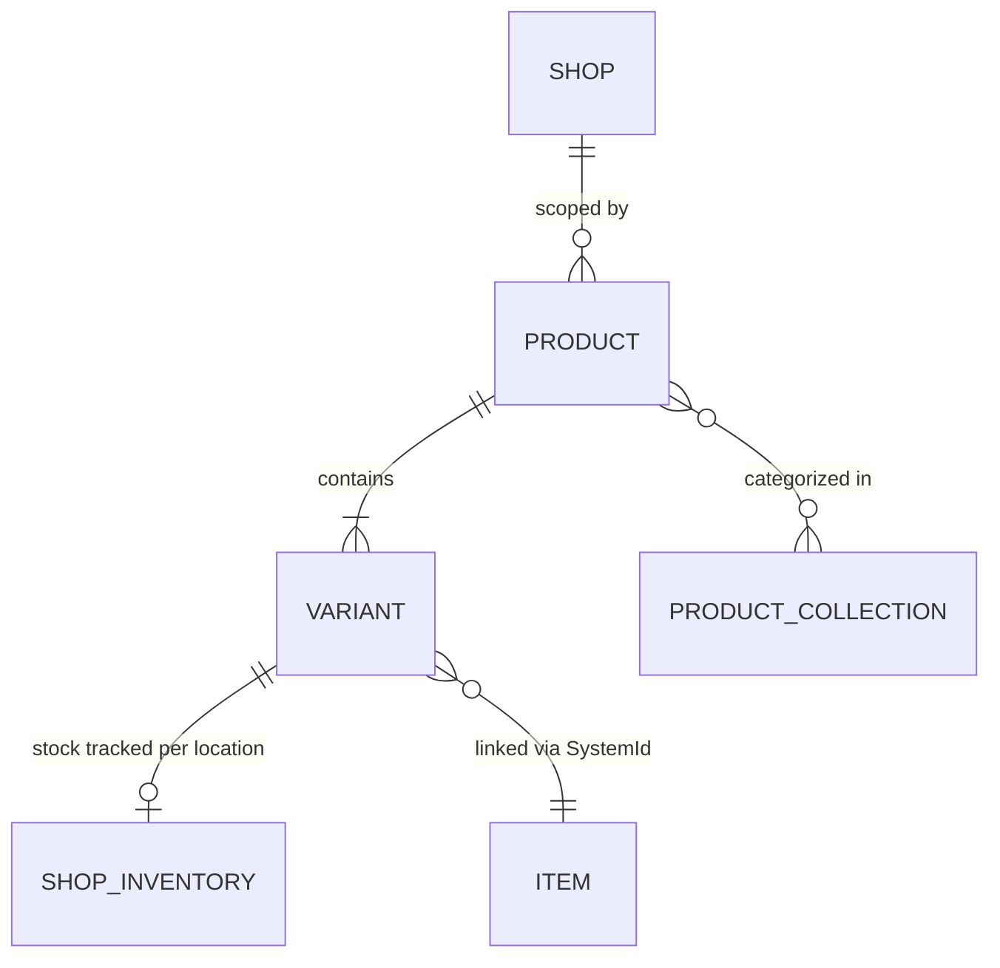
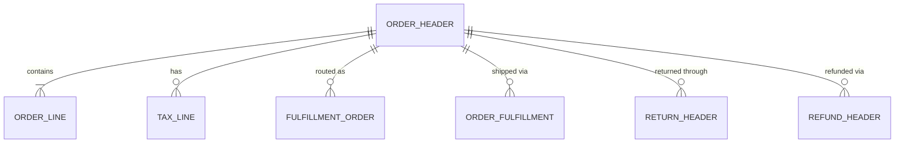
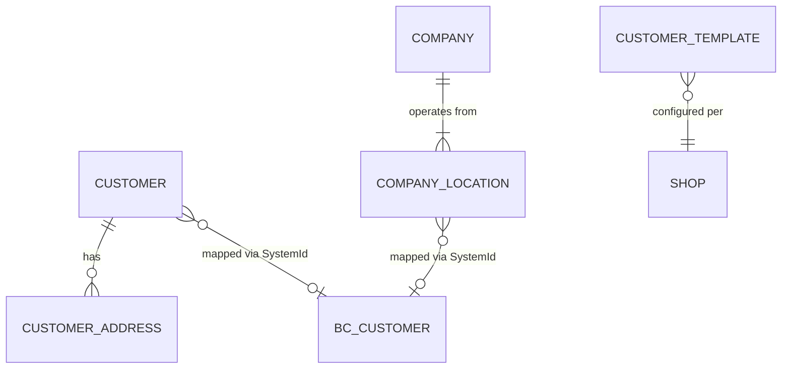
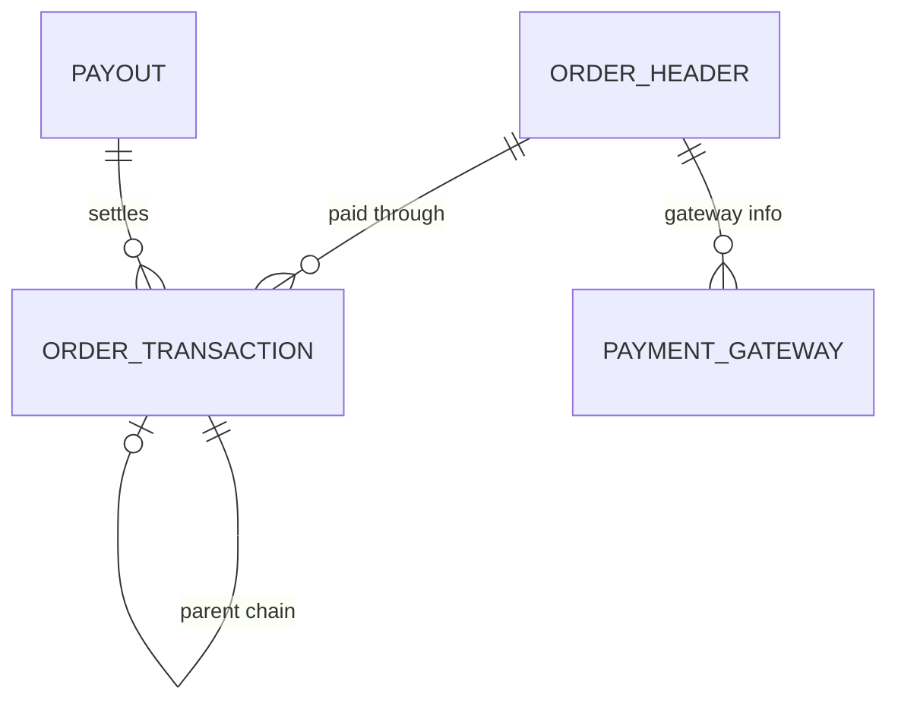
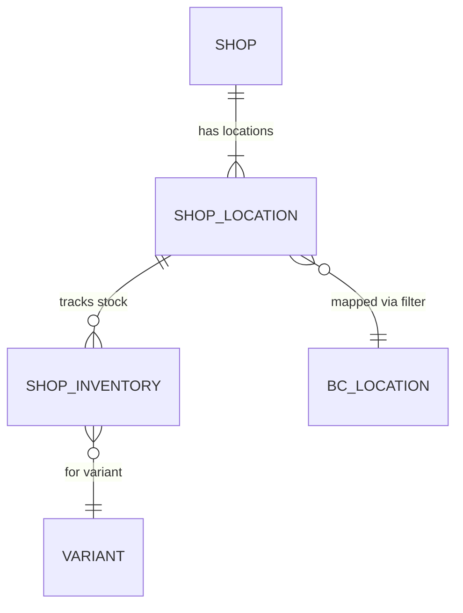

# Data model

The Shopify Connector's data model mirrors Shopify's own domain model more than it mirrors BC's. This is deliberate -- the connector needs to faithfully represent what Shopify sends, then map it to BC structures during order processing. The result is a parallel set of tables that shadow Shopify entities, linked to BC records through SystemId guids and document number references.

## Product catalog

The product hierarchy follows Shopify's structure: a Product contains Variants, and Variants are the purchasable units. The critical design decision is that the Product table (30127) links to BC Item through `Item SystemId` (a Guid), not through `Item No.`. The `Item No.` field exists as a FlowField that resolves through SystemId. This means products survive item renumbering without breaking the mapping.

The `Has Variants` flag on the Product controls whether the connector creates BC Item Variants or treats the Shopify product as a single-variant item. Shopify always has at least one variant per product, but when `Has Variants` is false, the connector maps the sole variant directly to the Item without creating an Item Variant record.

Variants carry three option name/value pairs (`Option 1 Name`/`Option 1 Value` through 3), reflecting Shopify's hard limit of 3 product options. When item attributes are mapped as options, this limit constrains how many attributes can participate. The `UoM as Variant` shop setting consumes one of these option slots for unit of measure, further reducing available slots.

Change detection uses integer hash fields on the Product: `Image Hash`, `Tags Hash`, and `Description Html Hash`. During export, the connector compares the current hash against the stored one to skip unchanged products. These are plain integer hashes (via `ShpfyHash` codeunit), not cryptographic -- collisions are possible but rare enough for change detection purposes.

The `Shpfy Product Collection` table (30127... actually a separate table) provides an N:M mapping between products and Shopify collections, keyed by Product Collection ID and Product ID.

## Order lifecycle

Orders are the most complex domain. The `Shpfy Order Header` (30118) stores approximately 50 active fields covering three address sets (sell-to, ship-to, bill-to), dual currency amounts (shop currency and presentment currency), B2B fields (`Company Id`, `PO Number`), and processing state.

The dual-currency design stores every monetary amount twice: once in the shop's base currency (`Total Amount`, `Subtotal Amount`, `VAT Amount`) and once in the customer's presentment currency (`Presentment Total Amount`, etc.). This matters for multi-currency storefronts where the customer pays in one currency but the merchant books revenue in another.

Order Lines (30119) link to the header via `Shopify Order Id`. Each line carries its own variant reference, quantity, and amounts. The line also has a `Gift Card` flag and a `Tip` flag -- these are not normal product lines and route to different GL accounts during sales document creation.

The `Line Items Redundancy Code` on the header is an integer hash of the concatenated, pipe-separated line IDs, computed by the `ShpfyHash` codeunit in `ShpfyImportOrder.Codeunit.al`. When re-importing an order that was already processed into a BC sales document, the connector compares this hash against the stored value. A mismatch (meaning lines were added or removed in Shopify after BC processed the order) triggers a conflict flag.

Fulfillment Orders (`Shpfy FulFillment Order Header`, 30143) represent Shopify's modern fulfillment model where each fulfillment order is scoped to a single location. These are distinct from actual Order Fulfillments (`Shpfy Order Fulfillment`, 30135), which represent completed shipments with tracking info. The connector imports both: fulfillment orders for location-aware order routing, and fulfillments for shipment tracking.

Returns and Refunds are deliberately separate entities. The `Shpfy Return Header`/`Return Line` tables track customer return requests, while `Shpfy Refund Header`/`Refund Line` track financial adjustments. A return can exist without a refund (customer sends item back, refund pending) and a refund can exist without a return (price adjustment, no physical return). The `IReturnRefundProcess` interface controls whether these are imported and whether credit memos are auto-created.

## Customer and company

The `Shpfy Customer` table (30105) stores Shopify customer data with a `Customer SystemId` guid linking to BC's Customer table. The `Shpfy Customer Address` table uses a BigInteger `Id` as its primary key. Addresses created by BC (during customer export) use negative IDs to avoid colliding with Shopify-assigned positive IDs -- a simple but effective convention.

B2B support adds the `Shpfy Company` table (30150) and `Shpfy Company Location` table. A Company can have multiple locations, and each location can map to a different BC customer. This is unusual -- in BC, a customer is typically a single entity, but in Shopify B2B, a company location is the billing/shipping unit. The `Customer SystemId` field appears on both Company and Company Location, allowing mapping at either level.

Customer Templates (`Shpfy Customer Template`, keyed by Shop Code + Country/Region Code) control how new BC customers are created during import. The template provides a default customer number and template code per country, giving per-market configuration.

## Payments and transactions

The `Shpfy Order Transaction` table (30133) stores payment events with a `Type` enum (authorization, capture, refund, etc.) and a `Gateway` text field for the payment provider name. Transactions form parent-child chains -- a capture references its authorization, a refund references its capture. The combination of Gateway + card brand determines which BC Payment Method is used during sales document creation.

Payouts (`Shpfy Payout` table) represent bank settlement records from Shopify Payments, used for bank reconciliation. Gift cards (`Shpfy Gift Card` table) have a dual role: they appear as products when sold (routed to the `Sold Gift Card Account` GL account) and as payment methods when redeemed (appearing as transactions on orders).

## Inventory

The `Shpfy Shop Location` table (30113) maps Shopify locations to BC location filters. Each Shop Location has a `Location Filter` field (a BC location filter expression) and a `Default Location Code`. The filter determines which BC locations contribute stock when calculating available inventory for that Shopify location.

The `Shpfy Shop Inventory` table (30112) stores per-variant-per-location stock snapshots, keyed by Shop Code + Product Id + Variant Id + Location Id. The `Shopify Stock` field records the last-known Shopify stock level, and the connector sends adjustments (deltas) rather than absolute values when syncing inventory to Shopify.

Stock calculation is pluggable through interfaces. `Shpfy Stock Calculation` provides a simple `GetStock(Item)` method, while `Shpfy Extended Stock Calculation` extends it with a `GetStock(Item, ShopLocation)` overload that receives the location context. The `Shpfy IStock Available` interface separately answers whether a given stock calculation type can have stock at all (used to skip non-stocking scenarios).

## Cross-cutting concerns

**Metafields** (`Shpfy Metafield`, 30101) are Shopify's custom field mechanism. Each metafield has a Namespace, Name (key), Value, Type, and Owner Id. The `IMetafieldOwnerType` interface handles polymorphic ownership -- a metafield can belong to a product, variant, customer, or company. The `IMetafieldType` interface handles type-specific validation (the Value field's OnValidate trigger delegates to the type interface).

**Tags** (`Shpfy Tag`, 30100) are normalized rows parsed from Shopify's CSV-formatted tag strings. They link to a parent entity via `Parent Table No.` and `Parent Id`, making them polymorphic across products, orders, customers, and companies.

**Document Links** (`Shpfy Doc. Link To Doc.`, 30146) provide an N:M junction between Shopify documents and BC documents. The table uses enum-based polymorphism for both sides: `Shopify Document Type` and `Document Type` are enums, and the `OpenShopifyDocument`/`OpenBCDocument` methods dispatch through `IOpenShopifyDocument` and `IOpenBCDocument` interfaces respectively.

**Data Capture** (`Shpfy Data Capture`, 30114) stores raw JSON blobs linked to any record via `Linked To Table` (table ID) and `Linked To Id` (SystemId). This is the connector's audit trail and debugging tool. When an order import goes wrong, the captured JSON shows exactly what Shopify sent.

**Skipped Records** (`Shpfy Skipped Record`, 30159) log every record the connector deliberately chose not to sync, with a reason text. This is distinct from errors -- a skipped record means the connector's logic decided to exclude it (blocked item, unchanged product, etc.).
