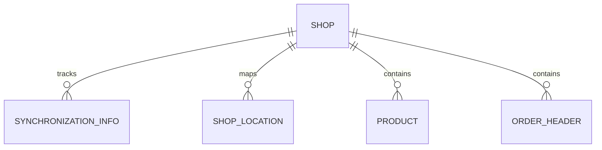
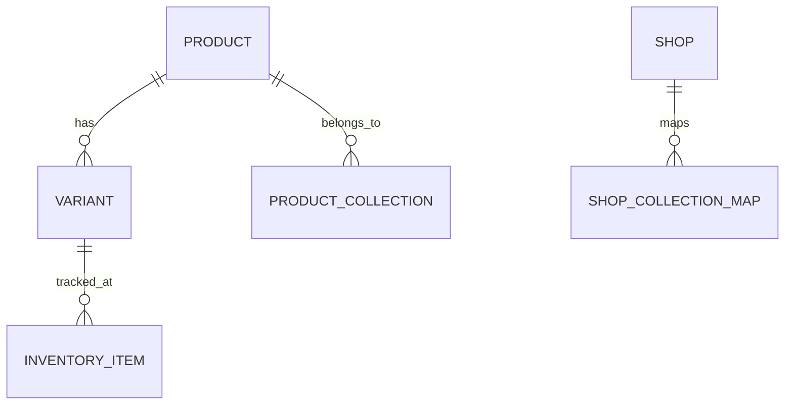
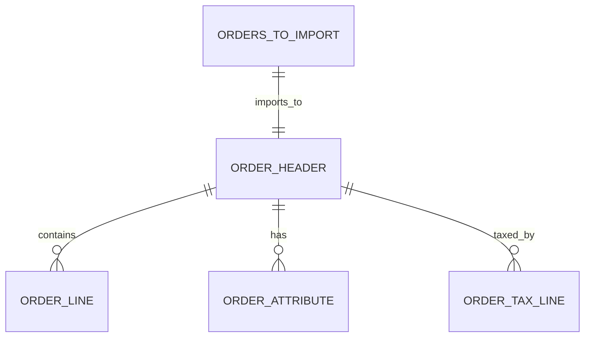
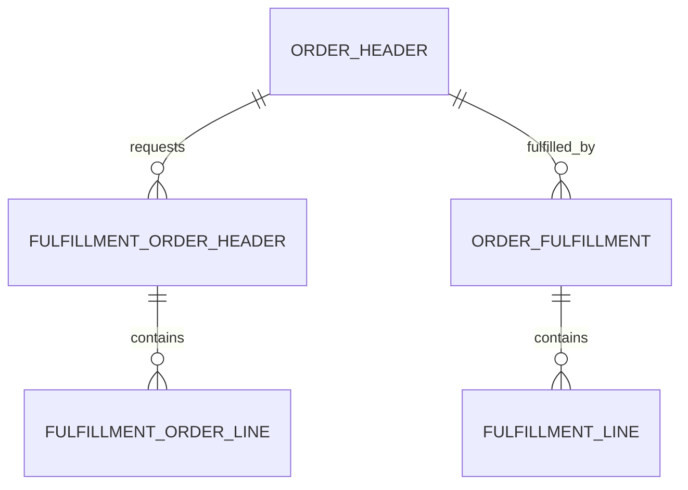
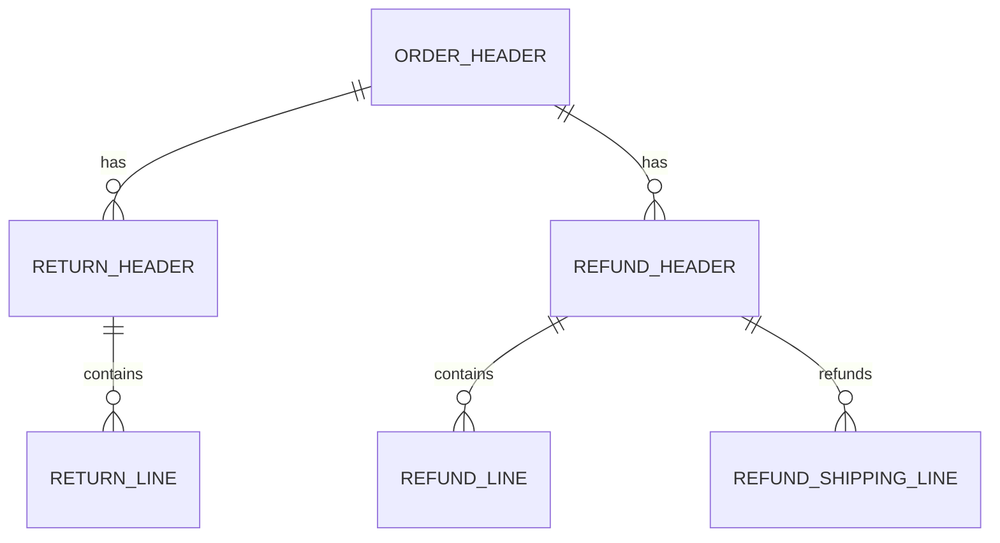
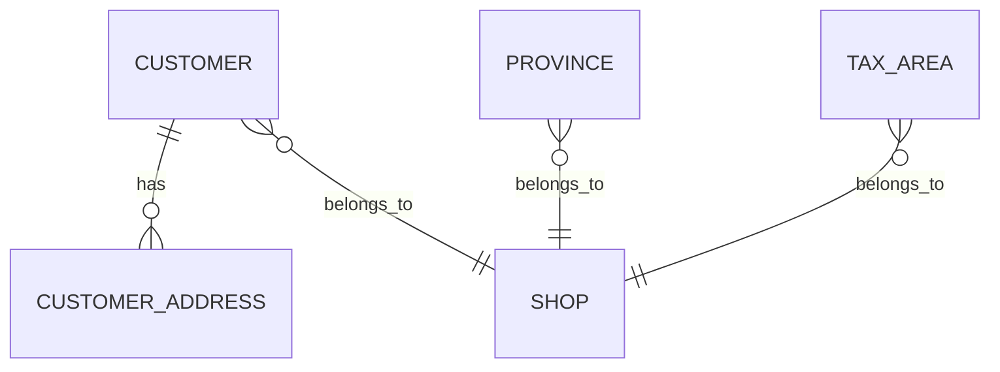
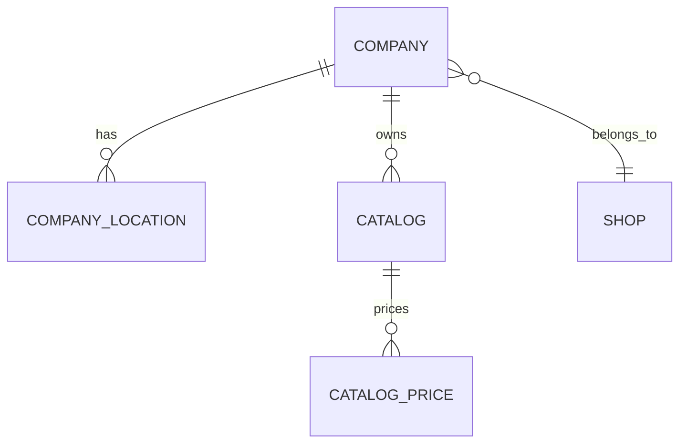
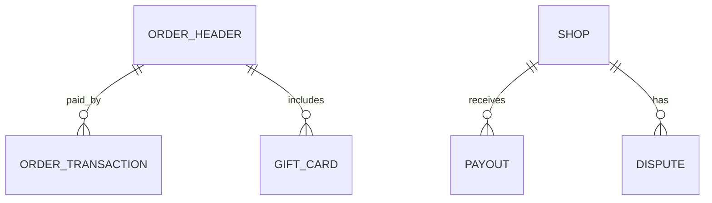
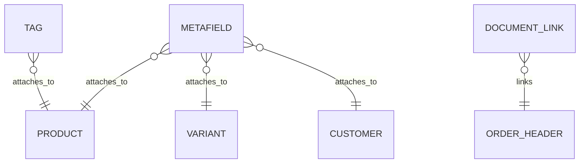

# Data model

This document covers how the Shopify Connector's data fits together. Each section explains a conceptual domain, includes an ER diagram, and highlights non-obvious design decisions.

## Configuration

The Shop table is the center of the configuration universe. Every sync operation, mapping strategy, webhook setting, and G/L account mapping lives on a single Shop record identified by a `Code[20]`. A BC company can connect to multiple Shopify shops, but each shop has exactly one configuration.

Synchronization Info stores the last sync timestamp per shop and sync type (products, customers, orders, inventory, etc.). It is keyed on Shop Code + Synchronization Type. For order sync specifically, the key is the Shop's integer hash (`"Shop Id"`) rather than the Shop Code -- this allows multiple BC companies connected to the same Shopify store to share one order sync cursor without re-importing the same orders.

The Shop table includes plan-based feature flags. The `"Advanced Shopify Plan"` field (207) is set to true for Plus, Plus Trial, Development, and Advanced plans, and currently gates staff member features. The old `"B2B Enabled"` field (117) has been obsoleted (CLEAN29/CLEANSCHEMA32 guards) -- B2B features are now unconditionally available on all plans.

*Updated: 2026-04-08 -- B2B Enabled obsoleted, Advanced Shopify Plan added*

Shop Location maps Shopify fulfillment locations to BC warehouse locations. Each mapping includes a stock calculation enum that determines how to compute available stock for that pairing.

The Shop's `GetEmptySyncTime()` returns `2004-01-01` as a sentinel for "never synced" -- not `0DT`. This date is far enough in the past to import all data on first sync but avoids edge cases with zero-date handling in AL. The `SetLastSyncTime()` method stores `CurrentDateTime` after a successful sync. When the next sync runs, it passes this timestamp to Shopify's `updated_at` filter to fetch only changed records.

## Product catalog

A Shopify product is a parent container holding one or more variants. In BC terms, a Product maps to an Item, and Variants map to Item Variants. The Product table stores the Shopify product ID (BigInteger), description, title, status, and crucially three hash fields: `"Image Hash"`, `"Tags Hash"`, and `"Description Html Hash"`. These enable the export flow to skip API calls when nothing has changed.

Each Variant belongs to a Product (via `"Product Id"`) and can map to both an Item and an Item Variant via their respective SystemIds. Variants carry the pricing fields (Price, Compare at Price, Unit Cost) and up to three option name/value pairs that represent Shopify's variant options (size, color, etc.).

Inventory Items represent the inventory-trackable entries for each variant at each Shopify location. Shop Inventory combines the location mapping with the calculated stock level.

Product Collections model Shopify's collections concept (manual or automated groupings of products). Shop Collection Map links a Shopify collection to a BC entity like a Tax Group or VAT Product Posting Group, driven by the Shop's `"Product Collection"` setting.

The `"Item SystemId"` field on both Product and Variant is a GUID linking to BC's Item table. The `"Item No."` FlowField resolves this to the human-readable item number via a CalcFormula lookup. This design means renumbering items in BC does not break the link. The same pattern applies to `"Item Variant SystemId"` on Variant.

The HTML description is stored in a Blob field (`"Description as HTML"`) because AL's Text fields cap at 2048 characters and Shopify product descriptions can be substantially longer. The hash is computed when the description is set (via `SetDescriptionHtml()`) and compared during export to avoid unnecessary API updates.

## Order lifecycle

Orders flow through a staging pipeline: first they appear in Orders to Import (lightweight records with just the Shopify order ID and basic metadata), then they are imported into Order Header and Order Lines, and finally processed into BC Sales Orders or Sales Invoices.

The Order Header is one of the largest tables in the connector. It stores complete sell-to, ship-to, and bill-to address blocks, financial summaries in dual currency (shop currency and presentment currency), status tracking, customer mappings, B2B fields (company ID, company location ID, PO number), and processing state flags.

Order Lines carry the item-level detail including the Shopify variant ID, mapped BC item number, quantities, and dual-currency amounts. Special line types include tips and gift cards, identified by boolean flags.

Order Attributes and Order Line Attributes store Shopify's custom attributes (key-value pairs that merchants can attach to orders). Order Tax Lines track per-tax-rate amounts, including a `"Channel Liable"` flag for marketplace tax collection.

The dual currency design deserves attention. Every monetary field on the Order Header exists twice: once in the shop's base currency (`"Total Amount"`, `"Discount Amount"`, etc.) and once in the presentment currency (`"Presentment Total Amount"`, `"Presentment Discount Amount"`, etc.). The Shop's `"Currency Handling"` setting controls which set of amounts is used when creating BC sales documents. The `"Processed Currency Handling"` field on the order captures which mode was actually used, so re-processing uses the same logic.

## Fulfillment

Shopify's fulfillment model has two layers: Fulfillment Orders (requests to fulfill from a specific location) and Fulfillments (actual shipments). This maps to two pairs of header/line tables.

Fulfillment Order Headers represent the fulfillment requests assigned to locations. They track the status (Open, InProgress, Closed, etc.) and the assigned location. Fulfillment Order Lines track which order line items are included and how many units.

Order Fulfillments represent actual shipments. When BC posts a sales shipment, the connector creates a fulfillment in Shopify with tracking information. Fulfillment Lines detail the specific items and quantities shipped.

The distinction matters operationally: a fulfillment order is "please ship these items from this location" while a fulfillment is "these items were actually shipped with this tracking number." An order can have fulfillment orders at multiple locations, and each can result in separate fulfillments.

## Returns and refunds

Returns and refunds are independent concepts in Shopify's data model. A return tracks the physical merchandise coming back (customer initiated a return, items are in transit or received). A refund tracks the financial reversal (money back to the customer). You can have a refund without a return (e.g., goodwill credit) or a return without a refund (e.g., exchange).

Return Headers link to the originating order and carry status information. Return Lines detail which items are being returned, the quantity, and the return reason.

Refund Headers also link to the originating order and carry a note and creation timestamp. Refund Lines track the refunded quantities, amounts in dual currency, and the restock type (Return, Cancel, NoRestock). Refund Shipping Lines handle refunded shipping costs separately.

The restock type on refund lines is important for inventory: `Return` means the item is going back to stock at the return location, `Cancel` means the item was never shipped, and `NoRestock` means the refund is purely financial. The connector uses this to decide whether to create inventory adjustments.

## Customer management

The Shopify Customer table mirrors Shopify's customer resource. It stores the Shopify customer ID, email, phone, name, and a `"Customer SystemId"` linking to the BC Customer table (again via GUID, with a FlowField for the human-readable number).

Customer Addresses hold the customer's saved addresses. Provinces store Shopify's province/state data for country-region resolution. Tax Areas map Shopify's tax jurisdictions to BC's tax area codes, used when creating sales documents.

The Customer Template table (`ShpfyCustomerTemplate.Table.al`) allows different BC customer templates to be selected based on the Shopify customer's country -- this is how the connector handles per-country posting group assignments when auto-creating BC customers.

## B2B companies

Companies model Shopify's B2B entities. A Company has one or more Company Locations (analogous to ship-to addresses), each of which can have its own customer mapping in BC. Catalogs provide company-specific product assortments and pricing.

The Company table stores the Shopify company ID, name, and a `"Customer SystemId"` linking to a BC customer. Company Locations carry address details and their own `"Customer SystemId"` for per-location BC customer mapping. This two-level structure supports scenarios where a single company has multiple shipping locations, each needing different tax or posting setups.

Catalog Prices store per-product pricing overrides for B2B catalogs. Payment Terms map Shopify's payment terms to BC's payment terms codes.

The B2B order flow differs from D2C: when an order has a `"Company Id"`, the connector uses the company mapping strategy instead of the customer mapping strategy, and it looks up the company location to determine the bill-to/ship-to customer. B2B features (companies, catalogs, company sync) are available on all Shopify plans -- they are no longer gated by a plan-specific flag.

*Updated: 2026-04-08 -- B2B no longer gated by plan*

## Payments and transactions

Order Transactions record the individual payment events on an order (authorization, capture, refund). They are imported from Shopify and store amounts, gateway names, and status. A `"Shop"` field links each transaction to its Shop record (populated via upgrade DataTransfer from Order Header).

*Updated: 2026-04-08 -- Shop field added to OrderTransaction*

Gift Cards have their own table because they serve dual roles: as a line item when purchased and as a payment instrument when redeemed.

Payouts represent Shopify's periodic settlements to the merchant's bank account. Disputes track chargeback and inquiry events.

## Infrastructure

Several tables serve as cross-cutting infrastructure used across multiple domains.

Metafields attach custom key-value data to any owning entity (Product, Variant, Customer, Company). They use a polymorphic pattern: `"Parent Table No."` identifies the owner's table, and `"Owner Id"` identifies the specific record. The `"Owner Type"` enum and `IMetafieldOwnerType` interface abstract over the different owner types. Each metafield has a typed value validated by the `IMetafieldType` interface. Negative IDs indicate BC-created metafields not yet synced to Shopify.

Tags use the same polymorphic parent pattern (`"Parent Table No."` + `"Parent Id"`) and can attach to Products, Orders, or any other entity that supports them. They are stored as individual records with a 250-tag-per-parent limit enforced in the OnInsert trigger.

Data Capture stores raw JSON responses from Shopify API calls, linked to the record they were imported for via `"Linked To Table"` and `"Linked To Id"` (using SystemId). This is used for debugging and for extracting additional data that the connector does not explicitly model.

Log Entries record activity for debugging, with a configurable logging mode on the Shop (None, Errors Only, All).

Document Links (`Shpfy Doc. Link To Doc.`) create bidirectional associations between Shopify documents (orders, returns, refunds) and BC documents (sales orders, invoices, credit memos). This table uses enum-driven dispatch via `IOpenBCDocument` and `IOpenShopifyDocument` interfaces to open the correct page for any linked document.

## Cross-cutting design decisions

**SystemId-based linking** is used everywhere that the connector references BC master data. Products link to Items via `"Item SystemId"`, Customers link via `"Customer SystemId"`, and so on. FlowFields provide the display value. This prevents broken references when BC records are renumbered.

**Cascade deletes in AL triggers** (not database-level foreign keys) ensure referential integrity. Deleting a Product cascades to its Variants and Metafields. Deleting an Order Header cascades to Lines, Returns, Refunds, Fulfillment Orders, Data Captures, and Fulfillments. This is implemented in OnDelete triggers because AL does not support database-level cascading deletes.

**Dual currency** is pervasive on order-related tables. Shop currency and presentment currency fields exist side by side for all monetary values. The `"Currency Handling"` enum on the Shop determines which set is used when creating BC documents.

**Polymorphic parent pattern** appears in Tags (`"Parent Table No."` + `"Parent Id"`), Metafields (`"Parent Table No."` + `"Owner Id"`), and Data Capture (`"Linked To Table"` + `"Linked To Id"`). This avoids creating separate tag/metafield tables per entity type.

**Negative ID convention** for BC-created records appears in Metafields and potentially other tables. When a record is created locally (not yet synced to Shopify), the OnInsert trigger assigns a negative ID by decrementing from the current minimum negative ID (or starting at -1). After Shopify assigns a real ID, the record is updated.

**Shop-scoped filtering** is applied everywhere. Almost every table has a `"Shop Code"` field and operations filter by it. This is the multi-tenancy mechanism -- a single BC company can connect to multiple Shopify shops without data mixing.
