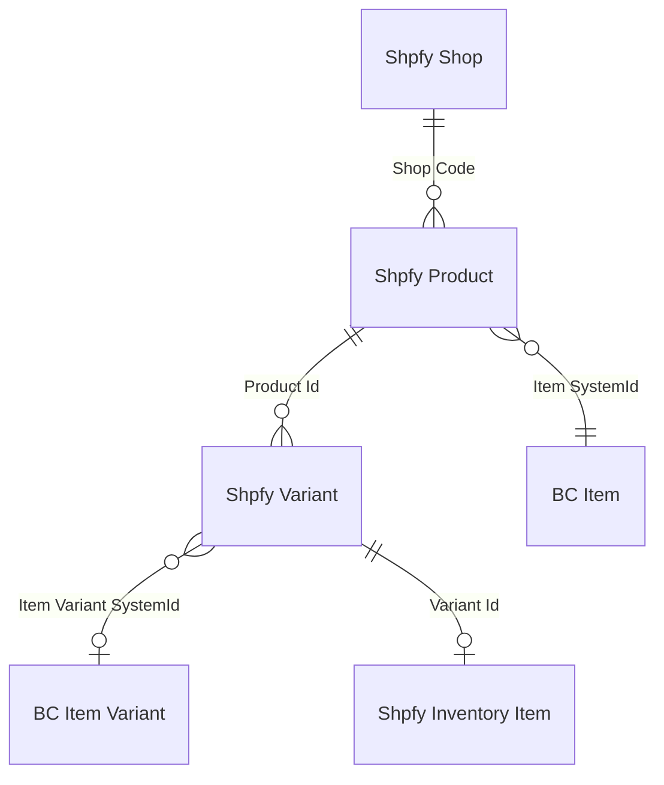
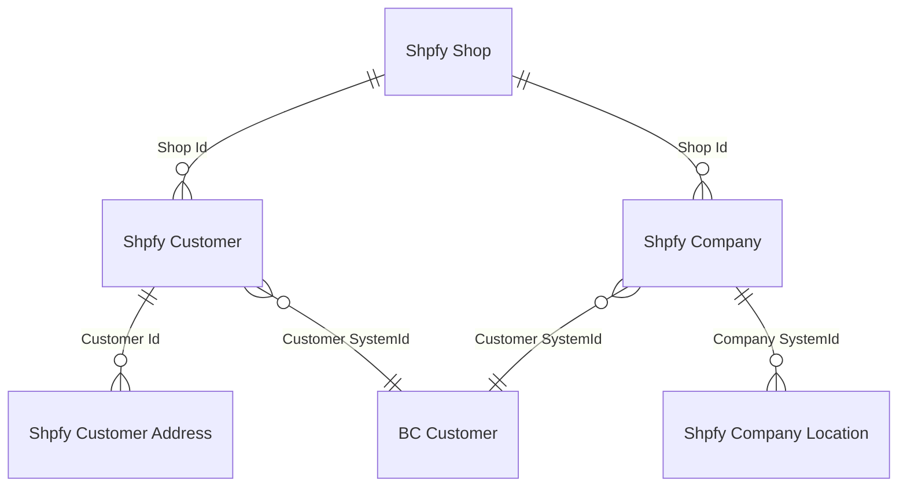
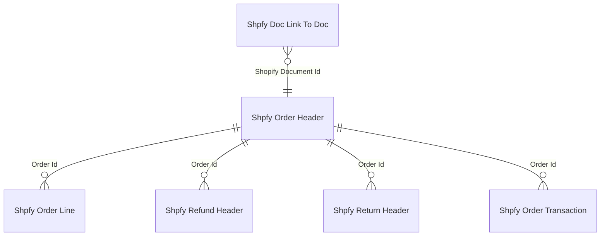
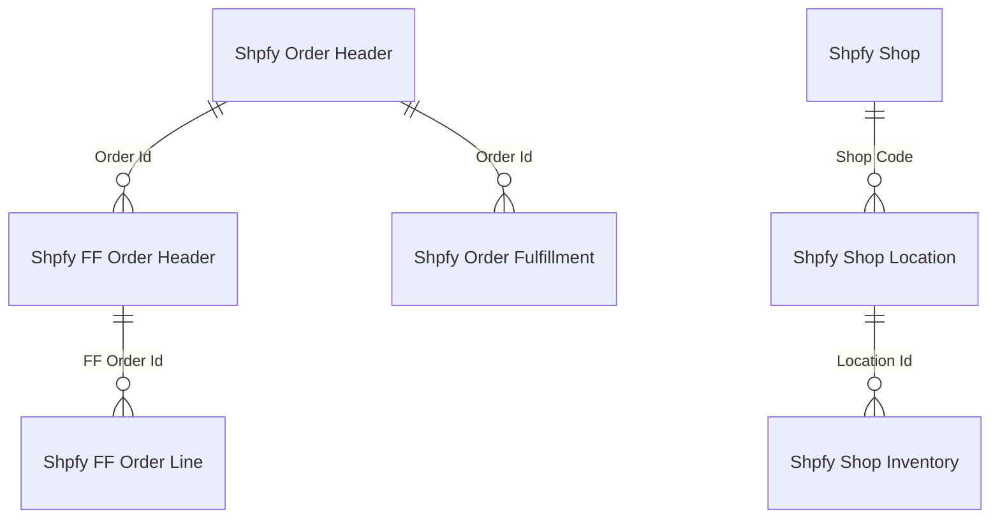
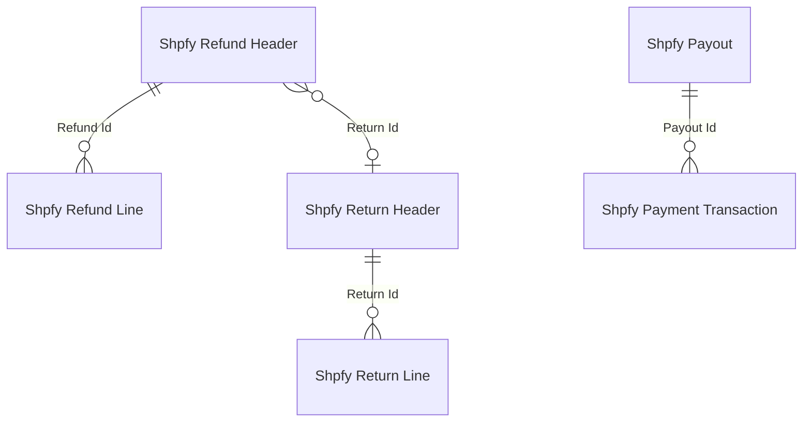

# Data model

## Entity relationship diagrams

### Product catalog

### Customers and companies

### Order lifecycle

### Fulfillments and shipping

### Refunds, returns, and payments

## Shop and configuration

The `Shpfy Shop` table (30102) is the central configuration record. One record per Shopify store. Its primary key is a `Code[20]`, but it also has a computed `Shop Id` (Integer) derived by hashing the Shopify URL. The `Shop Id` is used as a foreign key by customers and companies (which span shops), while `Shop Code` is used by products and orders (which belong to exactly one shop).

The Shop table holds references to BC posting groups, customer templates, G/L accounts (shipping charges, tips, gift cards, refunds, cash roundings), and enums controlling sync direction, customer mapping type, company mapping type, SKU mapping, stock calculation, currency handling, and return/refund processing. It also stores webhook IDs and user context for order-created webhooks.

The `Shpfy Synchronization Info` table tracks `Last Sync Time` per shop per sync type. For orders, the key is `Shop Id` (not `Shop Code`) -- this is a deliberate design choice so that renaming a shop code does not lose order sync state.

## Products and variants

`Shpfy Product` (30127) stores one record per Shopify product. It links to a BC Item via `Item SystemId` (Guid), with a FlowField `Item No.` that resolves the readable code. The `Last Updated by BC` timestamp prevents re-importing a product that BC just pushed to Shopify.

`Shpfy Variant` (30129) hangs off Product via `Product Id`. Each variant links to both `Item SystemId` and optionally `Item Variant SystemId`. Variants carry three option name/value pairs (Option 1..3), price, compare-at price, SKU, barcode, and weight. The `UoM Option Id` field supports the "UoM as Variant" feature where BC units of measure become Shopify variant options.

Hash-based change detection is used for product descriptions and tags. `Shpfy Product` stores `Description Html Hash`, `Tags Hash`, and `Image Hash` -- all computed via `Shpfy Hash.CalcHash()`. On export, the connector compares current hashes against stored ones to decide whether to push an update, avoiding unnecessary API calls.

`Shpfy Inventory Item` tracks the Shopify inventory item ID per variant. `Shpfy Shop Inventory` holds per-location inventory levels. `Shpfy Shop Location` maps Shopify locations to BC locations with a `Location Filter` for stock calculation and a `Default Location Code` for sales document creation.

`Shpfy Sales Channel` and `Shpfy Product Collection` track product publication and collection membership. `Shpfy Shop Collection Map` links collections to BC tax groups or VAT product posting groups.

## Orders

`Shpfy Order Header` (30118) is keyed by `Shopify Order Id` (BigInteger). It stores full sell-to, ship-to, and bill-to address blocks, financial/fulfillment/return status enums, and processing state (`Processed`, `Has Error`, `Error Message`, `Sales Order No.`, `Sales Invoice No.`).

The dual-currency model is prominent here. Every monetary field exists twice:

- **Shop currency**: `Total Amount`, `Subtotal Amount`, `VAT Amount`, `Discount Amount`, `Shipping Charges Amount`, `Total Tip Received` -- formatted using `Currency Code`
- **Presentment currency**: `Presentment Total Amount`, `Presentment Subtotal Amount`, `Presentment VAT Amount`, `Presentment Discount Amount`, `Pres. Shipping Charges Amount`, `Presentment Total Tip Received` -- formatted using `Presentment Currency Code`

The `Currency Handling` enum on Shop controls which set is used when creating BC sales documents. Once processed, the order stamps `Processed Currency Handling` so that the display remains consistent even if the shop setting changes later.

`Shpfy Order Line` (30119) is keyed by `(Shopify Order Id, Line Id)`. Lines carry `Item No.`, `Variant Code`, and `Unit of Measure Code` for the resolved BC mapping. Lines also have presentment variants of unit price and discount. Special boolean flags `Gift Card` and `Tip` cause the line to map to G/L accounts (from Shop config) rather than Items.

`Shpfy Orders to Import` is a staging table for the order import pipeline. Orders land here first during sync, then get processed into Order Header/Line records.

Supporting tables:

- `Shpfy Order Shipping Charges` -- one per shipping line, with both currency amounts and discount
- `Shpfy Order Tax Line` -- tax breakdown, with a `Channel Liable` flag for marketplace tax collection
- `Shpfy Order Attribute` / `Shpfy Order Line Attribute` -- key-value pairs from Shopify order attributes
- `Shpfy Order Discount Appl.` -- discount application details
- `Shpfy Order Payment Gateway` -- payment gateway names per order
- `Shpfy Order Risk` -- risk assessments, with a `Level` enum used by the `High Risk` FlowField on the header

## Customers and companies

`Shpfy Customer` (30105) stores Shopify customer data, linked to BC Customer via `Customer SystemId`. The `Shop Id` field ties the customer to a shop's hash ID. Customers have addresses in `Shpfy Customer Address` (one per Shopify address) and can have metafields and tags.

`Shpfy Company` (30150) is the B2B equivalent -- a Shopify company with `Customer SystemId` linking to BC Customer. Companies have `Shpfy Company Location` records for their physical locations. The `Main Contact Customer Id` links to the Shopify customer record of the company's main contact.

`Shpfy Customer Template` provides per-country customer template overrides beyond the default template on the Shop.

`Shpfy Province` and `Shpfy Tax Area` support tax area resolution. `Tax Area Priority` on Shop controls the lookup order (by city, county, state, country).

## Refunds, returns, and fulfillments

`Shpfy Return Header` (30147) and `Shpfy Return Line` represent Shopify returns. Returns are informational -- they track what the customer wants to send back, with status, decline reason, and discounted total amounts.

`Shpfy Refund Header` (30142) and `Shpfy Refund Line` represent actual refunds. A refund optionally links to a return via `Return Id`. Refund headers carry both currency amounts (`Total Refunded Amount` and `Pres. Tot. Refunded Amount`) and error tracking fields (`Has Processing Error`, `Last Error Description` as Blob). `Shpfy Refund Shipping Line` tracks refunded shipping costs.

The `Is Processed` field on Refund Header is a FlowField checking `Shpfy Doc. Link To Doc.` for a linked BC credit memo. This is the same pattern used by Order Header.

`Shpfy Order Fulfillment` (30111) records Shopify fulfillments with tracking numbers, URLs, and companies. `Shpfy Fulfillment Order Header` (30143) and `Shpfy Fulfillment Order Line` represent Shopify's fulfillment order concept -- the request to fulfill, which may come from Shopify to BC when BC acts as a fulfillment service.

## Payments and transactions

`Shpfy Order Transaction` stores individual payment transactions per order. `Shpfy Payment Transaction` and `Shpfy Payout` track Shopify Payments data. `Shpfy Dispute` tracks payment disputes.

`Shpfy Payment Method Mapping` maps Shopify payment gateways to BC payment methods. `Shpfy Shipment Method Mapping` maps Shopify shipping method titles to BC shipment methods (and optionally to item charge types for shipping cost lines).

`Shpfy Payment Terms` maps Shopify payment terms to BC payment terms codes, keyed by type + name + shop code.

## Metafields

`Shpfy Metafield` (30101) is a single generic table for all metafield owner types (Product, ProductVariant, Customer, Company). The `Owner Type` enum and `Parent Table No.` integer work together -- setting one triggers the other via the `IMetafieldOwnerType` interface. The `Type` enum has an `IMetafieldType` interface for validation (`IsValidValue`, `GetExampleValue`).

New metafields created locally in BC get **negative IDs** (starting at -1, decrementing in the OnInsert trigger) until they are synced to Shopify, which assigns real positive IDs. The `Last Updated by BC` timestamp prevents re-importing metafields that BC just pushed.

The money metafield type enforces that the currency code matches the shop's currency via `CheckShopCurrency`.

## Tags

`Shpfy Tag` (30104) is a polymorphic tag table keyed by `(Parent Id, Tag)`. The `Parent Table No.` field identifies the owner type (Product, Order, Customer). Maximum 250 tags per parent, enforced in OnInsert. The `UpdateTags` procedure does a delete-all/re-insert on every update -- there is no diffing.

## Document links

`Shpfy Doc. Link To Doc.` (30146) maps Shopify documents to BC documents with a four-part key: `(Shopify Document Type, Shopify Document Id, Document Type, Document No.)`. It supports multiple BC documents per Shopify document (e.g., an order could produce both a sales order and later a posted invoice). Both the order header's `Processed` flag and the refund header's `Is Processed` FlowField rely on existence checks against this table.

The table uses two interfaces -- `IOpenShopifyDocument` and `IOpenBCDocument` -- to navigate to the respective document pages, dispatched by enum value.
