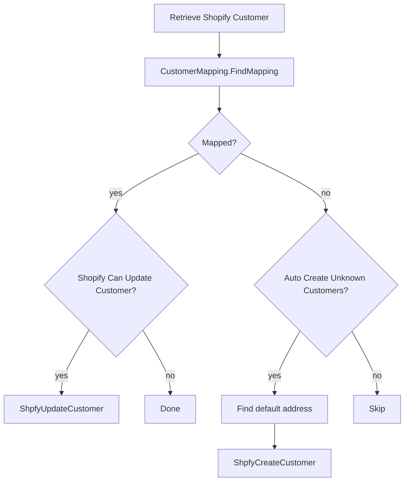
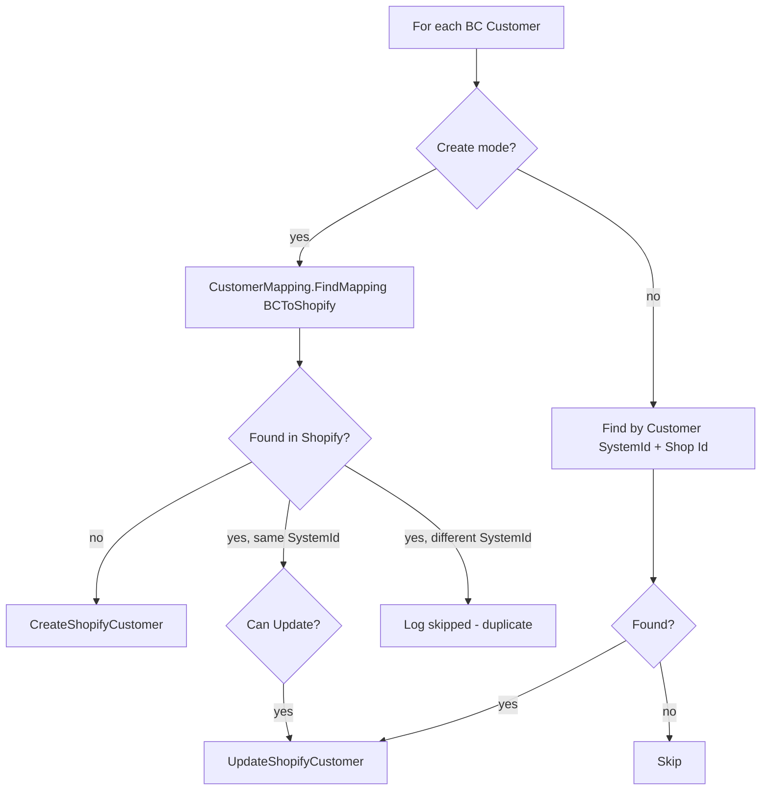

# Customers business logic

## Import flow

`ShpfySyncCustomers` discovers customer IDs from the Shopify API, then
`ShpfyCustomerImport` processes each one.

`FindMapping` in `ShpfyCustomerMapping` first checks whether the Shopify Customer
already has a `Customer SystemId` that resolves to a valid BC Customer. If the
linked customer was deleted, it clears the stale SystemId and proceeds with
discovery. The `OnBeforeFindMapping` event fires here, allowing full override.

The default discovery in `DoFindMapping` tries email first (case-insensitive
filter on BC Customer."E-Mail"), then phone. Phone matching uses
`CreatePhoneFilter`, which strips non-digits, trims leading zeros, and builds a
wildcard pattern like `*4*1*5*5*5*1*2*3*4` so formatting differences (spaces,
dashes, country codes) do not prevent matches.

Customer creation delegates to `ShpfyCreateCustomer`, which finds a template
using the address's country code. The `Shpfy Customer Template` table maps
(Shop Code, Country Code) to a Customer Template Code. When no country-specific
template exists, a new empty row is inserted (for future configuration) and the
Shop's default template is used. The `OnBeforeFindCustomerTemplate` event can
override this entirely.

## Export flow

`ShpfyCustomerExport` iterates BC Customers matching the report filters.

`FillInShopifyCustomerData` translates BC Customer fields into Shopify Customer
and Customer Address records. Name splitting respects three configurable sources
(Name, Name 2, Contact) and each source can be parsed as FirstAndLastName,
LastAndFirstName, or CompanyName. County mapping uses the `Shpfy Tax Area` table
to resolve between province codes and names based on the Shop's "County Source"
setting (Code or Name).

The export uses a diff check (`HasDiff`) comparing every field of the customer
and address records before and after filling. Only when something changed does
it call the API. This is the same RecordRef-based field comparison pattern used
in Products.

## County resolution

Two interface pairs handle province/county conversion.

`ICounty` converts from a stored Shopify Customer Address or Company Location
record to a BC County string. Implementations: `ShpfyCountyCode` (returns
province code) and `ShpfyCountyName` (returns province name).

`ICountyFromJson` converts from a raw JSON address object during API response
parsing. Implementations: `ShpfyCountyFromJsonCode` and
`ShpfyCountyFromJsonName`.

## Customer name formatting

`ICustomerName` takes first name, last name, and company name and produces the
BC Customer Name. Implementations:

- `ShpfyNameisFirstLastName` -- "First Last"
- `ShpfyNameisLastFirstName` -- "Last First"
- `ShpfyNameisCompanyName` -- uses company name
- `ShpfyNameisEmpty` -- returns empty (for cases where name is set elsewhere)
