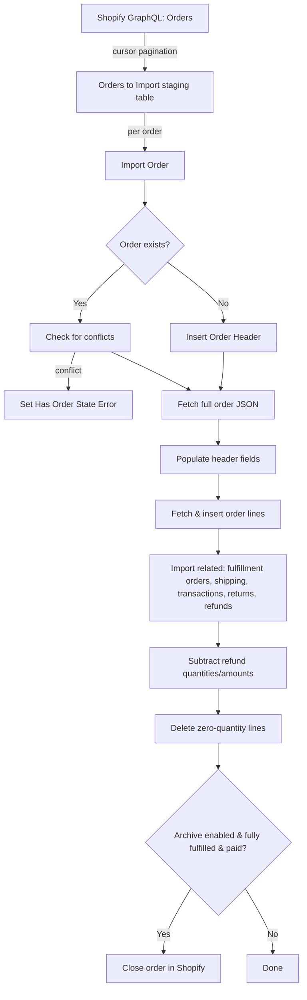
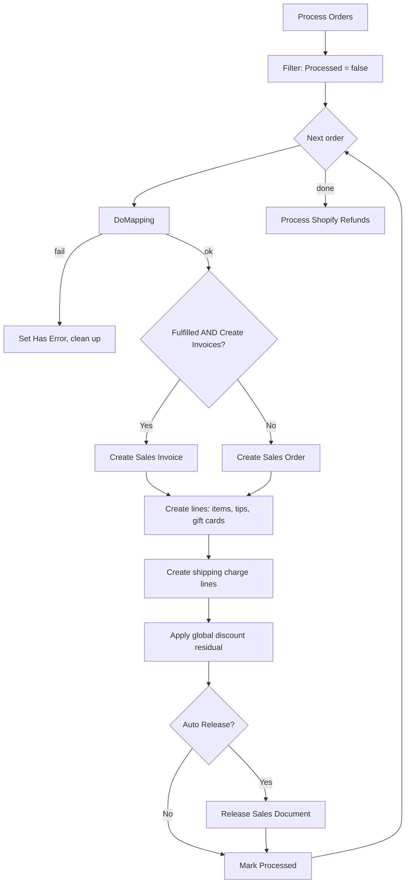

# Order handling -- business logic

## Order import

`ShpfyOrdersAPI.GetOrdersToImport` cursor-paginates through the Shopify GraphQL Orders API. It writes rows into `Shpfy Orders to Import` -- a staging table displayed in the "Orders to Import" page. Each row carries lightweight summary data (amounts, statuses, tags, risk, channel info). The `"Import Action"` field is set to `New` or `Update` depending on whether a matching `Shpfy Order Header` already exists. Closed orders that have never been imported are skipped.

`ShpfyImportOrder.ImportOrderAndCreateOrUpdate` does the heavy lifting per order:

1. Ensures an `Shpfy Order Header` record exists (insert if new).
2. Retrieves the full order JSON via `GetOrderHeader` GraphQL query.
3. Retrieves all order lines with cursor pagination (`GetOrderLines` / `GetNextOrderLines`).
4. If the order was already processed and is not already in a conflict state, compares the incoming data against the existing order (item quantities, line ID hash, shipping amounts) to detect edits. Sets `"Has Order State Error"` on conflict.
5. Populates header fields from JSON -- three address blocks (sell-to, ship-to, bill-to), B2B purchasing entity, retail location.
6. Calls `SetAndCreateRelatedRecords`: fulfillment orders, shipping charges, transactions, returns (if import needed), refunds (if import needed).
7. Inserts order lines, computing a hash-based redundancy code for future conflict detection.
8. Subtracts refunded quantities and amounts from lines and header.
9. Deletes zero-quantity lines.
10. Optionally closes the order in Shopify and marks as processed if a Shopify Invoice already exists.

## Order processing

`ShpfyProcessOrders` iterates unprocessed orders for a shop and delegates each to `ShpfyProcessOrder`. On failure the error is captured, the Sales Header (if partially created) is deleted via `CleanUpLastCreatedDocument`, and the order is flagged with `"Has Error"` / `"Error Message"`.

`ShpfyProcessOrder.OnRun` orchestrates:

1. **Mapping** -- `ShpfyOrderMapping.DoMapping` resolves customer, shipment method, shipping agent, payment method, and (for B2B) company location. If mapping fails, the order errors.
2. **Header creation** -- `CreateHeaderFromShopifyOrder` creates a Sales Order or Sales Invoice (see decision below), sets all address and metadata fields, validates currency, tax area, shipping method, payment method, and payment terms.
3. **Line creation** -- `CreateLinesFromShopifyOrder` creates lines for each order line (items, tips, gift cards), then shipping charge lines, then a cash rounding line if needed.
4. **Global discount** -- `ApplyGlobalDiscounts` computes the residual discount (order-level discount minus sum of line-level and shipping discounts) and applies it as an invoice discount.
5. **Auto-release** -- if `"Auto Release Sales Orders"` is enabled, the document is released.

After processing, `ProcessShopifyRefunds` runs if the shop's return/refund process is "Auto Create Credit Memo", iterating unprocessed refund headers and creating credit memos.

## Sales Order vs Sales Invoice decision

The decision happens in `CreateHeaderFromShopifyOrder`: if fulfillment status is `Fulfilled` **and** the shop setting `"Create Invoices From Orders"` is true, a Sales Invoice is created. Otherwise a Sales Order. This means partially-fulfilled orders always become Sales Orders.

## Currency selection

Controlled by `Shop."Currency Handling"`. When set to `Shop Currency`, the Sales Header gets `Shop."Currency Code"` and line prices use the `shopMoney` amounts from Shopify. When set to `Presentment Currency`, it uses the order's `"Presentment Currency Code"` and `presentmentMoney` amounts. The currency code is translated through BC's Currency table (ISO Code lookup) and blanked if it matches LCY.

## Fulfillment status checks

During import, the connector fetches fulfillment orders from Shopify and stores them as `Shpfy FulFillment Order Header` / `Line` records. These drive location and delivery method on order lines -- `UpdateLocationIdAndDeliveryMethodOnOrderLine` copies the fulfillment order's location and delivery method onto the order line when quantities match.

## Shipment sync to Shopify

Handled by `ShpfyExportShipments` (in the Shipping folder). When a BC Sales Shipment is posted against a Shopify order, the connector builds a `fulfillmentCreate` GraphQL mutation. It matches shipment lines to fulfillment order lines by `Shpfy Order Line Id`, respects remaining quantities, and auto-accepts pending fulfillment requests. Tracking info (number, URL, company) comes from the Sales Shipment Header and Shipping Agent.

## Error handling and retry

Each order is processed inside a `ProcessOrder.Run()` call (codeunit.Run with error isolation). If it fails:

- The partially-created Sales Header is deleted.
- `"Has Error"` and `"Error Message"` are set on the order header.
- `"Sales Order No."` and `"Sales Invoice No."` are cleared.
- `Commit()` is called, so the error state persists and the next order can proceed.

Orders with errors remain `Processed = false` and will be retried on the next sync run. The `"Has Order State Error"` flag (for conflict detection) is separate from `"Has Error"` (for processing failures) -- both must be addressed, but through different paths (manual resolution vs. retry).
