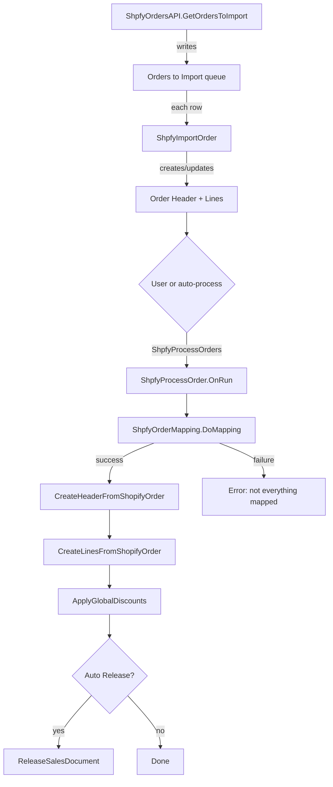
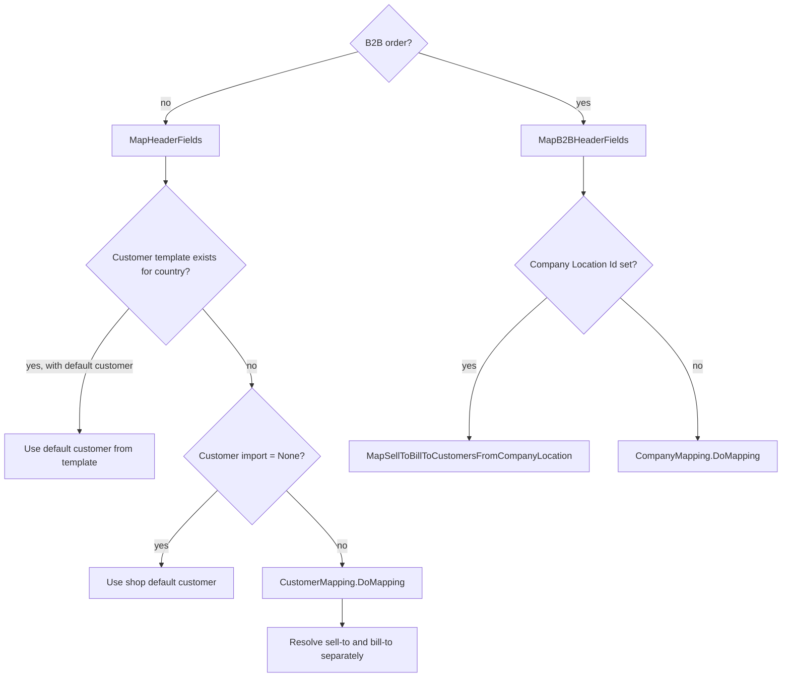

# Business logic

## Pipeline overview

## Phase 1: order discovery

`ShpfyOrdersAPI.GetOrdersToImport` paginates through Shopify's GraphQL `orders` connection. On first sync (no prior sync time), it uses `GetOpenOrdersToImport` which returns only open orders. On subsequent syncs it uses `GetOrdersToImport` filtered by `updatedAt` since the last sync time. For each order node it populates or updates a row in `Orders to Import`, computing the `Import Action` (New or Update) by checking whether an `Order Header` already exists. Closed orders are only imported as updates, never as new.

## Phase 2: order import

`ShpfyImportOrder.ImportOrderAndCreateOrUpdate` does the heavy lifting. It fetches the full order JSON via a second GraphQL call (`GetOrderHeader`), retrieves order lines in a paginated loop (`GetOrderLines` / `GetNextOrderLines`), and populates the staging tables.

`RetrieveOrderHeaderJson` conditionally includes the `staffMember { id }` field in the GraphQL query parameters based on `Shop."Advanced Shopify Plan"`. When the shop is not on an Advanced/Plus plan, the `StaffMember` parameter is sent as an empty string, omitting staff data from the query. `SetNewOrderHeaderValuesFromJson` (which populates the order header from the JSON response) similarly gates the staff member processing -- it only extracts the staff member ID and calls `SetSalespersonOnOrderHeader` when `Shop."Advanced Shopify Plan"` is true.

*Updated: 2026-04-08 -- staff member handling gated by Advanced Shopify Plan instead of B2B Enabled*

For already-processed orders, it runs conflict detection. A conflict is flagged if the current total items quantity increased, the line item composition changed (checked via a hash of line IDs), or the shipping charges amount changed. Conflicting orders get `Has Order State Error = true`.

After populating the header and lines, the import calls into related modules: fulfillment orders, shipping charges, transactions, returns (if the return/refund process requires import), and refunds. It then adjusts order line quantities and header amounts by subtracting refund line quantities and amounts. Zero-quantity lines are deleted. If the order is fully fulfilled and paid, and `Archive Processed Orders` is enabled, it closes the order in Shopify via the `CloseOrder` GraphQL mutation.

## Phase 3: mapping and document creation

### Customer mapping

`ShpfyOrderMapping.DoMapping` first resolves the customer (or company for B2B), then iterates order lines. Tip lines require a configured `Tip Account`, gift card lines require a `Sold Gift Card Account`, and regular lines go through `MapVariant` which looks up the Shopify variant, auto-imports the product if needed, and resolves the BC item, variant code, and unit of measure.

The mapping also resolves shipping method (from `Shpfy Shipment Method Mapping` by shipping charge title), shipping agent, and payment method (from the order's successful transactions, only if a single payment method is found).

### Sales document creation

`ShpfyProcessOrder.CreateHeaderFromShopifyOrder` inserts a Sales Header. The document type is Order by default, or Invoice if the order is already fulfilled and `Create Invoices From Orders` is enabled. It copies all three address blocks from the Shopify order, sets currency based on the shop's `Currency Handling`, applies the document date, shipping method, payment method, tax area, and payment terms. It writes a `Doc. Link To Doc.` record to tie the Shopify order to the BC document. If `Order Attributes To Shopify` is enabled, it pushes the BC document number back to Shopify as an order attribute.

`CreateLinesFromShopifyOrder` iterates order lines and creates corresponding sales lines. Tips go to the tip G/L account, gift cards to the sold gift card G/L account, and regular items are validated with location code resolution from `Shpfy Shop Location`. Shipping charges become separate sales lines, either as G/L account lines using the shop's `Shipping Charges Account` or as item charge lines when configured through `Shpfy Shipment Method Mapping`. Item charges are automatically assigned to the item lines.

`ApplyGlobalDiscounts` calculates the portion of the order's total discount that was not allocated to individual lines or shipping charges, and applies it as an invoice discount on the sales header.

A final cash rounding line is created if the order has a non-zero `Payment Rounding Amount`, posted to the shop's `Cash Roundings Account`.

## Error handling

`ShpfyProcessOrders.ProcessShopifyOrder` wraps `ShpfyProcessOrder.Run` in a `if not ... Run` pattern. On failure it captures the error text into the order header's `Error Message`, clears the sales document number, and calls `CleanUpLastCreatedDocument` to delete the partially created sales document. On success it sets `Processed = true` and records the `Processed Currency Handling` so refund processing later knows which currency was used.

## Contact lookup on the order page

The Shopify Order page exposes contact number fields for all three address contexts (sell-to, ship-to, bill-to). These fields are hidden by default and provide lookup and validation behavior.

- **Automatic resolution during mapping**: `ShpfyOrderMapping.FindContactNo` resolves a contact name to a contact number by finding a person-type contact whose name matches and whose company contact matches the customer's contact business relation. This runs during `DoMapping` for both standard and B2B paths, populating `Sell-to Contact No.`, `Ship-to Contact No.`, and `Bill-to Contact No.`.

- **Manual lookup on the page**: Each contact field's `OnLookup` trigger calls `OrderHeader.LookupContactForCustomer`, which filters the Contact list to contacts belonging to the customer's company contact. The user selects a contact, and `Validate` is called to store the selection.

- **Validation**: The `OnValidate` triggers on the contact number fields call `CheckContactRelatedToCustomer`, which verifies the selected contact is related to the corresponding customer via `Contact Business Relation`. If the contact is neither the company contact itself nor a person under that company, an error is raised.

- **Customer number changes**: When `Sell-to Customer No.` is validated on the order header, it automatically re-resolves `Sell-to Contact No.` and `Ship-to Contact No.` via `FindContactNo`. Similarly, validating `Bill-to Customer No.` re-resolves `Bill-to Contact No.`.

*Updated: 2026-04-08 -- contact lookup/validation added (PR #7525)*
