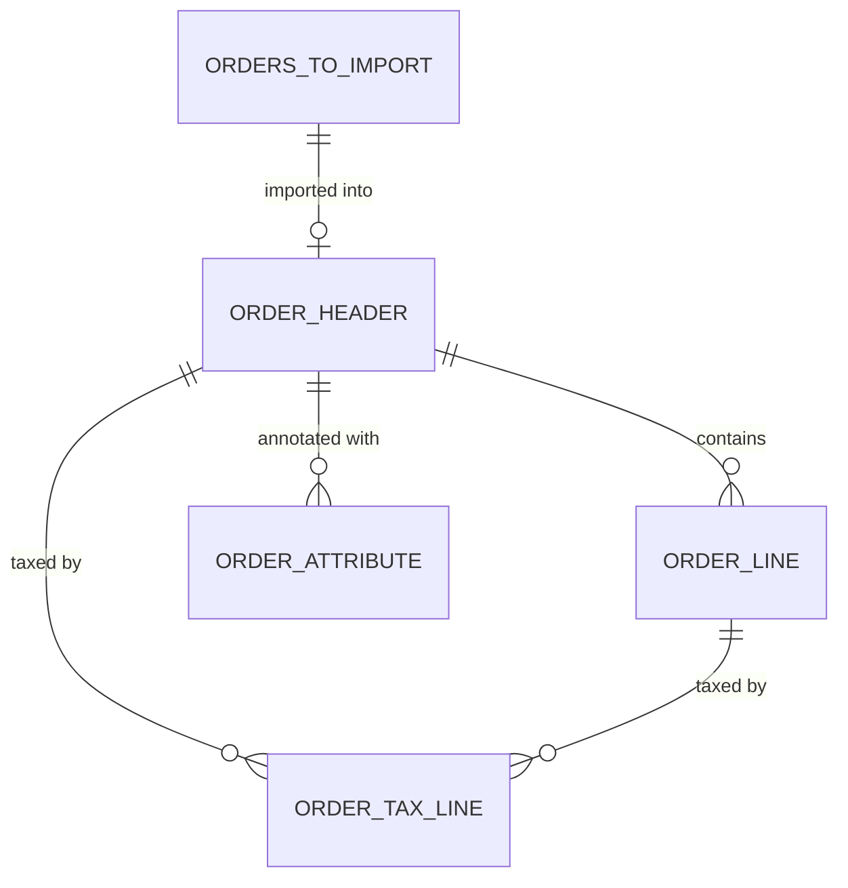
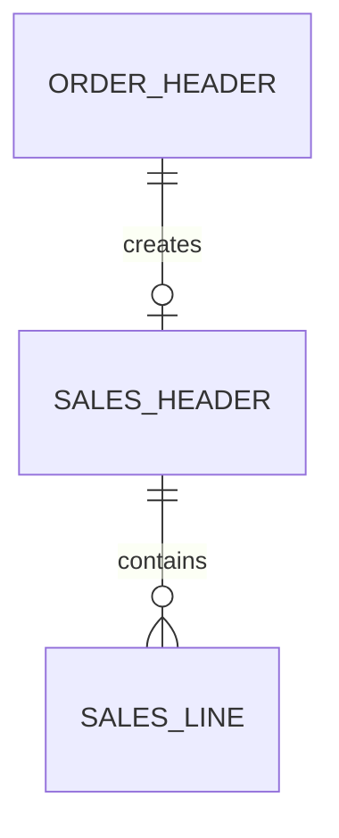

# Data model

## Overview

The order handling data model has two conceptual areas: the Shopify-side staging tables that capture the raw imported order, and the BC-side table extensions that stamp Shopify identifiers onto standard Sales documents. The staging tables are keyed by Shopify's BigInteger IDs and are intentionally denormalized -- the header carries three full address sets and dual-currency totals because Shopify delivers them in a single GraphQL response and the connector wants to avoid follow-up calls.

## Shopify order staging

`Shpfy Orders to Import` (30121) is a transient staging table populated by the sync report. It holds lightweight metadata (financial status, fulfillment status, order amount, tags) used to decide whether an order should be imported. Once imported, the full order lives in `Shpfy Order Header` (30118) and `Shpfy Order Line` (30119).

`Shpfy Order Tax Line` (30122) is polymorphic in its parent key: `Parent Id` can reference either an Order Header (the header's `Shopify Order Id`) or an Order Line (the line's `Line Id`). The table resolves currency codes by walking from the line to its parent header in `OrderCurrencyCode()`. This parent ambiguity means you cannot read tax lines without knowing whether the parent is a header or a line.

`Shpfy Order Attribute` (30116) stores custom checkout key-value pairs keyed by `(Order Id, Key)`. The value field was widened from 250 to 2048 characters in version 27 -- old code referencing the removed `Value` field will not compile.

The discount application table `Shpfy Order Disc.Appl.` (30117) captures Shopify's discount allocation metadata (allocation method, target type, value type) but is not directly consumed during BC document creation. Instead, line-level discount amounts are computed from `discountAllocations` in the GraphQL JSON, and any remaining "global" discount is applied as an invoice discount after all lines are created.

## BC document extensions

The `Shpfy Sales Header` table extension (30101) adds `Shpfy Order Id` (BigInteger), `Shpfy Order No.` (Code[50]), and `Shpfy Refund Id` to the standard Sales Header. The `Shpfy Sales Line` extension (30104) adds `Shpfy Order Line Id`, `Shpfy Order No.`, `Shpfy Refund Id`, `Shpfy Refund Line Id`, and `Shpfy Refund Shipping Line Id`. These fields survive posting -- archive table extensions (`ShpfySalesHeaderArchive`, `ShpfySalesLineArchive`) and posted invoice extensions carry the same identifiers, ensuring traceability back to the Shopify order throughout the document lifecycle.

The link between the Shopify order and the BC document is also recorded in `Shpfy Doc. Link To Doc.`, a separate junction table. The `IsProcessed()` method on Order Header checks both the `Processed` flag and this link table, so an order is considered processed if either condition is true.
